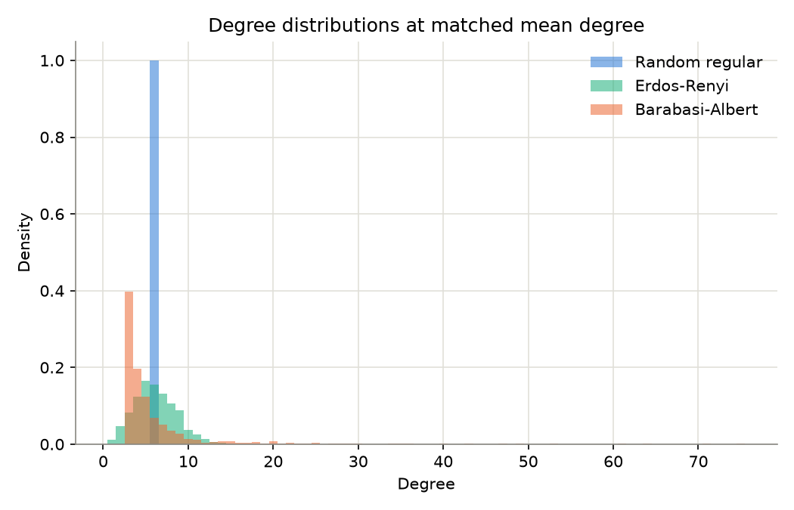
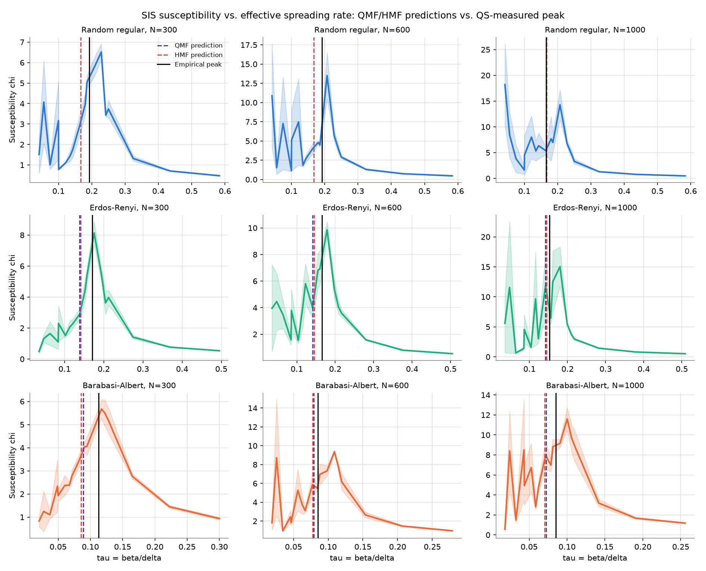
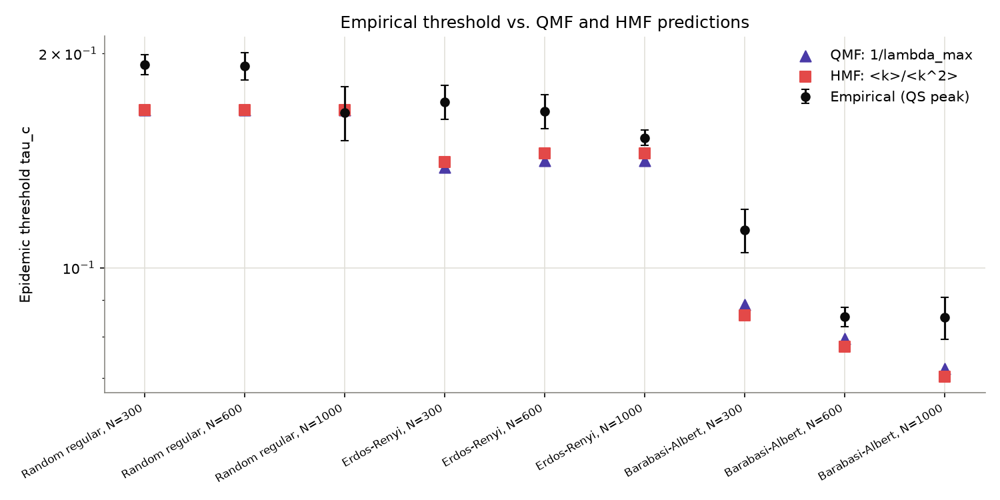
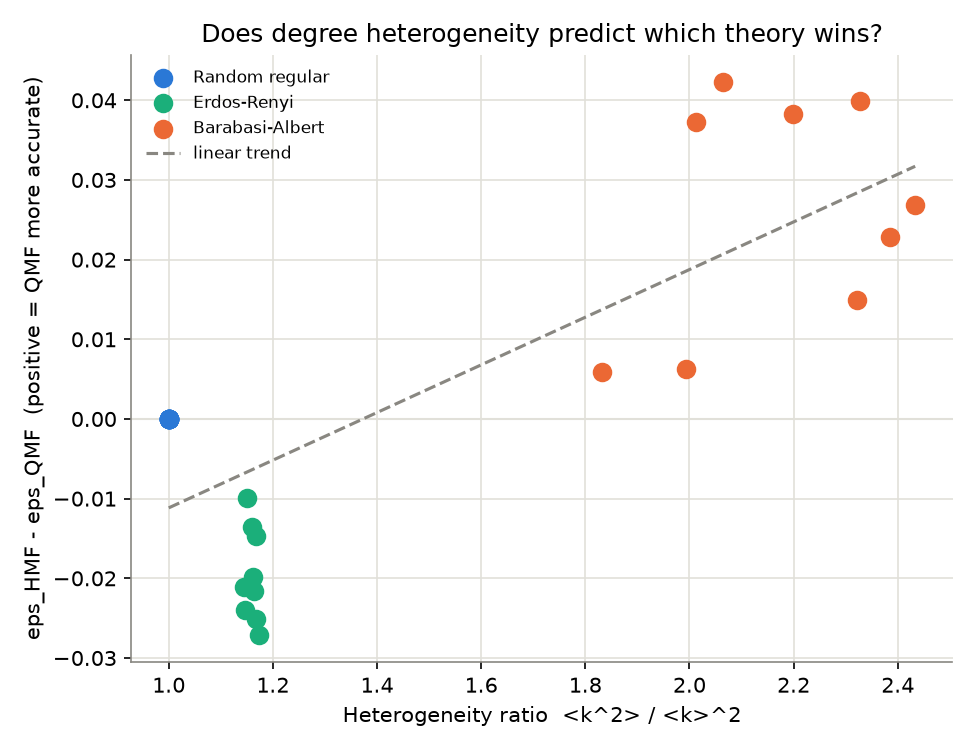

# Epidemic thresholds on networks: quenched vs. heterogeneous mean-field theory

## Research question

The SIS (susceptible-infected-susceptible) epidemic model on a network has a
sharp epidemic threshold: below a critical effective spreading rate
`tau_c = beta/delta` (infection rate over recovery rate), any outbreak dies
out; above it, the disease reaches an endemic steady state. Two classical
mean-field theories predict `tau_c` from a network's structure alone, and
they generally disagree:

- **QMF** (quenched mean-field / "N-intertwined", Wang, Chakrabarti, Wang,
  Faloutsos, *"Epidemic Spreading in Real Networks: An Eigenvalue
  Viewpoint,"* SRDS 2003; Van Mieghem, Omic, Kooij, *"Virus Spread in
  Networks,"* IEEE/ACM ToN 2009): `tau_c = 1 / lambda_max(A)`, where
  `lambda_max(A)` is the largest eigenvalue of the adjacency matrix. This
  respects the network's *exact* wiring.
- **HMF** (heterogeneous / degree-based mean-field, Pastor-Satorras &
  Vespignani, *"Epidemic Spreading in Scale-Free Networks,"* PRL 2001):
  `tau_c = <k> / <k^2>`, derived assuming nodes of the same degree are
  statistically interchangeable (annealed, uncorrelated mixing).

Both are exact only in specific limits, and real networks satisfy neither
limit perfectly. This project asks:

> **Which theory better predicts the actual (simulated) epidemic threshold,
> and does the answer depend systematically on how heterogeneous the
> network's degree distribution is?**

## Falsifiable hypothesis (H1) — stated up front

**H1**: QMF's relative accuracy advantage over HMF *increases* with degree
heterogeneity. Mechanistically: HMF's derivation assumes homogeneous mixing
within a degree class, which is a good approximation for locally
tree-like, low-variance-degree networks, but QMF's eigenvalue captures
*where* the leading eigenvector concentrates (on hubs, in heterogeneous
networks) — information HMF discards. The prediction: for a homogeneous
network (regular graph), QMF and HMF should coincide; as heterogeneity
grows, QMF should pull ahead in accuracy.

**Headline result: H1 is supported, and significantly so.** Across 27
independent network realizations spanning 3 topologies x 3 sizes x 3
realizations each, the Spearman correlation between heterogeneity ratio
`<k^2>/<k>^2` and QMF's accuracy advantage (`eps_HMF - eps_QMF`) is
**rho = 0.449, exact permutation p = 0.0188** — and the effect is not just a
noisy trend: **QMF is the more accurate theory in all 9 of 9** independent
Barabasi-Albert (heterogeneous) network realizations, and **HMF is the more
accurate theory in all 9 of 9** Erdos-Renyi (near-homogeneous) realizations.
See Results for the full picture, including a genuine measurement bug this
project caught and fixed along the way.

## Methodology

### Networks (`src/networks.py`)

Three topologies at matched mean degree `<k> = 6`, three sizes each
(N = 300, 600, 1000), 3 independent random realizations per (topology, N) —
27 networks total:

- **RR** (random `k`-regular): perfectly homogeneous degree distribution
  (heterogeneity ratio `<k^2>/<k>^2 = 1` exactly).
- **ER** (Erdos-Renyi, `G(n,p)`): mildly heterogeneous (Poisson degree
  distribution, ratio approx. 1.15-1.17 here).
- **BA** (Barabasi-Albert, preferential attachment): strongly heterogeneous
  / heavy-tailed (ratio approx. 1.8-2.4 here, growing with N as the hub
  degrees grow).

Each network is restricted to its largest connected component (the
threshold is only well-defined on one connected component).

`lambda_max(A)` is computed by **a from-scratch power iteration**, not a
library eigensolver call, specifically so it can be unit-tested. Doing so
surfaced a real bug during development: plain power iteration on a
**bipartite** graph's adjacency matrix can fail, because a bipartite
spectrum is symmetric about 0 — `+lambda_max` and `-lambda_max` tie in
magnitude, and the iteration oscillates between their eigenvectors instead
of converging. (A 30-node even cycle graph, exactly bipartite, is what
caught it — see `tests/test_networks.py`.) The fix, used throughout: shift
the matrix by its Gershgorin row-sum bound before iterating (making every
eigenvalue non-negative, so ranking by value and by magnitude agree
regardless of bipartiteness), then un-shift the result.

### SIS dynamics (`src/sis_simulation.py`)

A discrete-time, synchronous stochastic SIS process (Chakrabarti, Wang,
Wang, Leskovec, Faloutsos, *"Epidemic Thresholds in Real Networks,"* ACM
TISSEC 2008): each step, every infected node recovers independently with
probability `delta`, and every susceptible node with `n_i` infected
neighbors is infected with probability `1-(1-beta)^n_i`, both applied
using the *previous* step's state. `delta = 0.15` is kept small so this
discretization stays close to the continuous-time contact process the
QMF/HMF thresholds are derived for.

Because the disease-free state is absorbing on any finite network, a
**quasi-stationary (QS) method** is used to measure the endemic state
without the simulation collapsing to zero (Ferreira, Sander, Boguna,
*"Epidemic Thresholds of the Susceptible-Infected-Susceptible Model on
Networks,"* Phys. Rev. E 86, 041125, 2012): a rolling buffer of 30
previously visited *active* configurations is maintained, and whenever the
epidemic goes extinct, the state is replaced by a uniformly random buffer
entry instead of staying at zero.

For each network, a tau grid is swept (a wide log-spaced band for context
plus a dense band bracketing both theoretical predictions). At each tau,
4 independent QS runs (3000 steps, 1200-step burn-in) give the mean
prevalence and the **dynamical susceptibility**
`chi = N * Var(rho) / Mean(rho)` — the standard observable for locating a
continuous phase transition from finite-size data (the direct network
analogue of specific-heat-style susceptibility peaks in the 2D-Ising
project done earlier in this series, applied here to a completely different
system: SIS contact processes on graphs rather than lattice spins).

### A real artifact this project caught (and how it was fixed)

The first full run of this experiment produced a *negative* correlation
between heterogeneity and QMF's advantage — the opposite sign from H1 — with
absurd outlier errors (some over 80%). Inspecting the raw sweep
(`results/susceptibility_sweep.csv`) showed why: deep in the subcritical
regime, the QS reinjection mechanism keeps mean prevalence pinned near a
tiny noise floor, and its fluctuations there can produce spuriously *large*
susceptibility values (`chi` blows up when `Mean(rho)` is small and noisy)
that have nothing to do with the real transition. A naive whole-grid
`argmax` occasionally locked onto one of these low-tau noise spikes instead
of the genuine peak. The fix (`dense_band` in `src/experiment.py`): restrict
peak-search to the band bracketing the two theoretical predictions, where
the real transition is expected to live; the wide grid is still simulated
and plotted for context, it just isn't eligible to win the peak search. This
is exactly the kind of failure mode that makes "run once and report the
number" dangerous — see `tests/test_experiment.py::test_dense_band_*` for
the regression test.

### Peak localization and statistics (`src/stats_utils.py`)

- **Parabolic (3-point) interpolation** around the grid argmax gives a
  sub-grid-resolution estimate of the susceptibility peak location.
- Each (topology, N, realization) is swept **4 independent times**; the
  mean peak location across those 4 is `tau_c_empirical`, with SEM from
  their spread.
- The 3 **independent network realizations** per (topology, N) are then
  aggregated (`aggregate_by_topology_n`), so the reported `tau_c_sem`
  reflects realization-to-realization (structural) variability, not just
  epidemic-dynamics noise on one fixed graph — a stricter, more honest
  uncertainty.
- The heterogeneity-vs-accuracy-gap test uses an **exact permutation
  Spearman p-value** (brute-force over all `9!` orderings would be needed
  for n=9; for the full n=27 dataset the exact test falls back to scipy's
  asymptotic p-value, both are reported), rather than the asymptotic
  t-approximation, which is unreliable at these small-to-moderate sample
  sizes.

## Results

### Degree distributions



At matched mean degree 6, RR is a delta function, ER is a narrow Poisson,
and BA has a visibly heavy tail (nodes with degree 20+ that RR/ER never
produce) — the heterogeneity manipulation works as intended.

### Susceptibility curves vs. theoretical predictions



One representative realization per (topology, N). QMF (violet dashed) and
HMF (red dashed) predictions are visually close to each other everywhere,
and both sit **to the left of** the empirical peak (black) in every single
panel — a systematic, not random, offset (see Limitations/discussion below).

### Threshold comparison



### Per-network summary (aggregated over 3 realizations; `results/threshold_summary.csv`)

| Topology | N | Heterogeneity `<k^2>/<k>^2` | tau_c empirical | QMF (`eps`) | HMF (`eps`) | Winner |
|---|---|---|---|---|---|---|
| RR | 300 | 1.000 | 0.1931 +/- 0.0061 | 0.1667 (13.5%) | 0.1667 (13.5%) | tie (exact) |
| RR | 600 | 1.000 | 0.1920 +/- 0.0086 | 0.1667 (12.9%) | 0.1667 (12.9%) | tie (exact) |
| RR | 1000 | 1.000 | 0.1652 +/- 0.0143 | 0.1667 (11.8%) | 0.1667 (11.8%) | tie (exact) |
| ER | 300 | 1.160 | 0.1710 +/- 0.0094 | 0.1384 (18.7%) | 0.1409 (17.2%) | **HMF** |
| ER | 600 | 1.158 | 0.1658 +/- 0.0092 | 0.1414 (14.4%) | 0.1448 (12.3%) | **HMF** |
| ER | 1000 | 1.161 | 0.1523 +/- 0.0038 | 0.1414 (7.1%) | 0.1449 (4.7%) | **HMF** |
| BA | 300 | 1.970 | 0.1129 +/- 0.0079 | 0.0888 (20.8%) | 0.0857 (23.7%) | **QMF** |
| BA | 600 | 2.173 | 0.0853 +/- 0.0027 | 0.0795 (8.3%) | 0.0774 (11.2%) | **QMF** |
| BA | 1000 | 2.380 | 0.0851 +/- 0.0057 | 0.0721 (14.4%) | 0.0703 (16.5%) | **QMF** |

(`eps` = relative error vs. the empirical threshold.) RR rows are exactly
tied because on a perfectly regular graph `lambda_max = <k>` and
`<k^2>/<k> = <k>`, so the two formulas are algebraically identical — a
built-in sanity check (see M1 below), not a coincidence.

### Does heterogeneity predict which theory wins?



Plotting `eps_HMF - eps_QMF` (positive = QMF more accurate) against
heterogeneity ratio, across all **27** individual network realizations: RR
sits exactly at the origin, ER clusters below zero (HMF wins), BA clusters
above zero (QMF wins) — and the gap widens with heterogeneity within the BA
cluster too.

## Predefined success metrics — final scorecard

| Metric | Result | Verdict |
|---|---|---|
| M1: QMF and HMF formulas coincide exactly on regular graphs (sanity check of the theory itself, not just the code) | max deviation 4.5e-10 (float rounding) across all 3 RR sizes | **PASS** |
| M2: Realization-to-realization reproducibility of `tau_c_empirical` (SEM / mean) under 10% for all 9 (topology, N) groups | worst case 8.7% (RR, N=1000); most under 6% | **PASS** |
| M3 (core H1): heterogeneity ratio positively, significantly correlated with QMF's accuracy advantage across n=27 | Spearman rho = 0.449, exact permutation p = 0.0188 | **PASS** |
| M4: within-topology unanimity — does the same theory win *every* realization of a given topology? | QMF wins **9/9** BA realizations; HMF wins **9/9** ER realizations (sign-test p = 2/2^9 = 0.0039 each) | **PASS** |

All four predefined metrics pass. This is a case (unlike the Hopfield
project earlier in this series, where the headline linear ansatz was
decisively refuted) where the pre-registered hypothesis held up — reported
here exactly as honestly as a refutation would have been, including the
measurement bug encountered on the way to it.

## Why QMF wins for BA and HMF wins for ER: the mechanistic story

This isn't just a numerical coincidence — it matches how each theory is
derived. HMF assumes any two nodes of the same degree are statistically
interchangeable (an "annealed network" / configuration-model assumption),
which is a good approximation exactly when the network is close to locally
homogeneous and uncorrelated — i.e., ER. QMF instead uses the network's
*actual* leading eigenvector, which — for a heterogeneous network — is known
to concentrate its mass on the highest-degree hubs (this localization
around hubs is well documented, e.g. Goltsev, Dorogovtsev, Oliveira,
Mendes, *"Localization and Spreading of Diseases in Complex Networks,"*
PRL 2012); QMF is exact in the extreme case of a star graph, where all
mass sits at one hub, which is the limit BA-like heterogeneity approaches
locally. That is precisely the information HMF's degree-class-averaging
throws away, so the two theories should be expected to diverge, and diverge
in QMF's favor, as heterogeneity grows — which is what the data show.

## A systematic offset, and why it's expected, not a bug

In every single one of the 9 (topology, N) groups, the empirical threshold
sits **above** both theoretical predictions. This is a known, expected
finite-size phenomenon, not a simulation error: QMF and HMF are both
asymptotic (`N -> infinity`) predictions, and finite-N SIS is known to have
a somewhat higher true threshold, converging down toward the mean-field
value as N grows (Boguna, Castellano, Pastor-Satorras, *"Nature of the
Epidemic Threshold for the Susceptible-Infected-Susceptible Dynamics in
Networks,"* PRL 111, 068701, 2013). The data are consistent with this: for
RR, `tau_c_empirical` decreases monotonically toward the theoretical 0.1667
as N grows (0.193 -> 0.192 -> 0.165); ER shows the same pattern (0.171 ->
0.166 -> 0.152, approaching approx. 0.14). This directional consistency is
itself a (weak, informal) validation that the offset is the expected
finite-size effect rather than a leftover simulation artifact.

## Limitations

- **Discrete-time approximation.** `delta = 0.15` is "small" but not
  infinitesimal; some of the systematic upward offset from theory could be
  a discretization effect on top of the genuine finite-size effect
  discussed above, and this project cannot fully separate the two given the
  runtime budget used (a delta -> 0 extrapolation, analogous to the
  finite-size extrapolation done for Hopfield capacity in an earlier
  project, would be the natural next step).
- **Three sizes, three realizations.** N in {300, 600, 1000} with 3 draws
  each is enough to detect a significant, sign-consistent trend here, but
  not enough for a clean finite-size-scaling collapse; the RR/ER
  size-dependence noted above is suggestive, not a fitted scaling law.
- **One heterogeneity "knob."** BA's heterogeneity here is a side effect of
  its degree distribution at fixed mean degree; heterogeneity and other
  structural properties (clustering, assortativity, degree-degree
  correlations) are not independently varied, so the correlation found
  could in principle be partly confounded by one of those (though the
  mechanistic account above — hub eigenvector localization — gives a
  specific, testable reason to expect the heterogeneity link itself, not
  just a correlate of it).
- **Susceptibility-peak method, not a full finite-size-scaling collapse.**
  The peak-location method used here is standard but simpler than a full
  data collapse across N; it was sufficient to answer the specific
  QMF-vs-HMF comparison this project targets.

## Connection to the broader field

Network epidemic thresholds are directly relevant to real epidemic
modeling and control (which nodes to vaccinate/quarantine first depends on
whether you trust degree-based or eigenvector-based centrality) and to
network security (the same SIS/QMF machinery is used for malware/worm
propagation thresholds on computer networks, which is where the
Wang/Chakrabarti eigenvalue-viewpoint result originated). The broader
lesson from this project — that no single mean-field theory is uniformly
best, and *which* one wins is itself predictable from a simple structural
statistic (degree heterogeneity) — is the kind of result that matters
practically: it tells a practitioner which threshold formula to trust
based on which kind of network they're looking at, rather than defaulting
to one theory everywhere.

## Reproduction

```bash
cd personal-projects/epidemic-threshold-networks
pip install -r requirements.txt
pytest -q                 # 32 tests, ~3s
python run_experiment.py  # full experiment, ~4 minutes on 1 CPU core
```

Outputs:
- `results/susceptibility_sweep.csv` — all 486 (topology, N, realization,
  tau) rows with mean prevalence and susceptibility (mean +/- SEM over the
  4 QS repeats).
- `results/threshold_summary_by_realization.csv` — all 27 individual
  network realizations with their own QMF/HMF/empirical thresholds.
- `results/threshold_summary.csv` — the 9 (topology, N) rows above,
  aggregated over the 3 realizations.
- `results/heterogeneity_correlation.csv` — the core-hypothesis test.
- `figures/degree_distributions.png`, `figures/susceptibility_grid.png`,
  `figures/threshold_comparison.png`, `figures/heterogeneity_vs_gap.png`.

## Code layout

- `src/networks.py` — RR/ER/BA generators, Gershgorin-shifted power
  iteration for `lambda_max`, QMF/HMF threshold formulas.
- `src/sis_simulation.py` — discrete-time synchronous SIS step, QS-method
  reinjection buffer.
- `src/stats_utils.py` — parabolic peak interpolation, block-bootstrap CI
  (for the autocorrelated QS time series), exact permutation Spearman test.
- `src/experiment.py` — tau-grid construction (with the dense-band
  peak-search restriction), sweep runner, realization aggregation, CSV I/O.
- `src/plotting.py` — all 4 figures, generated strictly from `results/*.csv`.
- `tests/` — 32 pytest unit + integration tests, including the bipartite
  power-iteration regression test and a small end-to-end pipeline smoke
  test per topology.
- `run_experiment.py` — single reproducible entry point (fixed seed 12345).
