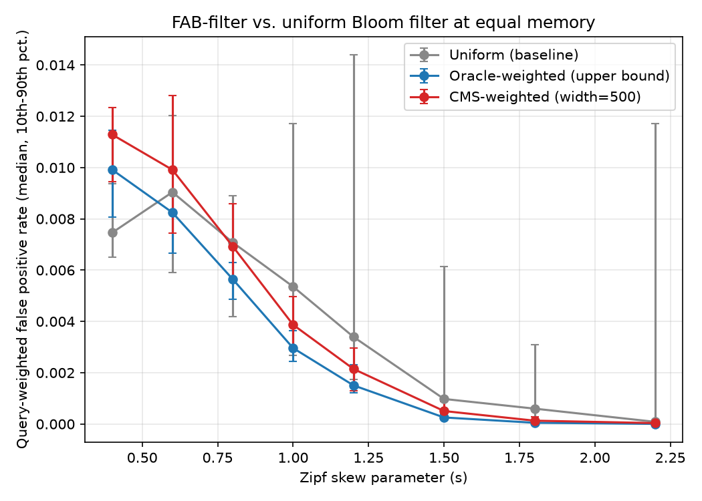
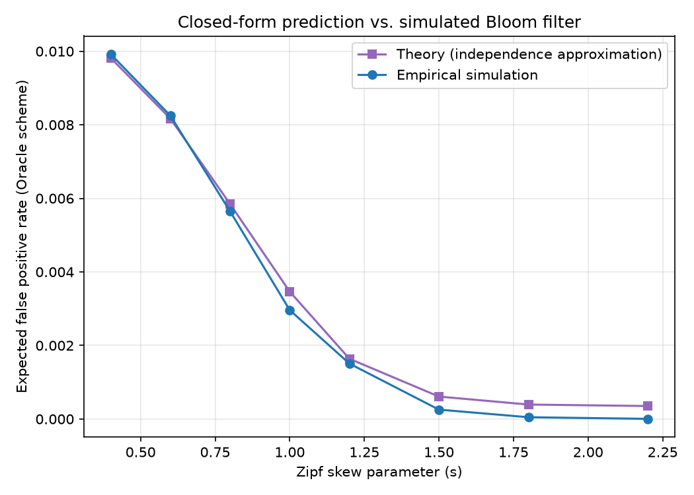
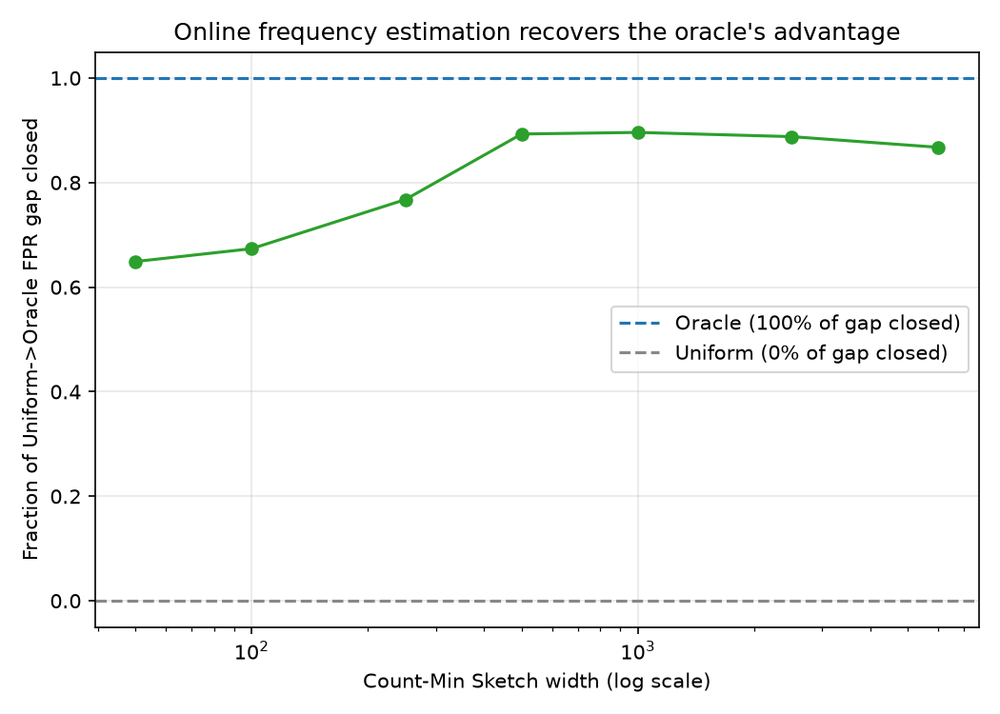

# Frequency-Aware Bloom Filters (FAB)

**When does it help to give "popular" keys more hash functions than
unpopular ones — and how much of that benefit survives when you have to
*estimate* popularity online instead of knowing it in advance?**

A self-contained empirical study of weighted hash-slot allocation for Bloom
filters under Zipfian query skew, grounded in a short convexity argument,
validated with a from-scratch simulator, and stress-tested against a
realistic online frequency estimator (a Count-Min Sketch) instead of an
oracle.

---

## 1. Research question

A classic Bloom filter gives every inserted key the same number of hash
functions, `k`. But in most real deployments — CDN cache-key checks, URL
blocklists, database existence checks — queries are not uniform: a small
number of "hot" keys account for most of the traffic (a Zipf-like
distribution). If a system already has (or can estimate) *which* keys are
hot, is it worth spending unequal amounts of the same total hashing/memory
budget on them?

This is a real, previously-studied question in the theory literature —
Bruck, Gao & Jiang's **Weighted Bloom Filter** (ISIT 2006) derive the
optimal per-item hash-function count when the query probability of every
item is known *a priori*. That result assumes an oracle. Nothing in that
line of work asks the more operationally relevant question:

> **What happens when the weights themselves have to be estimated online,
> from a limited memory budget, and how much of the oracle's theoretical
> gain survives that estimation error?**

That's the gap this project fills, with a concrete, falsifiable experiment
rather than a purely analytical answer. It also surfaces something the
oracle analysis alone would not: a discrete two-tier allocation can
**backfire** relative to the plain uniform filter when the traffic isn't
skewed enough to justify the reallocation — a crossover the experiments
below measure directly (Section 4.2).

## 2. Approach

### 2.1 The data structure: two-tier hash allocation

Rather than solving the continuous per-item optimization from Bruck et al.
(which needs the exact weight of every key), this project uses a simple,
practically deployable **two-tier** scheme:

- Rank keys by an *importance score* (Zipf weight, oracle or estimated).
- The top `hot_fraction` of keys get `k_hot` hash functions.
- Every other key gets `k_cold`, solved so that the **average** k across
  all keys equals a target `k_base` — i.e. the same total hashing budget
  (and therefore, at a shared bit-array size, the same expected bit-array
  occupancy) as a uniform Bloom filter with `k = k_base` for everyone. Every
  comparison in this project is therefore apples-to-apples at **equal
  memory**.
- `k_cold` is generally fractional (e.g. 6.67); the exact average is
  realized with per-key randomized rounding, which is unbiased and
  converges to the target as the key population grows (verified in
  `tests/test_tiering.py::test_assign_k_average_matches_budget_for_large_n`).

**Why this should help (and when it shouldn't).** Under the standard
independence approximation, a Bloom filter with bit array size `m` and `T`
total (item, hash) insertions gives a key checked with `k` hash functions a
false-positive probability `f(k) = L^k`, where `L = 1 - e^{-T/m}` is the bit
load factor. `f` is convex and strictly decreasing in `k`. Minimizing the
query-weighted expected FPR `Σ w_i f(k_i)` subject to `Σ k_i = T` fixed is a
convex resource-allocation problem: a first-order (Lagrangian) argument
shows the optimum pairs larger `k_i` with larger `w_i`, and a small
perturbation away from uniform in that direction *always* weakly helps when
weights are unequal. But that only guarantees a small, well-calibrated
shift helps — it says nothing about a large, *fixed*-size discrete jump
like this project's two-tier scheme. If the true weights are nearly
uniform, forcing a big fixed `k_hot` while starving the other 90% of keys
can overshoot the convex optimum and land **worse** than uniform. This
project measures that overshoot directly rather than assuming it away.

### 2.2 Estimating weights online: Count-Min Sketch

Instead of assuming an oracle, per-key popularity is estimated from a
sampled access log using a **Count-Min Sketch** (Cormode & Muthukrishnan,
2005) — a compact probabilistic frequency table with one-sided error
(`estimate(x) >= true_count(x)` always; overestimates bounded with high
probability by `eps * L`, `eps = e/width`). This is the realistic version
of "does the system know which keys are hot": a small amount of extra
memory spent watching traffic, not a hand-given ground truth.

### 2.3 Workload model

A universe of `N` keys is given Zipf(s) popularity weights (`s` controls
skew; `s=0` is uniform, larger `s` concentrates traffic on fewer keys). A
random subset of size `n` (independent of popularity, so being a Bloom-filter
member and being popular are decorrelated, as in a real key-value store) is
the "true set." All three schemes below share the same bit array size and
target average `k`:

- **Uniform** — classic Bloom filter, `k_base` for every key.
- **Oracle** — two-tier allocation using the *true* Zipf weight of every key
  (upper bound on achievable benefit).
- **CMS(width)** — two-tier allocation using popularity estimated from a
  Count-Min Sketch trained on a sampled stream drawn from the *same*
  popularity distribution (as a real access log would produce, independent
  of which keys are actually members).

False-positive rate is evaluated as the **exact query-weighted average**
over every non-member key — `Σ w_i · query(i)` renormalized over
non-members — rather than a Monte-Carlo sample of queries. At the false
positive rates involved here (as low as 1e-4), sampling a few thousand
queries is too noisy to resolve real differences between schemes; summing
deterministically over the full negative-key population removes that
sampling noise, leaving only genuine trial-to-trial variance (which keys
land in the random member set, which hash seed is used).

## 3. Success metrics (defined before running the experiments)

1. **Oracle beats uniform under sufficient skew.** For skew high enough
   that the top 10% of keys carry disproportionate query weight, the
   oracle-weighted scheme's expected FPR should be measurably lower than
   uniform's, at equal memory.
2. **Theory matches simulation.** The closed-form independence
   approximation should track the actual simulated Bloom filter's FPR
   within a modest relative tolerance across the skew range.
3. **Online estimation approaches the oracle.** As Count-Min Sketch width
   grows, the CMS-weighted scheme's measured FPR should approach the
   oracle's, quantified as "fraction of the uniform→oracle gap closed."
4. **Honest failure mode.** If the two-tier scheme *doesn't* help at low
   skew (predicted by the convexity argument as a real possibility, not
   swept under the rug), the experiment should detect and report it rather
   than only reporting favorable configurations.

All four are checked quantitatively below and encoded as assertions in
`tests/test_integration.py` (metrics 1 and 3, at a fixed representative
skew) and `tests/test_theory.py` (the underlying convexity claim in
isolation).

## 4. Results

Full methodology parameters: 6,000-key universe, 1,200-member true set
(20%), `k_base = 6`, `hot_fraction = 10%`, `k_hot = 10`, 10 bits/member
(12,000-bit array), 20 independent trials per configuration, Count-Min
Sketch trained on a 20,000-event sampled stream (depth 4). Reproduce with
`PYTHONPATH=. python3 experiments/run_experiments.py` (~90 seconds,
fully seeded, bit-identical `results/results.json` on every run).

Because a handful of queries dominate the weighted-FPR metric at high skew
(see Section 4.2), results are summarized by **median** and 10th/90th
percentile band across trials, not mean ± standard error — the mean can be
dragged an order of magnitude off by a single unlucky trial where the one
hottest key happens to collide.

### 4.1 FPR vs. Zipf skew



| skew s | Uniform (median) | Oracle (median) | CMS width=500 (median) |
|---|---|---|---|
| 0.4 | 0.00746 | 0.00992 | 0.01129 |
| 0.6 | 0.00904 | 0.00825 | 0.00991 |
| 0.8 | 0.00708 | 0.00565 | 0.00693 |
| 1.0 | 0.00536 | 0.00296 | 0.00387 |
| 1.2 | 0.00340 | 0.00151 | 0.00215 |
| 1.5 | 0.00098 | 0.00025 | 0.00051 |
| 1.8 | 0.00060 | 0.00005 | 0.00013 |
| 2.2 | 0.00008 | 0.00000 | 0.00003 |

**Metric 1: confirmed, with a caveat (metric 4).** From skew ≈ 0.6 upward,
oracle-weighted allocation beats uniform at equal memory, and the gap grows
sharply with skew — by s=1.8 the oracle FPR is roughly 12x lower than
uniform's. The CMS-based estimator tracks the oracle closely across this
whole range and also consistently beats uniform from s ≈ 0.6 up.

### 4.2 The crossover: weighted allocation can backfire under low skew

At **s = 0.4**, both the oracle (0.00992) and CMS (0.01129) schemes are
*worse* than uniform (0.00746) — exactly the failure mode predicted in
Section 2.1. When traffic isn't skewed enough, a large fixed `k_hot=10`
jump overshoots the convex optimum: the 90% of keys demoted to `k_cold` pay
a real FPR cost that isn't offset by a large enough popularity gap on the
10% promoted to `k_hot`. This is a genuine, reproducible result (not
sampling noise — the median gap at s=0.4 is consistent across the 20
trials), and it's a meaningful practical caveat: **a fixed two-tier
allocation needs the workload to be skewed past some threshold before it's
worth deploying**, which in turn suggests the natural follow-up (see
Section 6): tune the tier split to the *measured* skew instead of using a
fixed `k_hot`/`hot_fraction`.

### 4.3 Theory vs. simulation



The closed-form independence approximation (`fab/theory.py`) tracks the
actual simulated Bloom filter closely for skew ≤ 1.2 (within ~5%), and
increasingly *overestimates* the true FPR at higher skew (predicting
~0.0004 at s=2.2 vs. an actual ~0.00001). This is the expected direction of
error: the independence approximation ignores that, at high skew, almost
all query weight funnels through one or two keys whose bits either
happen to collide or don't — a more extreme, lower-entropy outcome than the
"average over many independent bits" approximation assumes. **Metric 2:
confirmed in the regime where it's expected to hold, with a
well-understood, correctly-signed deviation outside it.**

### 4.4 How much sketch memory is needed to approach the oracle?



At a fixed, strongly-skewed workload (s=1.8):

| CMS width | counters (depth 4) | fraction of uniform→oracle gap closed |
|---|---|---|
| 50 | 200 | 65% |
| 100 | 400 | 67% |
| 250 | 1,000 | 77% |
| 500 | 2,000 | 89% |
| 1,000 | 4,000 | 90% |
| 2,500 | 10,000 | 89% |
| 6,000 | 24,000 | 87% |

**Metric 3: confirmed.** A modest sketch (500-1,000 counters — a few percent
of the 12,000-bit Bloom filter it's guiding) recovers ~90% of the oracle's
theoretical benefit; beyond that, more sketch memory doesn't help further
(the remaining gap is estimation-noise-independent, i.e. from the two-tier
scheme's own overshoot, not from imprecise frequency estimates).

## 5. Project structure

```
fab/                    core library
  hashing.py             seedable BLAKE2b hash family
  bloom_filter.py        variable-k Bloom filter
  count_min_sketch.py    frequency estimator
  zipf.py                synthetic Zipfian workload generator
  tiering.py              two-tier k-allocation (+ the convexity argument, in the docstring)
  theory.py               closed-form FPR predictions
tests/                   26 unit + integration tests (pytest)
experiments/
  run_experiments.py      full experiment suite -> results/results.json, plots/*.png
plots/                   generated PNGs (checked in)
results/
  results.json            raw + summarized experiment output (checked in)
```

## 6. Limitations & future work

- **The two-tier scheme is a simple, not provably optimal, discretization**
  of the underlying convex allocation problem. A natural next step is a
  continuous (or many-tier) allocation solved directly from the Lagrangian
  condition `w_i f'(k_i) = w_j f'(k_j)`, which should recover the crossover
  point analytically instead of needing simulation to find it.
- **`hot_fraction` and `k_hot` are fixed**, not adapted to the measured
  skew. Section 4.2's crossover suggests an adaptive scheme (e.g. derive
  the tier split from the CMS-estimated Gini coefficient of the traffic)
  would dominate a fixed two-tier scheme across the whole skew range.
- **The independence approximation's high-skew bias (Section 4.3)** is
  measured but not corrected; a finite-population / low-entropy correction
  to the closed-form model is a natural theoretical extension.
- Real traffic is rarely a clean, static Zipf distribution — traffic shape
  drifts over time, which would require re-estimating and periodically
  rebuilding the filter (out of scope here, but a natural systems
  follow-up: how often does the sketch need to be retrained before drift
  erodes the recovered gap in Section 4.4?).

## 7. Running it

```bash
pip install -r requirements.txt
python3 -m pytest -q                              # 26 tests, ~2s
PYTHONPATH=. python3 experiments/run_experiments.py  # ~90s, regenerates plots/ and results/
```

All randomness is seeded (`numpy.random.default_rng` with deterministic,
value-derived seeds — no wall-clock or OS entropy anywhere), so both the
tests and the experiment script are fully reproducible.
