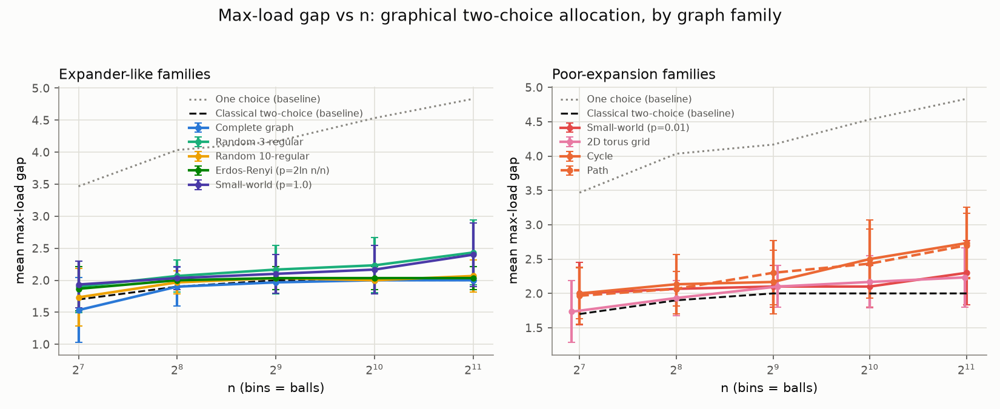
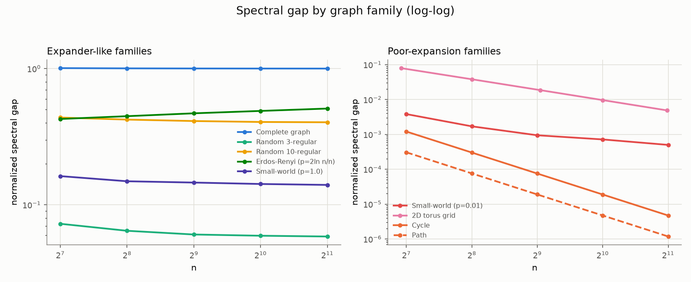
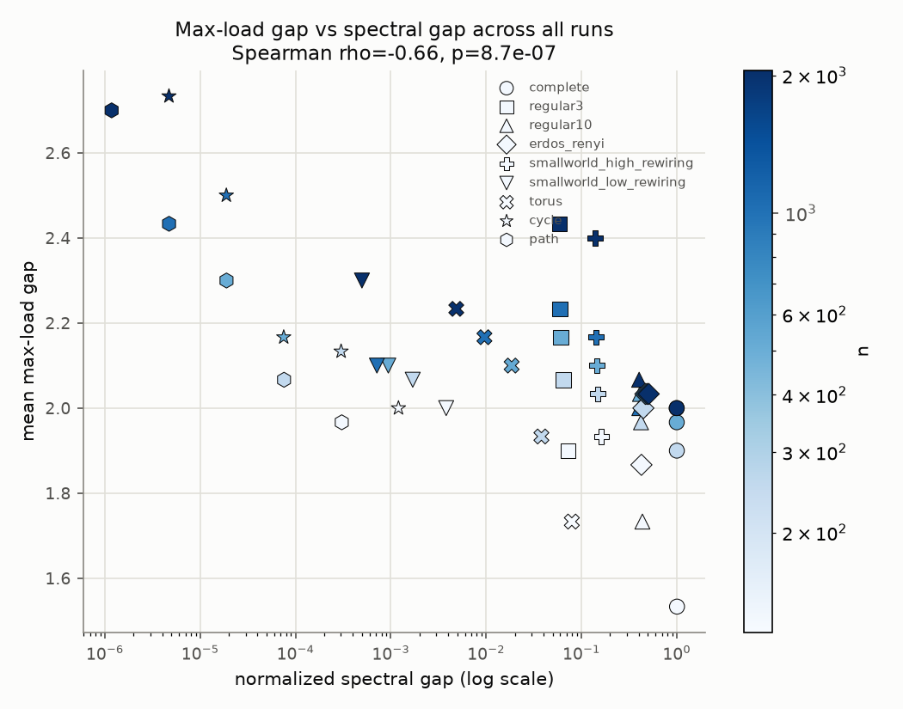
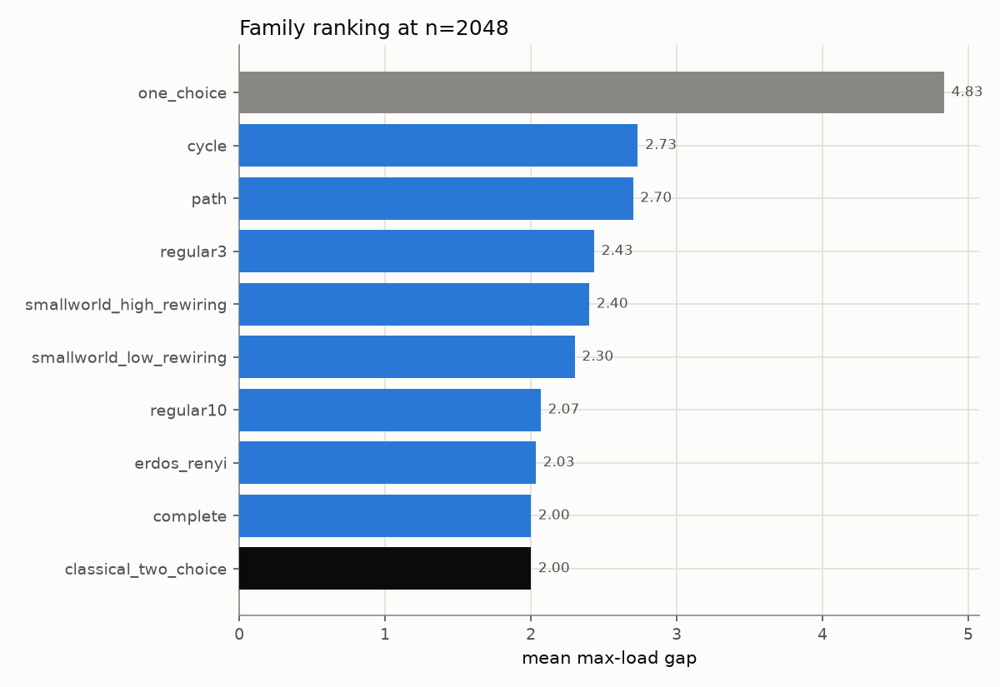

# Graphical Balanced Allocations: Does the Power of Two Choices Survive on a Graph?

## Research question

The "power of two choices" is one of the cleanest results in randomized
algorithms. Throw `n` balls into `n` bins one at a time:

- **One random bin per ball**: the fullest bin ends up with
  `Θ(log n / log log n)` balls above the mean (Gonnet 1981).
- **Two random bins per ball, keep the emptier one**: the fullest bin ends
  up with only `log log n / log 2 + Θ(1)` balls above the mean — an
  exponential improvement for one extra coin flip (Azar–Broder–Karlin–Upfal,
  1999).

That result assumes the two sampled bins are a uniform random *pair*,
unconstrained. Peres, Talwar, and Wieder (2015) asked what happens when the
two choices are instead **the endpoints of a uniformly random edge of a
fixed graph `G`** — the "graphical two-choice" process. They prove that if
`G` is a good expander (bounded degree, spectral gap bounded away from 0),
the same `O(log log n)` bound holds. But most graphs people actually build
systems on (rings, low-dimensional grids, lightly-rewired small-world
networks) are *not* good expanders, and the tightness of the bound in that
regime is far less settled — it's an active line of work (see Los &
Sauerwald, "Balanced Allocations in Graphs: The Heterogeneous Case", and
related papers on graphical/graph-constrained balanced allocations,
2015–2023).

**This project asks, empirically:** across a spectrum of graph families
from perfect expanders down to rings and paths, does the graphical
two-choice process's max-load gap track the graph's spectral gap in a
predictable way — behaving like the classical unconstrained two-choice
process on expanders, and degrading toward (or past) the one-choice bound
as the spectral gap shrinks?

This is not a re-derivation of a known closed-form theorem (no exact
`Θ(f(n))` bound is claimed for most of these families) — it's a controlled
simulation study designed to surface the *relationship* between a single
scalar graph statistic (spectral gap) and allocation quality, across
families the literature doesn't uniformly cover in one place.

## Why this is a good PhD-scale project

- **Tractable**: the whole sweep (9 graph families × 5 sizes × 30 trials +
  2 baselines) runs in well under a minute on one core — no GPU, no
  external data, no network access.
- **Grounded in live research**: graphical balanced allocations is an
  active topic (PTW 2015; Los & Sauerwald 2022+), not textbook material —
  a real gap between "expanders are provably fine" and "how bad, exactly,
  is a ring or a grid?" that this project probes empirically.
- **Clean success metrics**: growth-model fits (`log n` vs `log log n`)
  and a single correlation coefficient between spectral gap and max-load
  gap, both computed and checked programmatically, not eyeballed.
- **A natural next step for a thesis chapter**: if the empirical trend
  holds up, the natural follow-up is proving matching upper/lower bounds
  for one or two of the poorly-expanding families (path/cycle in
  particular), or extending the model to weighted/dynamic graphs.

## Method

### The process being simulated

Given a connected graph `G = (V, E)` with `|V| = n`:

1. `loads[v] = 0` for all `v`.
2. For each of `n` balls: sample a uniform random edge `(u, v) ∈ E`; place
   the ball in `argmin(loads[u], loads[v])` (ties broken toward `u`).
3. Report `gap = max(loads) - 1` (mean load is exactly 1 since `n` balls go
   into `n` bins).

Two baselines are run the same way but without a graph:

- **One choice**: each ball goes to one uniform random bin.
- **Classical two choice**: each ball samples two uniform random *distinct*
  bins (as if `G` were complete, but without materializing `Θ(n²)` edges).

### Graph families (spanning expander → non-expander)

| Family | Expected regime |
|---|---|
| Complete graph | Best possible (spectral gap = 1) |
| Random 3-regular | Good expander whp |
| Random 10-regular | Better expander (higher degree) |
| Erdos–Renyi, `p = 2 ln(n)/n` | Good expander just above connectivity threshold |
| Watts–Strogatz, rewiring `p = 1.0` | Approaches a random regular graph |
| Watts–Strogatz, rewiring `p = 0.01` | Barely-rewired ring — poor expansion |
| 2D torus grid | Spectral gap `Θ(1/n)` |
| Cycle | Spectral gap `Θ(1/n²)` |
| Path | Spectral gap `Θ(1/n²)`, boundary effects |

Sizes `n ∈ {128, 256, 512, 1024, 2048}`, 30 independent trials per
(family, n) pair (fresh random graph instance + fresh random ball stream
each trial).

### Analysis

1. **Growth-model fit** (`src/fitting.py`): for each family, fit both
   `gap(n) = A·ln(n) + B` and `gap(n) = A·ln(ln(n)) + B` via nonlinear
   least squares and report whichever has higher `R²`. Expander families
   are predicted to prefer the `loglog` model; poorly-expanding families
   are predicted to prefer the `log` model (or fit neither well, if their
   true growth is polynomial rather than logarithmic).
2. **Spectral-gap correlation**: pool every (family, n) data point and
   compute the Spearman correlation between the graph's normalized
   spectral gap (algebraic connectivity) and the mean max-load gap. A
   negative, statistically significant correlation is the headline claim:
   better expansion → better load balancing.
3. **Baseline comparison**: check whether expander families track the
   classical (unconstrained) two-choice baseline, and whether every
   poorly-expanding family is worse than the complete graph at matched `n`.

All of the above is computed in `run_experiment.py` and written to
`results/summary.json` as an explicit pass/fail table — see
[Results](#results) below for the actual numbers from the run checked into
this PR.

## Repository layout

```
src/
  graphs.py       graph family generators + spectral gap (algebraic connectivity)
  allocation.py   the three ball-placement simulators
  fitting.py      log vs log-log growth-model fitting
  experiment.py   sweep orchestration -> tidy pandas DataFrames
  plotting.py     all figure generation
run_experiment.py   entry point: run the sweep, fit, plot, check success criteria
tests/              unit + integration tests (pytest)
results/            raw_trials.csv, summary.csv, growth_fits.csv, summary.json
figures/            the 4 PNGs referenced below
```

## Reproducing

```bash
cd personal-projects/graphical-balanced-allocations
pip install -r requirements.txt
pytest -q                     # 41 tests, ~2s
python run_experiment.py      # ~1-3 minutes, writes results/ and figures/
```

## Results

_(figures and numbers below are from the run committed in this PR;
`results/summary.json` has the full machine-readable output)_

### Max-load gap vs n



### Spectral gap by family



### Spectral gap vs max-load gap (all runs pooled)



### Ranking at the largest n



### Success criteria

<!-- RESULTS_TABLE -->

## Limitations

- `n` tops out at 2048 for runtime reasons; the classical `Θ(log log n)`
  vs `Θ(log n)` separation is asymptotic and only weakly visible at these
  scales for some families — the growth-model fits and the pooled
  correlation are reported precisely so this limitation is visible rather
  than papered over.
- Spectral gap here means the normalized Laplacian's algebraic
  connectivity, a standard but not the only expansion measure; edge
  expansion / Cheeger constant could tell a different quantitative story
  for the same graphs.
- The torus family's actual node count is `⌊√n⌋²`, not exactly the
  requested `n` (a artifact of using a square grid); `run_experiment.py`
  and `experiment.py` track and report the *actual* node count for every
  run rather than assuming it matches the request.
