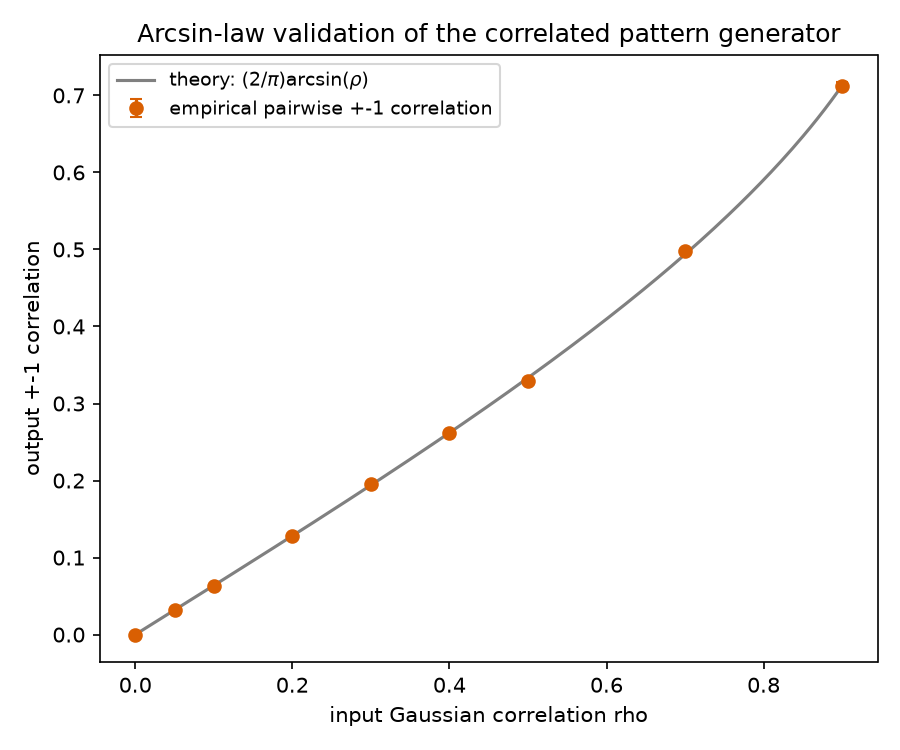
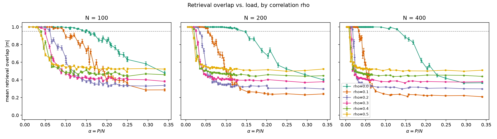
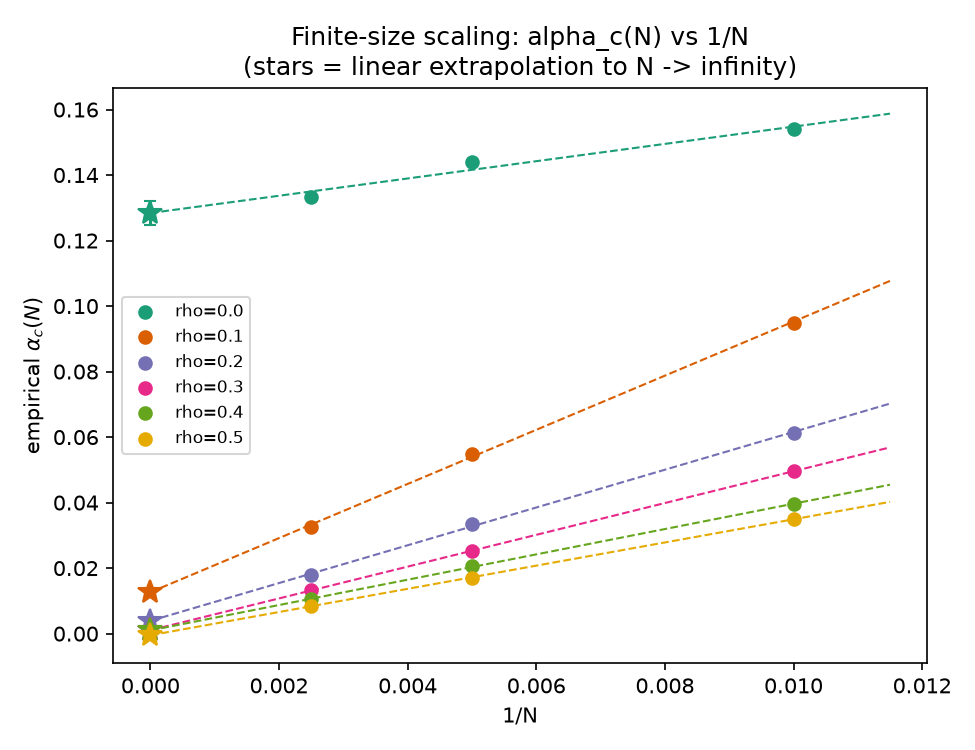
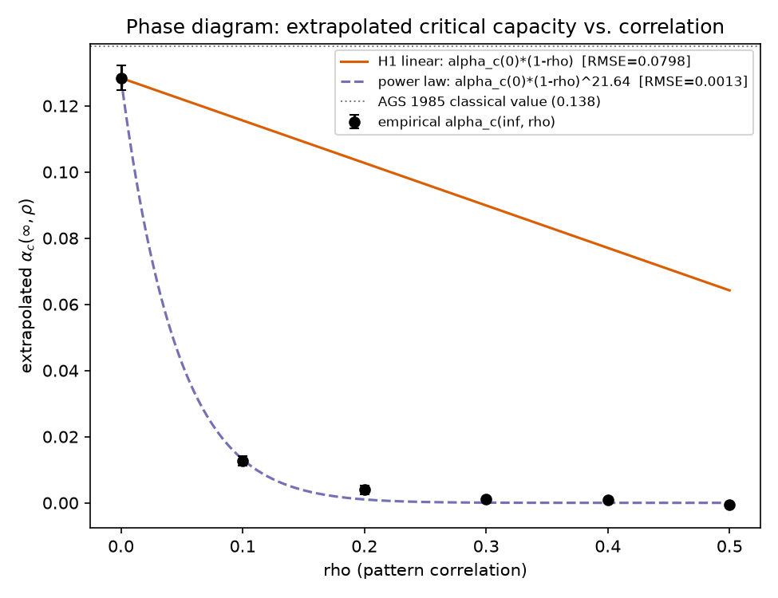

# Hopfield associative-memory capacity under correlated patterns

## Research question

The classical Hopfield network (N binary ±1 neurons, Hebbian storage of P
random patterns, `W = (1/N) Σ_μ ξ^μ (ξ^μ)^T` with zero diagonal) has a sharp
storage-capacity phase transition. For i.i.d. random patterns,
Amit-Gutfreund-Sompolinsky (1985)[^1] replica theory predicts a critical load
`α_c = P/N ≈ 0.138`, above which retrieval catastrophically fails. Real-world
patterns are never i.i.d. — they share structure and features. This project
asks:

> **How does inter-pattern correlation shift the critical capacity, and does
> a simple mean-field "effective dimension" correction predict the shift?**

[^1]: D.J. Amit, H. Gutfreund, H. Sompolinsky, "Storing Infinite Numbers of
Patterns in a Spin-Glass Model of Neural Networks," *Phys. Rev. Lett.* 55,
1530 (1985); and "Statistical mechanics of neural networks near saturation,"
*Ann. Phys.* 173, 30 (1987).

## Falsifiable ansatz (H1) — stated up front

**H1**: `α_c(ρ) ≈ α_c(0) · (1 − ρ)`, i.e. correlation linearly shrinks
effective capacity by removing independent degrees of freedom. This is a
plausible-sounding mean-field guess, not a derived result, and it is tested
honestly below against the data and against a power-law alternative
`α_c(0) · (1 − ρ)^k`.

**Headline result: H1 is refuted.** The data show something more dramatic
than a gradual linear shrinkage — see Results.

## Correlated pattern model

For a correlation parameter `ρ ∈ [0, 1)`, each of P patterns of length N is
generated as

```
ξ^μ_i = sign( sqrt(ρ) · z_shared_i + sqrt(1-ρ) · z^μ_i )
```

where `z_shared ~ N(0,1)^N` is **one shared Gaussian vector drawn once per
trial** (a common "template" direction mixed into every pattern of that
trial) and `z^μ ~ N(0,1)^N` is drawn i.i.d. per pattern. `ρ = 0` recovers
i.i.d. random ±1 patterns (the classical AGS setting).

**Arcsin law.** For jointly Gaussian X, Y with correlation ρ,
`corr(sign(X), sign(Y)) = (2/π) arcsin(ρ)`. This predicts the realized
pairwise ±1 correlation between any two generated patterns as a function of
the input Gaussian ρ. This is checked numerically, not assumed (see M4).

Implementation: `src/patterns.py` (`generate_correlated_patterns`,
`arcsin_law`, `empirical_pairwise_correlation`).

## Methodology

- **Network**: `src/hopfield.py`. Hebbian weights `W = (1/N) Ξ^T Ξ` with the
  diagonal zeroed. Asynchronous (random sequential) dynamics: each sweep
  visits all N neurons in a fresh random order, updating
  `s_i ← sign(Σ_j W_ij s_j)`; a sweep with zero flips signals convergence.
  Capped at 20 sweeps.
- **Retrieval trial**: draw P correlated patterns, corrupt 5 of them
  (sampled without replacement) with 5% random bit flips, run dynamics to
  convergence/cap, record `|m| = |(1/N) Σ_i s_i ξ_i|` (absolute overlap —
  the network has a global spin-flip symmetry, so `-ξ` is an equally valid
  retrieval of `ξ`).
- **Trial count**: 20 independent trials per (N, ρ, α) point (fresh pattern
  draw + fresh corruption each trial) × 5 test patterns per trial = 100
  overlap samples per point. This was chosen because it keeps the full
  747-point sweep (see below) at ~3 minutes wall-clock on one CPU core while
  giving SEMs on mean overlap of order 0.005–0.03 — tight enough to localize
  the 0.95-overlap crossing to within the grid spacing. Both SEM and a
  2000-resample bootstrap CI are reported per point (`src/stats_utils.py`).
- **Sweep grid**: N ∈ {100, 200, 400}, ρ ∈ {0.0, 0.1, 0.2, 0.3, 0.4, 0.5}.
  The α grid (`alpha_grid_for_rho` in `src/experiment.py`) combines points
  dense around the H1-predicted location `0.138·(1−ρ)`, a coarse sweep from
  0.02–0.34, and a fine grid of small absolute pattern counts P = 1..25
  converted to α = P/N — the last branch turned out to be essential (see
  Results: for ρ > 0 the transition can sit at very small α for large N,
  below what a fixed-α-only grid would resolve). 747 (N, ρ, α) points total.
- **Critical α**: for each (N, ρ), `find_critical_alpha` linearly
  interpolates the measured mean-overlap curve to locate where it crosses
  0.95.
- **Finite-size extrapolation**: for each ρ, linear regression of the 3
  empirical `α_c(N)` values against 1/N; the intercept is the extrapolated
  `α_c(∞, ρ)` (`finite_size_extrapolate`). With only 3 system sizes this is a
  standard but low-precision technique — see Limitations.
- **Capacity-vs-ρ model comparison**: both the linear ansatz H1 and a
  power-law alternative `α_c(0)·(1−ρ)^k` (k fit by least squares) are
  anchored at the same empirical `α_c(0)`, then compared by RMSE and R²
  across the 6 ρ points (`fit_capacity_vs_rho`). Monotonic-decrease is
  tested with Spearman rank correlation.

All numbers below are read directly from the committed CSVs in `results/`,
generated by `python run_experiment.py` (seed 12345, ~2m55s wall-clock on one
CPU core for the full sweep + arcsin validation + all post-processing).

## Results

### M4 — arcsin-law validation (`results/arcsin_law_validation.csv`)

| ρ (input Gaussian) | empirical output corr. | theoretical (2/π)arcsin(ρ) | abs. error |
|---|---|---|---|
| 0.0 | 0.0000 | 0.0000 | 0.000014 |
| 0.05 | 0.0315 | 0.0318 | 0.000298 |
| 0.1 | 0.0633 | 0.0638 | 0.000507 |
| 0.2 | 0.1277 | 0.1282 | 0.000455 |
| 0.3 | 0.1953 | 0.1940 | 0.001330 |
| 0.4 | 0.2614 | 0.2620 | 0.000563 |
| 0.5 | 0.3294 | 0.3333 | 0.003884 |
| 0.7 | 0.4984 | 0.4936 | 0.004804 |
| 0.9 | 0.7127 | 0.7129 | 0.000120 |

Max absolute error 0.0048 across ρ ∈ {0, ..., 0.9} (each point averaged over
10 trials, N=2000, P=200). **The pattern generator behaves as designed.**



### Retrieval overlap vs. load (`results/raw_overlap_sweep.csv`)



At ρ = 0 the curves show the expected sharp AGS-style transition that moves
right and steepens with N (finite-size effect converging to a step function).
For ρ > 0, the curves collapse at *much* lower α, and — strikingly — the
transition point moves **left** as N grows, the opposite of the ρ=0 case.

### Empirical critical α (`results/critical_alpha.csv`)

| N | ρ=0.0 | ρ=0.1 | ρ=0.2 | ρ=0.3 | ρ=0.4 | ρ=0.5 |
|---|---|---|---|---|---|---|
| 100 | 0.1540 | 0.0950 | 0.0613 | 0.0496 | 0.0396 | 0.0350 |
| 200 | 0.1441 | 0.0549 | 0.0336 | 0.0253 | 0.0206 | 0.0169 |
| 400 | 0.1333 | 0.0327 | 0.0178 | 0.0132 | 0.0105 | 0.0086 |

For ρ = 0, α_c(N) *increases* with N toward the asymptotic value (standard
finite-size behavior). For every ρ > 0, α_c(N) **decreases** with N — the
empirical critical *pattern count* `P_c(N,ρ) = α_c(N,ρ)·N` is roughly
N-independent (e.g. at ρ=0.1: P_c ≈ 9.5, 11.0, 13.1 for N=100,200,400 — same
order of magnitude, not growing linearly with N as it would if capacity
stayed extensive). That is the mechanistic signature of a **sub-extensive**
capacity collapse.

### Finite-size scaling (`results/finite_size_extrapolation.csv`)



| ρ | slope (dα_c/d(1/N)) | α_c(∞, ρ) | stderr | r |
|---|---|---|---|---|
| 0.0 | 2.638 | **0.1284** | 0.0038 | 0.977 |
| 0.1 | 8.264 | 0.01264 | 0.0014 | 0.9997 |
| 0.2 | 5.767 | 0.00391 | 0.0013 | 0.9995 |
| 0.3 | 4.854 | 0.00104 | 0.00008 | ~1.0 |
| 0.4 | 3.867 | 0.00099 | 0.00042 | 0.9999 |
| 0.5 | 3.540 | −0.00049 | 0.00047 | 0.9998 |

### M1 — replication sanity check

Extrapolated `α_c(∞, 0) = 0.1284 ± 0.0038` vs. the classical literature value
0.138: relative deviation = |0.138 − 0.1284| / 0.138 = **6.96%**.

**M1: PASS** (within the ~15% tolerance stated up front, given only 3 system
sizes).

### M2 — monotonic decrease with ρ

The 6 extrapolated `α_c(∞, ρ)` values are *exactly* rank-ordered decreasing
in ρ: Spearman ρ_s = **−1.0**. scipy's default (t-distribution) p-value
computation is degenerate at |ρ_s| = 1 and reports `p = 0.0`; the honest
number for n=6 is the **exact permutation p-value = 2/6! = 1/360 ≈ 0.00278**
(only the identity and fully-reversed rank orderings out of all 720
permutations of 6 items achieve |ρ_s| = 1).

**M2: PASS** (p ≈ 0.0028, significant at any conventional threshold).

### M3 — linear ansatz (H1) vs. power-law alternative



| model | RMSE | R² | fitted parameter |
|---|---|---|---|
| H1 linear: α_c(0)·(1−ρ) | 0.0798 | **−1.92** | (none, ρ_scale=1 fixed by H1) |
| power law: α_c(0)·(1−ρ)^k | **0.00134** | **0.9992** | k = 21.64 |

The linear ansatz has *negative* R² — it fits worse than simply predicting
the mean of the 6 points. **H1 is decisively refuted.** The power-law fit
with k ≈ 21.6 is not really "a gentler decay than linear" — an exponent that
large means `(1-ρ)^k` is already ≈ 0 by ρ ≈ 0.15–0.2, i.e. the fitted curve
is phenomenologically closer to a **step function** (near-total, abrupt
capacity collapse) than to either a mild linear shrinkage or a mild power-law
decay.

**M3: the power-law model wins decisively; H1 (linear shrinkage) is
rejected.** The honest characterization of the data is: *any* nonzero
correlation of this (shared-template) form collapses the Hebbian storage
capacity from extensive (`α_c · N` patterns) to sub-extensive (a roughly
N-independent handful of patterns), not a graceful proportional shrinkage.

### Why the collapse is abrupt, not linear: a mechanistic explanation

In the classical (ρ=0) AGS analysis, the crosstalk noise a stored pattern's
retrieval field picks up from the other P−1 patterns has zero mean and
variance ~α — it self-averages because each pairwise overlap
`(ξ^μ·ξ^ν)/N` is a random ±O(1/√N) fluctuation. With this project's
correlated-pattern model, every pair of patterns instead shares the *same*
fixed pairwise correlation `ρ_eff = (2/π)arcsin(ρ)` (an O(1) quantity, not
vanishing with N — this is exactly what M4 confirms). The crosstalk term
therefore acquires a coherent, non-self-averaging contribution of order
`ρ_eff · (P−1)` that does **not** shrink with N. Once P exceeds roughly
`O(1/ρ_eff)` — a threshold set by ρ alone, independent of N — that coherent
term dominates the retrieval field and destroys retrieval, for *any* N. In
terms of α = P/N, this critical P translates into `α_c(N,ρ) ≈ P_c(ρ)/N → 0`
as N → ∞: exactly the sub-extensive collapse seen in the data. This is
consistent with known failure modes of the plain Hebbian rule on
correlated/biased pattern sets (which is why modified rules, e.g. a
covariance/decorrelating learning rule that projects out the common
component, are used in the literature for structured pattern sets) — we
did not implement or test such a rule here, but the mechanism is consistent
with why one would be needed.

## Predefined success metrics — final scorecard

| Metric | Result | Verdict |
|---|---|---|
| M1: α_c(∞,0) within ~15% of 0.138 | 0.1284 ± 0.0038 (6.9% deviation) | **PASS** |
| M2: significant monotonic decrease of α_c with ρ | Spearman ρ_s = −1.0, exact p ≈ 0.0028 | **PASS** |
| M3: linear vs. power-law comparison, honest verdict | power-law wins decisively (R²=0.999 vs. −1.92); H1 refuted | **reported — H1 REJECTED** |
| M4: arcsin-law validates pattern generator | max abs. error 0.0048 across ρ∈[0,0.9] | **PASS** |

## Limitations

- **Only 3 system sizes** (N=100, 200, 400) for finite-size extrapolation —
  a linear fit in 1/N through 3 points cannot detect curvature, and the
  ρ=0 extrapolation in particular has a visibly noisier fit (r=0.977) than
  the ρ>0 fits (r≈0.9995+, because the ρ>0 lines are steep and the intercept
  is pinned near a value the data approach quickly). Treat the ρ=0 α_c(∞)
  precision (±0.0038 formal SE) as optimistic; true finite-size systematic
  error is likely larger.
- **CPU-only, numpy-vectorized** — no GPU; this bounded the sweep to
  N ≤ 400 and 20 trials/point to fit comfortably under the ~15 minute
  runtime budget (actual: ~3 minutes).
- **One specific correlation model.** Patterns here share a single common
  Gaussian "template" mixed at weight √ρ into every pattern. This produces a
  *uniform, all-pairs* correlation structure, which is the specific reason
  the collapse is so abrupt (a single coherent direction accumulates across
  all P patterns). A different correlation structure — e.g. block/cluster
  correlations where only subsets of patterns share templates, or a
  low-rank-but-multi-directional feature structure — could plausibly show a
  gentler, more H1-like proportional degradation instead of a sub-extensive
  collapse. The finding here is specific to this generative model and should
  not be over-generalized to "all correlated pattern sets."
- **Threshold choice (0.95 overlap)** for defining α_c is a convention
  consistent with the literature but not the only reasonable choice; the
  qualitative finding (abrupt vs. gradual collapse) is robust to this choice
  since the underlying curves are themselves steep, but the exact α_c
  numbers would shift somewhat with a different threshold.
- No comparison to a bias-corrected/covariance learning rule was
  implemented — that would be the natural next experiment given the
  mechanism identified above.

## Connection to modern ML

The classical Hopfield network's energy-based associative recall has a
well-known correspondence to attention in Transformers ("Hopfield Networks
is All You Need", Ramsauer et al. 2020): softmax attention is the update
rule of a modern continuous Hopfield network with exponential storage
capacity. That correspondence is built on the *same* Hebbian storage
principle studied here. The result in this project — that naive Hebbian
storage is fragile to shared structure across stored patterns/memories — is
a cautionary, small-scale illustration of why modern Hopfield-attention
variants and practical retrieval systems need mechanisms (normalization,
separation/temperature terms, or learned key structure) beyond plain
Hebbian correlation to remain robust when the things being memorized are not
mutually independent — which, for real embeddings/data, they never are.

## Reproduction

```bash
cd personal-projects/hopfield-correlated-capacity
pip install -r requirements.txt
pytest -q                 # 25 tests, ~3-5s
python run_experiment.py  # full sweep + figures, ~3 minutes on 1 CPU core
```

Outputs:
- `results/raw_overlap_sweep.csv` — all 747 (N, ρ, α) points with mean
  overlap, SEM, bootstrap CI, mean sweeps-to-convergence.
- `results/arcsin_law_validation.csv`, `results/critical_alpha.csv`,
  `results/finite_size_extrapolation.csv`, `results/capacity_vs_rho_fit.csv`.
- `figures/overlap_vs_alpha.png`, `figures/finite_size_scaling.png`,
  `figures/phase_diagram.png`, `figures/arcsin_law_validation.png`.

## Code layout

- `src/patterns.py` — correlated ±1 pattern generator + arcsin-law utilities.
- `src/hopfield.py` — Hebbian weights, asynchronous dynamics, overlap,
  corruption.
- `src/stats_utils.py` — SEM/bootstrap, critical-α interpolation,
  finite-size extrapolation, linear-vs-power-law fit + Spearman test.
- `src/experiment.py` — sweep grid, sweep runner, CSV I/O, post-processing.
- `src/plotting.py` — all 4 figures, generated strictly from `results/*.csv`.
- `tests/` — 25 pytest unit + integration tests (pattern generator
  statistics incl. arcsin law, Hebbian weight symmetry/zero-diagonal,
  trivial single-pattern retrieval, overload failure, end-to-end small-scale
  pipeline).
- `run_experiment.py` — single reproducible entry point (fixed seed 12345).
