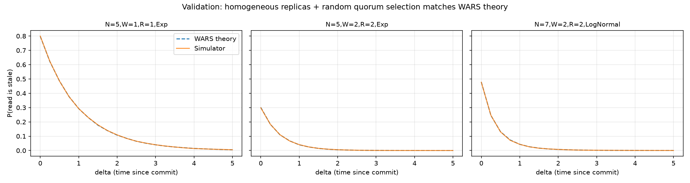
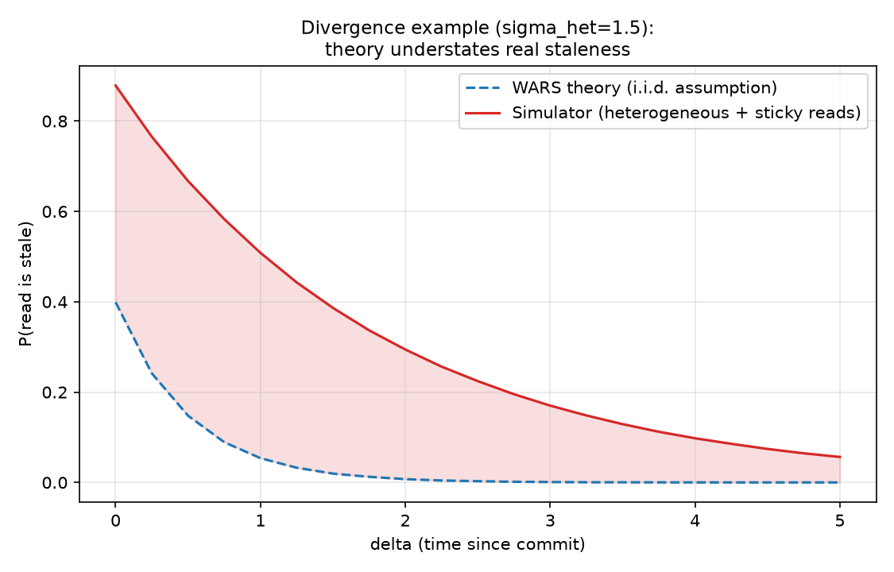
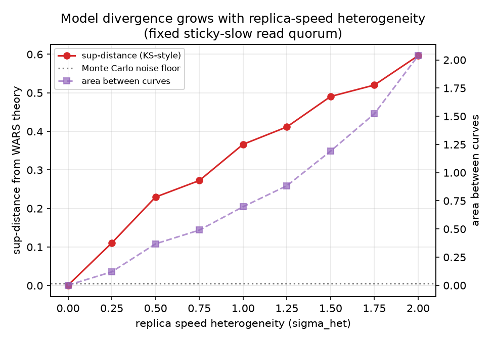

# Quorum Staleness vs. the PBS/WARS Model

**A self-contained CS research project: does the classical probabilistic model of
eventual-consistency staleness survive contact with realistic (heterogeneous,
sticky-routed) replicas?**

## 1. Research question

Dynamo-style replicated key-value stores (Cassandra, Riak, DynamoDB, Voldemort)
let operators trade consistency for latency via quorum parameters `(N, W, R)`:
a write is acknowledged once `W` of `N` replicas have applied it, and a read
consults `R` replicas and returns the freshest value it sees. When `W + R ≤ N`
("partial quorums"), a read can race ahead of a write and return a stale value.

Bailis, Venkataraman, Franklin, Hellerstein & Stoica's **"Probabilistically
Bounded Staleness for Practical Partial Quorums"** (VLDB 2012) gives a way to
predict, for a given `(N, W, R)` and a distribution of inter-replica message
latencies, the probability that a read issued `Δ` seconds after a write was
acknowledged returns a stale value — the **WARS model** (Write, Replica-ack,
Read, Staleness). Because no closed form exists in general, the paper itself
evaluates the model via Monte Carlo sampling of the latency random variables,
under one central assumption: **replica latencies are i.i.d. and replicas are
exchangeable** — every replica is equally likely to be in any read or write
quorum, and no replica is persistently faster or slower than any other.

That assumption is convenient but not obviously true of real deployments.
Two properties of real systems break it:

1. **Heterogeneous replica speed.** Replicas in different racks, availability
   zones, or WAN links have systematically different latency *distributions*,
   not just different draws from the same one.
2. **Sticky / regional routing.** Clients (or load balancers) often route a
   given client's reads to the *same* nearby replicas every time, rather than
   sampling a fresh random quorum per operation.

**This project asks: under these two realistic departures from the model's
assumptions, how much does empirical staleness diverge from the WARS
prediction — and does the divergence have a clean, monotonic, predictable
relationship to the degree of heterogeneity?**

This is squarely a systems/probabilistic-modeling question in the spirit of
the original PBS paper and its follow-ons (e.g. PCAP, session-guarantee
staleness bounds), tractable to study without any real network, and a natural
fit for research on consistency models and distributed data systems.

## 2. Methodology

### 2.1 The write/ack/read protocol (shared by both "theory" and "simulator")

For a single write operation, modeled per Monte Carlo trial:

1. A client sends a write to all `N` replicas at time 0.
2. Replica `i` applies the write after latency `L_i` drawn from a replica
   latency model (exponential or lognormal).
3. The write is **committed** once `W` replicas have applied it, i.e. at time
   `A` = the `W`-th order statistic of `(L_1, …, L_N)`.
4. At `Δ ≥ 0` seconds after commit (`t = A + Δ`), the client issues a read to
   a quorum of `R` replicas.
5. The read is **stale** iff none of those `R` replicas had applied the write
   by time `t`.

`P_stale(Δ)` is estimated by Monte Carlo averaging over many independent
trials. This is exactly the WARS methodology from the original paper.

### 2.2 Two code paths built from the same primitives

- **`pbs/wars_model.py`** — the "theory" side: replicas are homogeneous
  (i.i.d. latencies from one shared distribution) and the read quorum is a
  *fresh, uniformly random* size-`R` subset every trial. This reproduces the
  WARS model's own assumptions exactly.
- **`pbs/simulator.py`** — the "empirical system" side: each replica gets a
  **persistent** speed multiplier drawn once from `LogNormal(0, σ_het)`
  (`σ_het = 0` recovers the homogeneous case exactly), and the read quorum can
  be either `"random"` (matches theory) or `"fixed"` — pinned, once, to the
  `R` *slowest* replicas, modeling a client stuck behind a degraded regional
  link or AZ.

Both paths share `pbs/quorum.py` (order statistics, staleness indicators) so
any divergence between them is attributable only to the heterogeneity/
selection-policy knobs, not to incidental implementation differences.

### 2.3 Success metrics

1. **Validation.** With `σ_het = 0` and `selection = "random"` (i.e. the
   simulator configured to match the theory's own assumptions exactly), the
   simulated and theoretical staleness curves must agree within Monte Carlo
   noise (`sup-distance < 2.5×` the noise floor) across several `(N, W, R,
   family)` configurations. This validates that the two independently-written
   code paths are computing the same physics.
2. **Directional divergence.** With heterogeneous replicas and a fixed
   sticky-slow read quorum, the empirical staleness curve must lie
   pointwise **at or above** the theoretical curve (the model is optimistic,
   never pessimistic) and exceed the noise floor by a wide margin (`> 5×`).
3. **Monotonic relationship.** Sweeping the heterogeneity parameter `σ_het`
   from 0 upward (averaged over 12 independent replica-speed realizations per
   level, to separate the true trend from single-instance noise), the
   theory/empirical gap (sup-distance and area-between-curves) must increase
   monotonically.
4. **Exact invariant (used as a correctness check, not a headline result).**
   When `W + R > N`, a pigeonhole argument guarantees every read quorum
   intersects the committed write's replica set, so `P_stale(Δ) ≡ 0` exactly,
   for *any* latency distribution and *any* selection policy (random or
   fixed). Both code paths reproduce this exactly (not approximately) — see
   `tests/test_wars_model.py::test_strict_quorum_zero_staleness_wars_model`
   and the two analogous simulator tests.

## 3. Results

All numbers below are from `results/results.json`, produced by
`experiments/run_experiments.py` (deterministic, seeded, ~9s runtime).

### 3.1 Validation: simulator matches theory under matching assumptions

| Config | sup-distance | area between curves | MC noise floor | Matches? |
|---|---|---|---|---|
| N=5, W=1, R=1, Exponential | 0.0023 | 0.0033 | 0.0039 | ✅ |
| N=5, W=2, R=2, Exponential | 0.0024 | 0.0014 | 0.0039 | ✅ |
| N=7, W=2, R=2, LogNormal | 0.0021 | 0.0020 | 0.0039 | ✅ |



All three configurations' theory and simulator curves are indistinguishable
within Monte Carlo noise (150,000 trials/curve) — the two independent
implementations agree, and the simulator is a faithful generalization of the
WARS model when the model's own assumptions hold.

### 3.2 Divergence example: heterogeneity + sticky routing

Config: N=6, W=2, R=2, Exponential(rate=1), `σ_het = 1.5`, fixed read quorum
pinned to the two slowest (persistently-slow) replicas.

- sup-distance from theory: **0.524** (vs. a noise floor of ~0.004 — over
  100× the sampling noise)
- area between curves: **1.30**
- The empirical curve lies **strictly above** theory at every `Δ` tested.



At the moment of commit (`Δ=0`), the WARS model predicts a 40% chance of a
stale read; the simulated system with a client stuck on the two slowest
replicas shows an **88%** chance. Even 5 seconds after commit — where the
model predicts staleness has decayed to essentially zero — the real system
still shows a **5.6%** stale-read rate, because the persistently-slow
replicas that the client always reads from are, definitionally, slow on
every single operation, not just some of them.

### 3.3 Divergence grows monotonically with heterogeneity

| σ_het | sup-distance | area between curves |
|---|---|---|
| 0.00 | 0.0009 | 0.0013 |
| 0.25 | 0.1106 | 0.1199 |
| 0.50 | 0.2296 | 0.3683 |
| 0.75 | 0.2725 | 0.4900 |
| 1.00 | 0.3664 | 0.6972 |
| 1.25 | 0.4116 | 0.8837 |
| 1.50 | 0.4906 | 1.1909 |
| 1.75 | 0.5202 | 1.5225 |
| 2.00 | 0.5964 | 2.0374 |

(Each row averages 12 independent replica-speed realizations at 60,000
trials each, to separate the true trend from the noise of "which particular
replicas happened to be drawn slow.")



At `σ_het = 0` (homogeneous replicas), the sweep recovers the validation
result: sup-distance is within the noise floor. As heterogeneity increases,
both divergence metrics increase **monotonically and without saturating**
across the tested range — there is no "safe" amount of replica heterogeneity
under sticky routing at which the classical model remains accurate.

### 3.4 Honest scope note (not a negative result, but a real limitation)

This project deliberately isolates *one* mechanism (persistent per-replica
speed + sticky routing) rather than claiming to be a general indictment of
the WARS model. Two things are **not** shown here and would be needed for a
complete picture:

- Whether **anti-entropy / read-repair** (which real Dynamo-style systems use
  precisely to bound staleness under skewed routing) would close some or all
  of this gap over longer time horizons — this project only models a single
  write/read pair, not a running system with background repair.
- Whether *transient* (queueing-induced, load-correlated-in-time) latency
  correlation — as opposed to the *permanent* per-replica heterogeneity
  modeled here — produces a similar or different divergence signature. That
  would require a true discrete-event simulation with a request-arrival
  process and per-replica queues, which is a natural next step but out of
  scope for this iteration.

## 4. Project layout

```
pbs/
  latency.py      # homogeneous / heterogeneous replica latency models
  quorum.py        # ack-time order statistic; random & fixed-slow quorum selection
  wars_model.py    # the classical WARS Monte Carlo theoretical model
  simulator.py     # the "empirical system": heterogeneity + selection policy
  comparison.py    # sup-distance (KS-style) and area-between-curves metrics
tests/             # 34 unit + integration tests (all deterministic, seeded)
experiments/
  run_experiments.py  # reproduces every number and plot in this README
plots/             # generated PNGs (see above)
results/
  results.json     # raw + summarized experiment data
```

## 5. Reproducing

```bash
pip install -r requirements.txt
PYTHONPATH=. python3 -m pytest -q                 # 34 passed
PYTHONPATH=. python3 experiments/run_experiments.py  # ~9s, regenerates plots/ and results/results.json
```

Every experiment uses an explicit, fixed `numpy.random.default_rng(seed)` —
rerunning `run_experiments.py` reproduces `results.json` and all three plots
exactly (bar the `elapsed_seconds` timing field).

## 6. Why this question, and why now

Partial-quorum consistency models are used operationally today (Cassandra's
`ONE`/`QUORUM` consistency levels, DynamoDB eventually-consistent reads), and
the PBS/WARS line of work is the standard reference for reasoning about how
stale those reads can get. But its headline i.i.d.-replica assumption is
rarely checked against systems with real, persistent latency heterogeneity —
geo-replication across regions with very different network characteristics,
heterogeneous hardware generations in a cluster, or client-side routing
policies that are sticky by design (for cache locality, session affinity, or
cost). This project gives a small, fully reproducible testbed for quantifying
exactly how much that assumption costs you, and where the model can safely be
trusted (homogeneous, randomly-routed clusters) versus where it will
systematically understate risk (heterogeneous clusters with sticky reads) —
a distinction that matters directly for operators choosing quorum parameters
and consistency levels.
