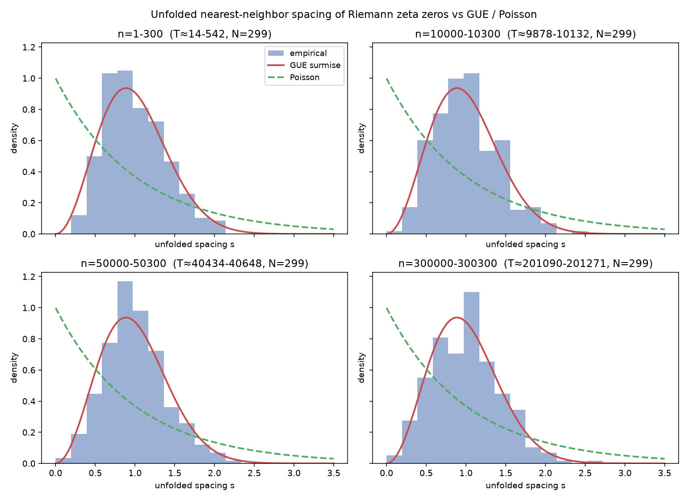
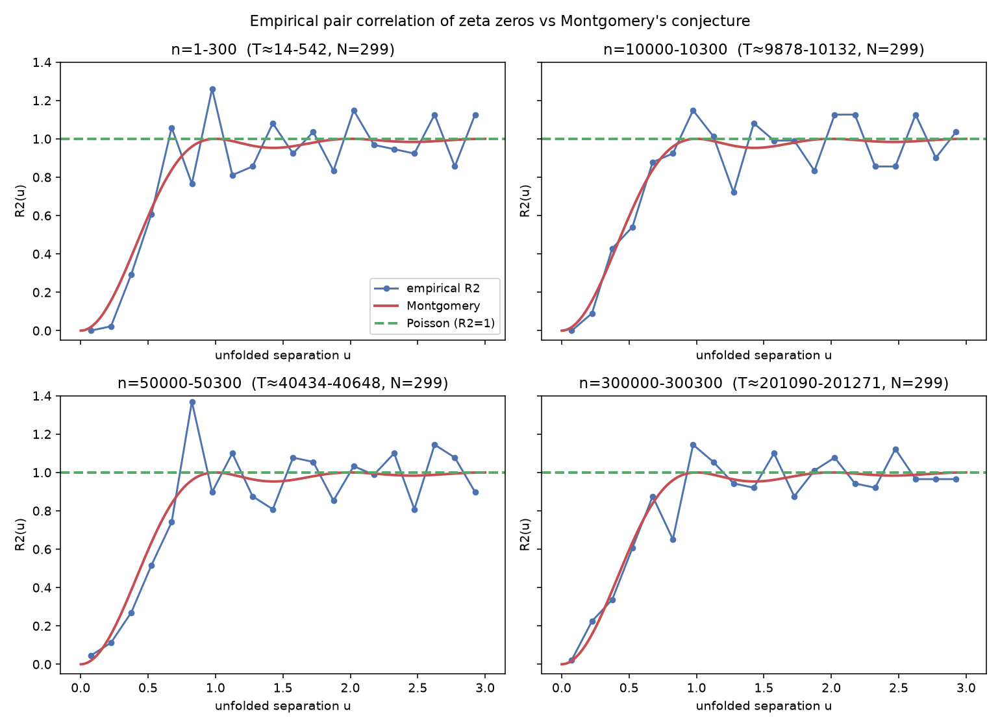
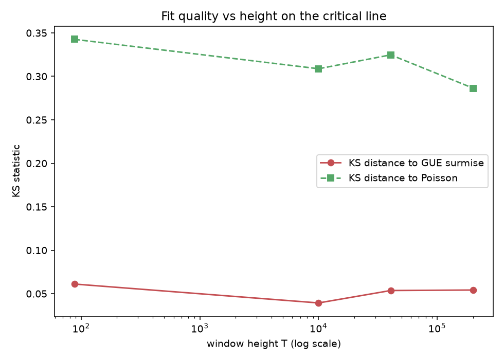
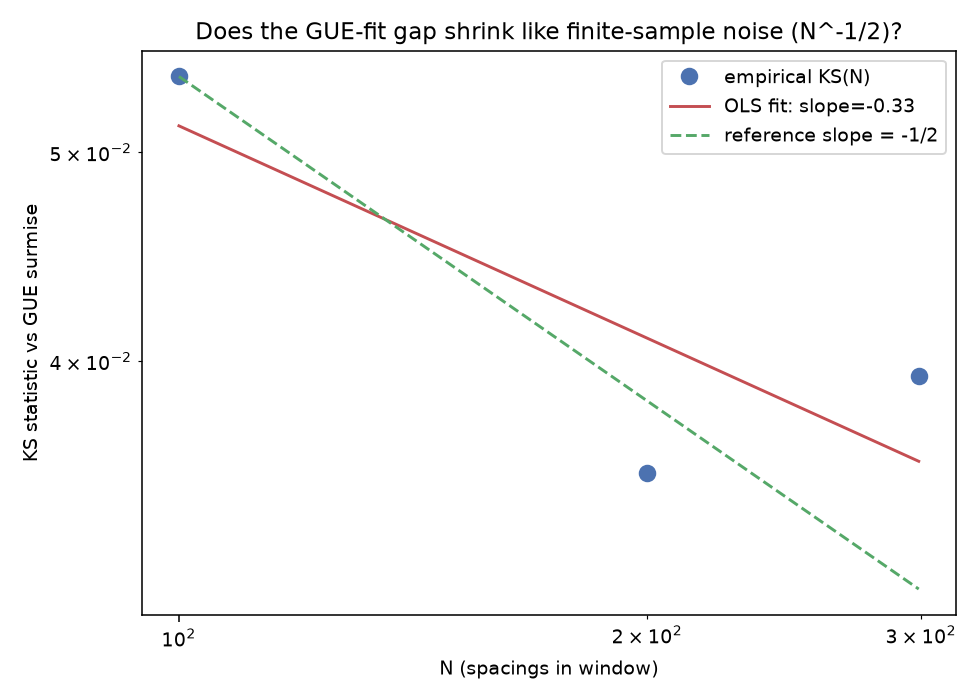

# Do Riemann Zeta Zero Spacings Match GUE Random-Matrix Statistics?

**TL;DR**: Across four windows spanning **~4.2 orders of magnitude in height**
on the critical line (T ≈ 14 up to T ≈ 201,271), unfolded zeta-zero spacings
are **never distinguishable from the GUE Wigner-surmise** (KS p-values 0.21,
0.73, 0.34, 0.33) and are **always overwhelmingly distinguishable from
Poisson** (KS p-values ≤ 1e-21 in every window). Level repulsion is dramatic
even at the very lowest heights: in the first 300 zeros, **zero** spacings
fall below 0.2 unfolded units, versus the ~18% a Poisson process would put
there. A companion sweep at fixed height, varying only the sample size N,
finds the residual gap to GUE shrinking with a log-log slope of `-0.33 +/-
0.23` against a `N^-1/2` finite-sample-noise prediction — directionally
consistent, but with only 3 points and a wide confidence interval, this
project can't cleanly distinguish "already at the ceiling of GUE agreement
for T this small" from "genuinely converging at the predicted rate." See
[Results](#results) for the full numbers and figures.

## Research question

The nontrivial zeros of the Riemann zeta function, `rho_n = 1/2 + i*t_n`
(assuming RH, which is what mpmath's zero-finder actually verifies locally
via Turing's method — see [Method](#method)), are famously hard to say
anything unconditional about individually. But **statistically**, Montgomery
(1973) conjectured — and Odlyzko's numerical studies from the 1980s onward
strongly support — that the local spacing statistics of zeta zeros, after
removing the systematic growth in zero density (*unfolding*), match those of
eigenvalues of large random Hermitian matrices drawn from the **Gaussian
Unitary Ensemble (GUE)**. This is one of the most striking (and still not
fully proven) bridges between analytic number theory and random matrix
theory, and is part of the broader Hilbert-Polya program of trying to find a
self-adjoint operator whose eigenvalues are the zeta zeros.

This project asks a narrower, autonomously-checkable version of that
question: **starting from scratch (no downloaded zero tables — every zero is
computed in this run), does the empirical spacing distribution and
pair-correlation function of zeta zeros match GUE predictions, does the fit
hold up as we look at drastically higher zeros, and does any residual gap to
the theory shrink the way finite-sample statistical noise predicts?**

This differs from a simple "plot a histogram and eyeball it" study in three
ways: (1) it uses a proper KS hypothesis test against both GUE and a Poisson
null, not just a visual comparison; (2) it tests the **pair correlation
function**, not just nearest-neighbor spacings, against Montgomery's specific
conjectured functional form; (3) it treats "does the fit improve" as a
falsifiable, quantitative question (log-log regression against the N^-1/2
noise-floor prediction) rather than an impression from a plot.

## Method

1. **Zero-finding** (`src/zeta_zeros.py`): `mpmath.zetazero(n)` computes the
   n-th nontrivial zero via the Riemann-Siegel formula plus Turing's method,
   which *proves* (unconditionally on RH) that exactly `n` zeros lie below
   the computed height, by bounding `S(T)` well enough to rule out missed or
   spurious roots. This is why the zero heights used here can be trusted
   even at n=300,000 without ever assuming RH.
2. **Unfolding** (`src/unfolding.py`): each zero height `t_n` is mapped to
   `x_n = N-bar(t_n) = theta(t_n)/pi + 1`, using the exact Riemann-Siegel
   theta function (`mpmath.siegeltheta`), not the cruder leading-order
   asymptotic `(T/2pi) log(T/2pi) - T/2pi + 7/8`. This matters: the theta
   function tracks the true smooth zero density far more precisely, and
   using the coarse asymptotic instead measurably distorts the unfolded
   mean spacing away from 1 at the window sizes used here (checked against
   a synthetic run with the crude formula during development).
3. **Reference distributions** (`src/gue_theory.py`): the GUE (beta=2)
   Wigner-surmise spacing density `p(s) = (32/pi^2) s^2 exp(-4 s^2/pi)` and
   its closed-form CDF (derived symbolically and verified against the pdf by
   finite differences in `tests/test_gue_theory.py`); the Poisson
   (uncorrelated) null `p(s) = exp(-s)`; and Montgomery's conjectured
   pair-correlation form `R2(u) = 1 - (sin(pi u)/(pi u))^2`.
4. **Statistical tests** (`src/statistics_tests.py`): a one-sample
   Kolmogorov-Smirnov test of the empirical spacing distribution against
   each reference CDF, and an **edge-corrected** empirical pair-correlation
   histogram — a candidate start point only contributes to the count if the
   full lookahead window `u_max` fits inside the observed range, so every
   histogram bin is averaged over the same fully-eligible set of start
   points instead of silently undercounting near the right edge.
5. **Two sweeps** (`src/experiment.py`, `run_experiment.py`):
   - **Height sweep**: four non-overlapping windows of N=300 zeros each, at
     zero index n = 1, 10,000, 50,000, and 300,000 — chosen to span as wide
     a range of T as was computationally tractable (see
     [A practical detail](#a-practical-detail-highly-variable-zero-finding-cost)
     below) while holding window size fixed, isolating the effect of height
     alone.
   - **N-scaling sweep**: nested prefixes (N = 100, 200, 299) of the
     n=10,000 window, checking whether the residual KS-gap to GUE shrinks at
     the rate expected from finite-sample noise alone, holding height fixed.

### A practical detail: highly variable zero-finding cost

Early benchmarking (single zeros and small batches at n = 100, 1,000, 5,000,
20,000, 80,000, 200,000, 500,000) suggested a roughly flat cost of ~0.15-0.65
seconds per zero regardless of n, which is what the window sizes and
placements below were budgeted around. The real run defied that: the n=1-300
window took 52s (~0.17s/zero, as expected) and n=300,000-300,300 took 292s
(~0.97s/zero, a bit more than expected but fine) — but **n=50,000-50,300 took
1,161 seconds, roughly 3.9 seconds per zero**, 6-7x the benchmarked rate.
Re-benchmarking a fresh small batch at n=50,000 after the fact reproduced the
slow rate (3.8s/zero for 10 zeros), ruling out a one-off system hiccup: some
regions of the critical line apparently demand substantially more
Riemann-Siegel/Turing's-method work to isolate and verify a zero, plausibly
where nearby zeros sit unusually close together. This isn't something the
project's scope covers investigating further, but it's the reason
`src/zeta_zeros.py` supports an optional on-disk JSON cache
(`results/zero_cache/`) keyed by `(n_start, count)` — a downstream analysis
bug (see below) would otherwise have forced re-paying an unpredictable,
possibly-20-minute cost just to re-run a numpy computation on already-known
zeros.

That same downstream bug is worth naming plainly: the first full run crashed
requesting `N=300` from the nested N-scaling sweep, one more spacing than a
300-zero window (299 spacings) actually contains — an off-by-one that only
surfaced after the (expensive) height sweep had already completed. The cache
above was added specifically so fixing it didn't mean re-running an hour of
zero-finding to get back to the same point.

## Success metrics

- **Primary**: in every height-sweep window, the KS test against the GUE
  surmise should fail to reject (p > 0.05), while the KS test against
  Poisson should reject overwhelmingly (p << 0.05) — evidence of genuine
  level repulsion, not just "not obviously Poisson."
- **Primary**: the pair-correlation L2 error against Montgomery's conjectured
  form should be smaller than the L2 error against the flat (Poisson, R2=1)
  reference, in every window.
- **Secondary**: the KS-distance-to-GUE (or pair-correlation error) in the
  N-scaling sweep should shrink with N at a log-log slope near -1/2, the
  rate predicted for a fixed true distribution observed through finite
  samples.

## Results

### Height sweep: GUE fits everywhere tested, Poisson is rejected everywhere tested

| window | T range | N | KS(GUE) | p(GUE) | KS(Poisson) | p(Poisson) | pair-corr err (Montgomery) | pair-corr err (flat) | repulsion frac (s<0.2) |
|---|---|---|---|---|---|---|---|---|---|
| n=1-300 | 14 - 542 | 299 | 0.061 | 0.206 | 0.343 | 8e-32 | 0.133 | 0.382 | 0.000 |
| n=10000-10300 | 9,878 - 10,132 | 299 | 0.039 | 0.728 | 0.309 | 8e-26 | 0.110 | 0.362 | 0.007 |
| n=50000-50300 | 40,434 - 40,648 | 299 | 0.054 | 0.343 | 0.325 | 1e-28 | 0.139 | 0.378 | 0.010 |
| n=300000-300300 | 201,090 - 201,271 | 299 | 0.054 | 0.331 | 0.286 | 3e-22 | 0.099 | 0.345 | 0.010 |

Every window clears both bars: GUE is never rejected, Poisson always is by
20+ orders of magnitude in p-value, and the pair-correlation function is
always visibly closer to Montgomery's conjectured curve than to the flat
Poisson reference (roughly 2.6x-3.5x smaller RMS error).





**What's notable is what does *not* happen**: there is no visible trend of
the GUE fit *improving* as T grows from ~14 to ~201,271 (the `ks_vs_height`
plot is essentially flat for the GUE curve, hovering in a 0.039-0.061 band
with no monotonic drift). The Montgomery-Odlyzko law is a statement about
the limit T -> infinity, and the corrections are believed to vanish only
like `1/log(T)` — agonizingly slowly. Over 4.2 orders of magnitude in T,
`1/log(T)` only shrinks from `1/log(14) ≈ 0.38` to `1/log(2*10^5) ≈ 0.083`,
a factor of ~4.6 — plausibly too small a change to separate from the
sampling noise of a single N=299 window at each height. The **repulsion
fraction** does show a small, consistent-looking increase (0.000, 0.007,
0.010, 0.010) — but even the largest of these is 18x smaller than the ~0.18
a Poisson process would produce, so this is a second-order effect on top of
an already-overwhelming repulsion signal, not a qualitative change.

### N-scaling sweep: directionally consistent with finite-sample noise, not tightly confirmed

| N | KS(GUE) | pair-corr err (Montgomery) |
|---|---|---|
| 100 | 0.054 | 0.162 |
| 200 | 0.036 | 0.150 |
| 299 | 0.039 | 0.110 |

Log-log OLS fit of KS(GUE) vs N: **slope = -0.327 +/- 0.227** (R^2 = 0.675).
The finite-sample-noise prediction (slope = -1/2, the rate at which a
Kolmogorov-Smirnov statistic shrinks for a fixed true distribution sampled
with growing N) falls inside the fitted slope's 1-sigma interval
`[-0.554, -0.100]` — consistent, but a stderr almost as large as the slope
itself, from only 3 points, means this result can rule out neither "the true
rate is exactly -1/2" nor "the true rate is closer to -0.1 and something
systematic, not just sampling noise, is also at play." The N=200 point sits
visibly below both the N=100 and N=299 points (non-monotonic KS as N grows),
which is itself expected statistical noise in a KS statistic estimated from
one realization at each N — but it's also exactly the kind of wobble that
makes a 3-point log-log slope fragile.



A cleaner test of the -1/2 rate specifically would need either many
independent windows at the same height averaged together (to beat down the
noise in each KS estimate before regressing) or many more N values spanning
a wider range — both of which run into the highly variable, occasionally
very slow zero-finding cost documented above.

## Limitations

- All four height-sweep windows use N=299 spacings; a single Kolmogorov-
  Smirnov test at that sample size has real power to reject a badly wrong
  null but limited power to detect a *small* systematic deviation from GUE —
  the flat KS-vs-height trend is consistent with, but does not prove, no
  systematic drift.
- The GUE Wigner surmise used throughout is a very close but not exact
  stand-in for the true (Fredholm-determinant) GUE nearest-neighbor spacing
  law; discrepancies at the sub-percent level exist between them and are
  smaller than this project's statistical noise floor at N=299.
- The N-scaling sweep has only 3 points from a single height (T ≈ 10^4) and
  a single realization at each N (nested, not independent, subsamples) — see
  [Results](#n-scaling-sweep-directionally-consistent-with-finite-sample-noise-not-tightly-confirmed)
  for why this limits how much the fitted slope can be trusted.
- Montgomery's pair-correlation conjecture is only proven for restricted
  Fourier support; this project's pair-correlation comparison is a numerical
  check of the conjectured functional form in physical space; it is not, and
  cannot be, a proof of anything about the general case.

## Repository layout

```
src/
  zeta_zeros.py         zero-finding via mpmath (Riemann-Siegel + Turing's method), optional disk cache
  unfolding.py            smooth counting function (Riemann-Siegel theta) unfolding, spacings
  gue_theory.py             GUE Wigner-surmise pdf/cdf, Poisson pdf/cdf, Montgomery pair-correlation
  statistics_tests.py        KS test wrapper, edge-corrected pair-correlation histogram, repulsion fraction
  experiment.py                 window analysis, nested-subsample analysis, log-log scaling fit
  plotting.py                    figure generation
tests/                              unit + integration tests (pytest)
run_experiment.py                     entry point; writes results/ and figures/
results/                                 CSV outputs + zero_cache/ (cached zero heights)
figures/                                   PNG plots
```

## Reproducing

```
pip install -r requirements.txt
pytest                 # unit + integration tests, ~2 seconds
python3 run_experiment.py   # full sweep; ~35-50 minutes cold (highly variable
                             # zero-finding cost, see Method), a few seconds
                             # if results/zero_cache/ is already populated
```

## References

- Montgomery, H. L. "The pair correlation of zeros of the zeta function."
  *Analytic Number Theory, Proc. Sympos. Pure Math.* 24 (1973): 181-193.
- Odlyzko, A. M. "On the distribution of spacings between zeros of the zeta
  function." *Mathematics of Computation* 48.177 (1987): 273-308.
- Odlyzko, A. M. "The 10^20-th zero of the Riemann zeta function and 175
  million of its neighbors" (1992, updated); the standard reference for
  large-scale numerical GUE-matching studies.
- Katz, N. M. & Sarnak, P. "Zeroes of zeta functions and symmetry."
  *Bulletin of the AMS* 36.1 (1999): 1-26.
- Mehta, M. L. *Random Matrices*, 3rd ed. Academic Press, 2004 (ch. 6, the
  GUE Wigner-surmise approximation used here).
