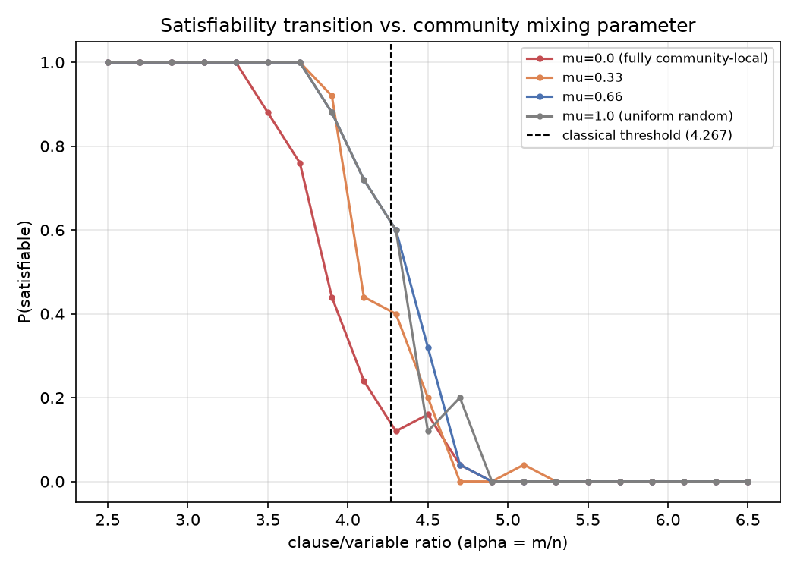
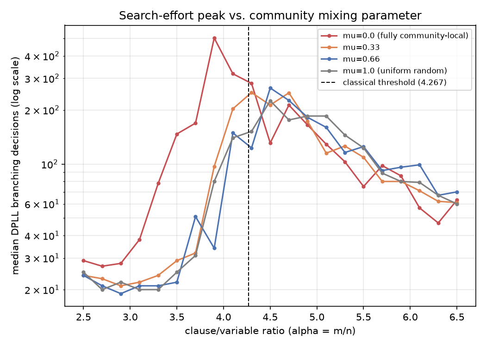
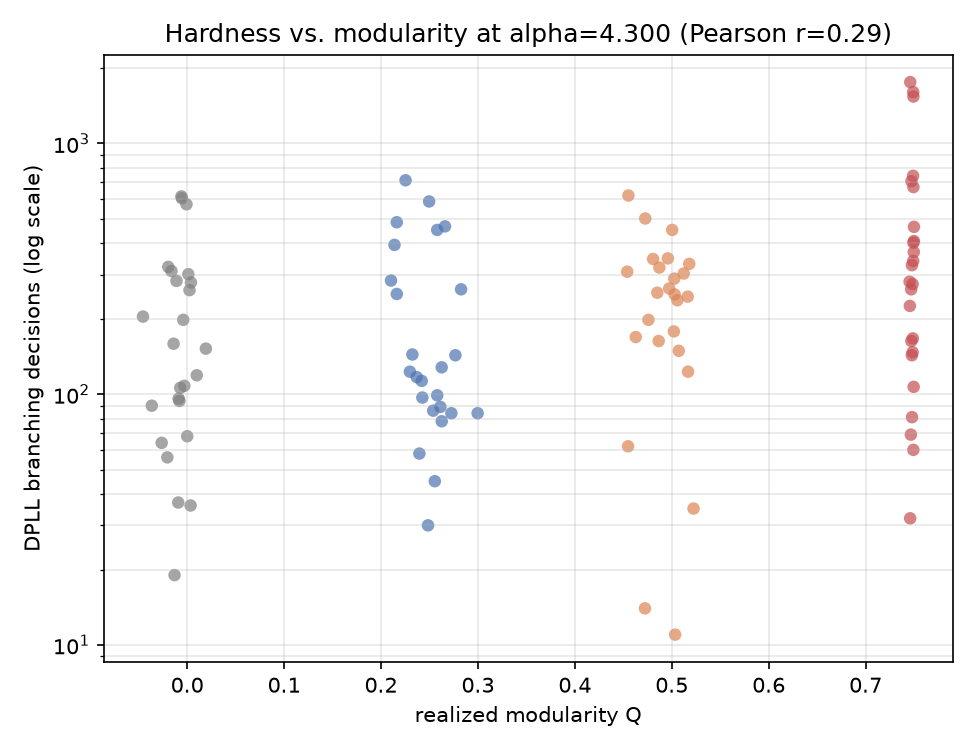
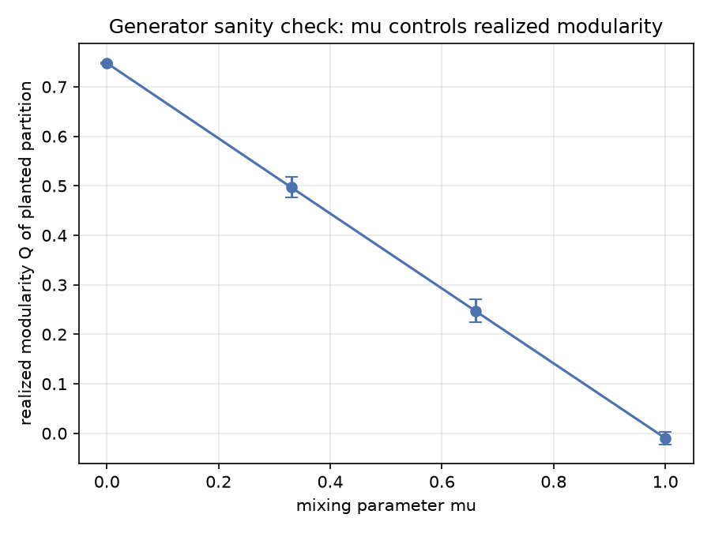
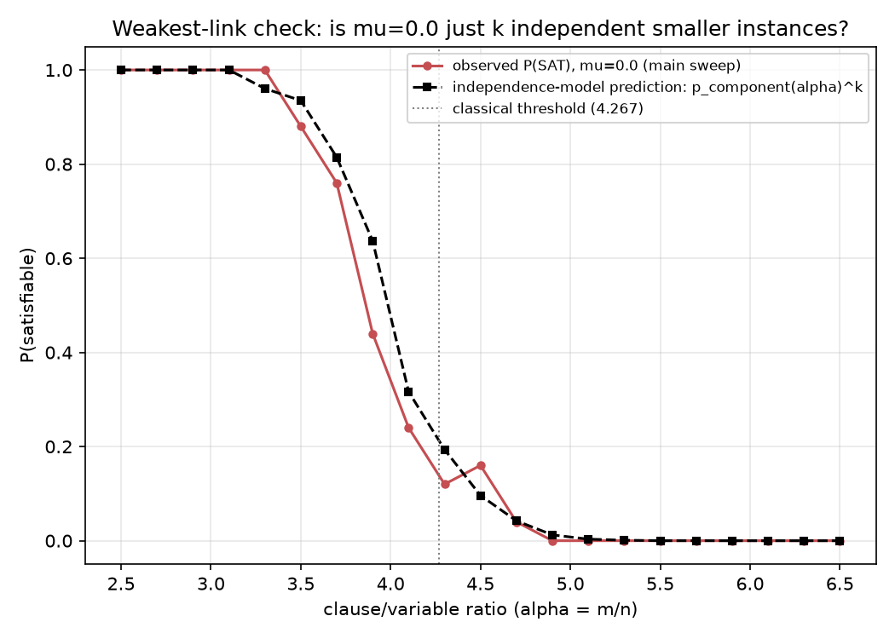
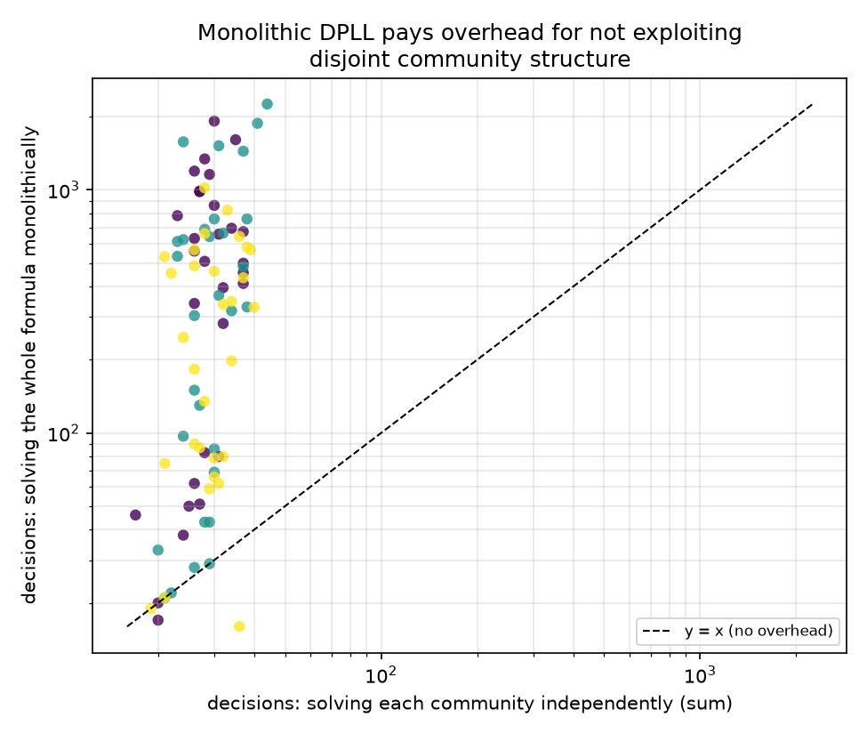

# Community Structure and the SAT Phase Transition

**Does imposing community structure on random 3-SAT make it easier, the way real-world
(industrial) SAT instances are believed to be easier than random ones at the same
clause/variable ratio? On a plain DPLL solver, the data here says no — it does the
opposite, and the reason why is itself the interesting part.**

## Research question

Random 3-SAT has a famous, sharp satisfiability phase transition at a clause-to-variable
ratio `alpha = m/n ≈ 4.267`: below it formulas are satisfiable with probability tending to
1 as `n → ∞`, above it unsatisfiable with probability tending to 1, and search cost for a
resolution-based solver peaks right at the transition (Mitchell, Selman & Levesque, 1992;
Kirkpatrick & Selman, 1994). Separately, it is well documented that *industrial* SAT
instances — which typically exhibit community/modularity structure in their
variable-interaction graph — are solved far faster by modern CDCL solvers than random
instances of comparable size (Ansótegui et al., 2012; Giraldez-Cru & Levy, 2015, 2017).
That second body of work studies structure that already exists in real benchmarks; it
does not isolate structure as a single controllable knob and sweep it against the
classical transition.

This project builds that knob directly: a generator that interpolates continuously
between uniform-random 3-SAT and fully community-local 3-SAT via a single mixing
parameter `mu`, and asks two concrete questions against a plain (non-clause-learning)
DPLL solver:

1. Does community structure shift *where* the satisfiability transition occurs?
2. Does community structure change *how hard* instances are to solve, as measured by
   DPLL branching-decision count (the standard hardness proxy from the classical
   phase-transition literature, chosen specifically because it doesn't depend on
   solver-implementation details or clause-learning heuristics)?

## Methodology

### The generator (`src/cnf.py`)

`community_3sat(n_vars, n_clauses, n_communities, mu)` partitions variables into
`n_communities` equal-sized groups. Each clause is drawn as:

- a **random** clause (3 variables uniform over *all* variables), with probability `mu`, or
- a **local** clause (3 variables drawn from one uniformly-chosen community), with
  probability `1 - mu`.

`mu = 1.0` recovers uniform-random 3-SAT exactly. `mu = 0.0` produces a formula whose
variable-interaction graph (VIG) is a disjoint union of `n_communities` independent
smaller random-3-SAT instances (no clause ever crosses a community boundary). Realized
structure is measured by the modularity `Q` of the planted partition against the VIG
(`src/community.py`), which is validated against `mu` directly (Figure 3) rather than
assumed.

### The solver (`src/solver.py`)

A from-scratch DPLL solver: unit propagation to a fixpoint, then branch on the
unassigned variable appearing in the most not-yet-satisfied clauses, recursing on both
truth values. No clause learning, no restarts, no activity-based (VSIDS-style) variable
ordering. This is deliberate: the classical phase-transition experiments use exactly
this class of solver because CDCL's learned clauses and adaptive heuristics would
confound "how structurally hard is this formula" with "how good is the solver's learned
heuristic." Decision count is the reported hardness metric, exactly as in the original
literature. Correctness is checked against a brute-force satisfiability oracle over many
random small instances (`tests/test_solver.py`), not just hand-built examples.

### Experimental design

- `n_vars = 80`, `n_communities = 4` (20 variables/community), decision cap 2,000,000
  (never triggered — max decisions observed was 5,241).
- `alpha` swept over 21 evenly spaced points in `[2.5, 6.5]`.
- `mu ∈ {0.0, 0.33, 0.66, 1.0}`.
- 25 independent random instances per `(alpha, mu)` grid point → **2,100 solved
  instances** in the main sweep.
- Success metrics fixed before running: (a) reproduce the classical transition shape for
  `mu = 1.0`; (b) test whether `P(SAT)` and median decision count differ significantly
  across `mu` at fixed `alpha` near the threshold (Mann-Whitney U, two-sided); (c) if a
  shift is found, propose and *quantitatively test* a mechanism rather than stop at the
  correlation.

Two follow-up analyses (`run_supplementary_analysis.py`) were run after the main sweep
produced a result that contradicted the naive hypothesis (see below), to test candidate
mechanisms rather than just report the surprise.

## Results

### 1. Community structure shifts the transition — to a *lower* alpha



The `P(SAT) = 0.5` crossing point moves left as `mu` decreases (more structure):

| mu | P(SAT)=0.5 at alpha ≈ |
|------|------------------------|
| 1.00 (uniform random) | 4.34 |
| 0.66 | 4.37 |
| 0.33 | 4.08 |
| 0.00 (fully community-local) | **3.86** |

Going from uniform-random to fully community-local shifts the 50%-satisfiable point down
by about **0.48** in `alpha` — a large effect at this scale, not noise.

### 2. Community structure *raises* the hardness peak for this solver



Median DPLL decisions peak at **503** (alpha=3.9) for `mu=0.0`, versus **225** (alpha=4.5)
for `mu=1.0` and **265** (alpha=4.5) for `mu=0.66` — the community-local peak is both
*earlier* and roughly *2x higher*. At `alpha=4.3` (nearest grid point to the classical
threshold 4.267), median decisions are 281 (`mu=0.0`) vs. 152 (`mu=1.0`); a two-sided
Mann-Whitney U test rejects equality (U=196, **p=0.024**, n=25 per group).

At that same alpha, realized modularity correlates *positively* with decisions (Pearson
r=0.29, p=0.0039, n=100 across all four `mu` groups) — see Figure 4. More structure, more
search effort. This is the opposite of the "structured instances are easier" folklore.



The generator's `mu → Q` mapping was validated directly (mean realized modularity: 0.748,
0.497, 0.247, -0.010 for `mu = 0, 0.33, 0.66, 1.0` respectively) so this isn't an artifact
of `mu` failing to control structure:



### 3. Why: two mechanisms, both directly tested

**Mechanism 1 — the transition shift is a weakest-link / conjunction effect.** At
`mu=0.0` the formula is *exactly* a disjoint union of 4 independent 20-variable random
3-SAT instances (no shared variables). If that's the whole story, then
`P(SAT)_whole(alpha) ≈ P(SAT)_component(alpha)^4`, where `P(SAT)_component` is the
satisfiability probability of a bare 20-variable random-3-SAT instance — a strictly
*smaller*, individually *softer* transition than the 80-variable case, whose 4-way
conjunction is pulled below 50% at a lower `alpha` than the monolithic instance would be.
This was tested directly: 300 fresh 20-variable instances were solved at each of the 21
alpha values to estimate `P(SAT)_component`, and `P(SAT)_component^4` was compared to the
`mu=0.0` curve from the main sweep.



**Mean absolute error between prediction and observation: 0.028** across 21 alpha values
— the independence model alone accounts for essentially all of the shift. No appeal to
anything more exotic than "AND of 4 independent coin flips whose bias follows the
finite-size random-3-SAT curve" is needed.

**Mechanism 2 — the hardness increase is the solver failing to exploit decomposability.**
A solver aware that the formula is 4 disconnected components could solve each
independently and sum the work — provably no harder, and typically much easier, than
solving the union monolithically. Plain DPLL with a static most-frequent-literal
heuristic has no such awareness; it interleaves decisions across all four components
without ever noticing they don't share variables. This was tested by decomposing 90
fresh `mu=0.0` instances (30 each at alpha=3.7, 3.9, 4.1 — the empirical hardness-peak
window) into their 4 independent parts, solving each part separately, and comparing
summed per-part decisions to the monolithic solve (`src/cnf.py:decompose_by_community`).
Every one of the 90 monolithic/decomposed satisfiability verdicts agreed exactly (a
built-in correctness assertion in `run_supplementary_analysis.py`).



**Median overhead: monolithic DPLL takes 11.8x more branching decisions than solving the
same formula's 4 parts independently and summing.** Every point in Figure 6 sits above
the `y=x` line. The community structure doesn't make the *problem* harder in any deep
sense — it makes the *monolithic, non-decomposing solver* pay for not noticing an easy
decomposition, on top of pushing the effective operating point into a harder finite-size
regime via mechanism 1.

## Interpretation

The popular narrative — "real SAT instances are easier because they have community
structure" — is well supported empirically for modern CDCL solvers on real industrial
benchmarks. This project's result is not a contradiction of that; it's a decomposition of
*where the benefit actually comes from*. The results here suggest that benefit is not an
automatic, algorithm-independent property of community-structured formulas. It plausibly
depends on the solver actively exploiting locality — via clause learning that stays
localized, restarts, activity-based (VSIDS) branching that adapts to the graph structure,
or explicit connected-component decomposition — none of which a plain 1962-style DPLL
solver does. Absent that machinery, imposing hard community structure can make a solver's
life measurably *worse*, both by shifting the operating point into a harder finite-size
regime (mechanism 1) and by leaving an easy decomposition on the table (mechanism 2).

This reframes "does structure help SAT solving" as a question about the interaction
between structure *and* the algorithm probing it, not a property of the formula alone —
and gives a concrete, falsifiable next experiment (below).

## Limitations and future work

- **Solver class.** Results are specific to plain DPLL. The natural next step is
  re-running the same sweep with a CDCL solver (e.g. via `python-sat`/MiniSat) and a
  connected-components-aware wrapper, to test the hypothesis that CDCL's adaptive
  heuristics recover (or even invert) the folklore direction where vanilla DPLL doesn't.
- **Generator realism.** This generator's community structure is a simple
  concentration model (clauses either fully local or fully global); real industrial
  instances have richer structure (e.g. hierarchical, or with sparse bridging variables
  connecting communities) that a pure vertex-partition model doesn't capture. A next
  version could add a controlled *inter*-community edge density instead of an all-or-nothing
  choice.
- **Scale.** `n=80` was chosen so a from-scratch Python DPLL solver could run the full
  2,100-instance sweep in about 4 minutes; finite-size effects are real at this scale (the
  independence-model check explicitly relies on and validates them rather than assuming
  the asymptotic `alpha=4.267` applies exactly). Larger `n` with a compiled solver backend
  would sharpen the transition and test whether the shift direction persists asymptotically.
- **3-SAT only.** k-SAT for `k != 3` and non-uniform clause lengths are untested.

## Reproducing

```bash
pip install -r requirements.txt
python -m pytest tests/ -v                  # 26 unit + integration tests
python run_experiment.py                    # full sweep: ~4 min, writes results/results.csv + figures 1-4
python run_supplementary_analysis.py        # mechanism checks: ~40s, writes figures 5-6
python run_experiment.py --quick            # fast smoke test (tiny grid), not for real results
```

## Project structure

```
src/
  cnf.py            CNF representation, random/community 3-SAT generators, decomposition
  solver.py         From-scratch DPLL solver with decision/backtrack counters
  community.py      Variable-interaction graph construction, modularity measurement
  experiment.py     Main (alpha, mu) sweep -> results/results.csv
  analysis.py       Aggregation, Mann-Whitney U, Pearson correlation
  plots.py          All 6 figures
tests/
  test_cnf.py           generator correctness, decomposition correctness
  test_solver.py        DPLL correctness incl. brute-force oracle cross-check
  test_community.py     VIG construction, modularity sanity checks
  test_integration.py   end-to-end pipeline smoke test (generation -> solve -> plot)
run_experiment.py               main sweep entry point
run_supplementary_analysis.py   mechanism-validation entry point
results/                        results.csv, independence_check.csv, decomposition_check.csv
figures/                        fig1-fig6 (all regenerated from results/, not hand-edited)
```

All numbers reported above come directly from `results/results.csv`,
`results/independence_check.csv`, and `results/decomposition_check.csv` in this
directory, produced by the two scripts above with the seeds fixed in their `main()`
functions (seed 42 for the main sweep, seeds 100/200 for the supplementary checks) — the
run is fully reproducible.
