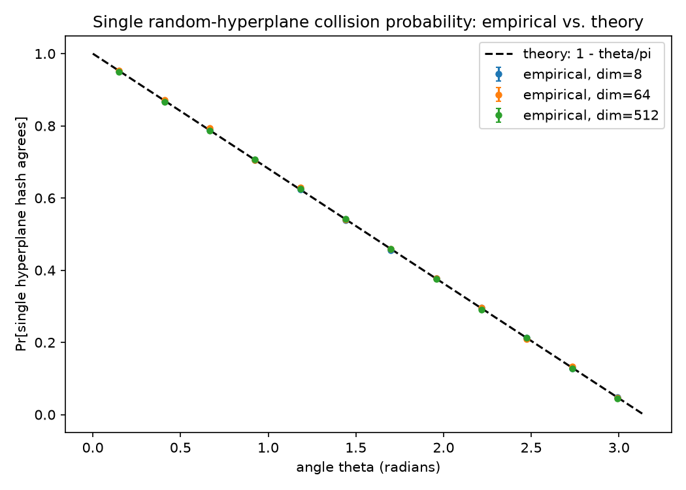
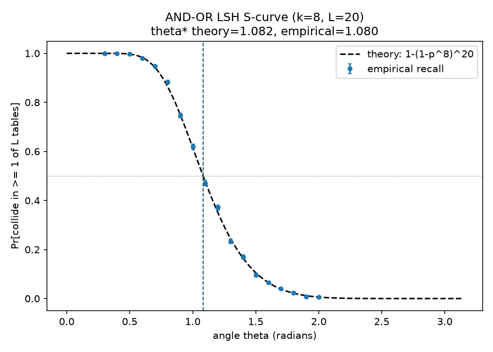
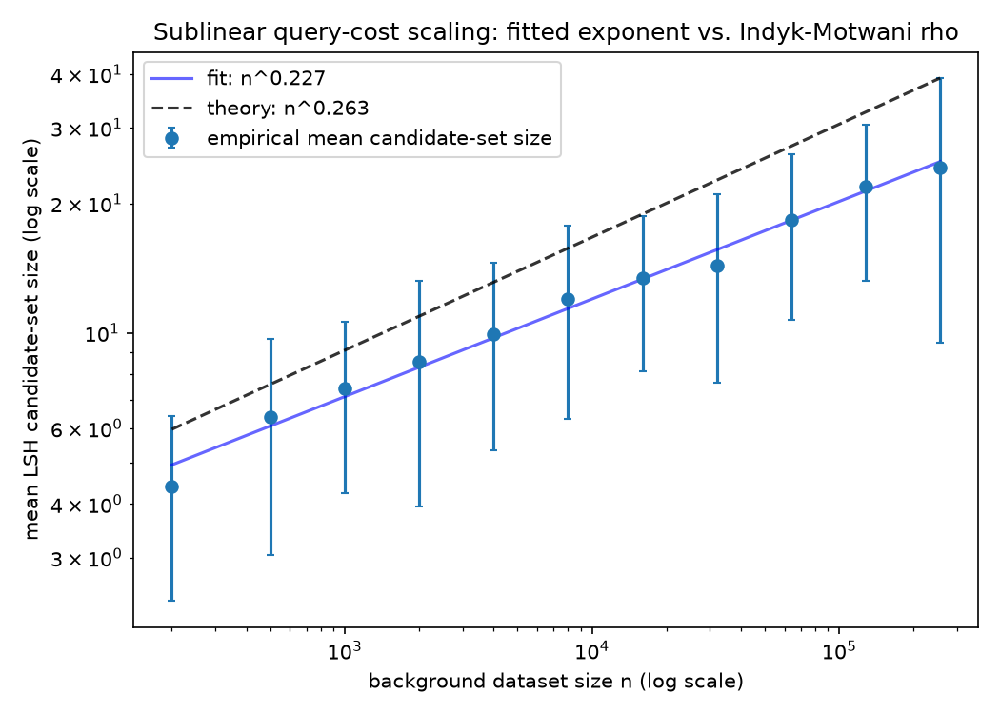
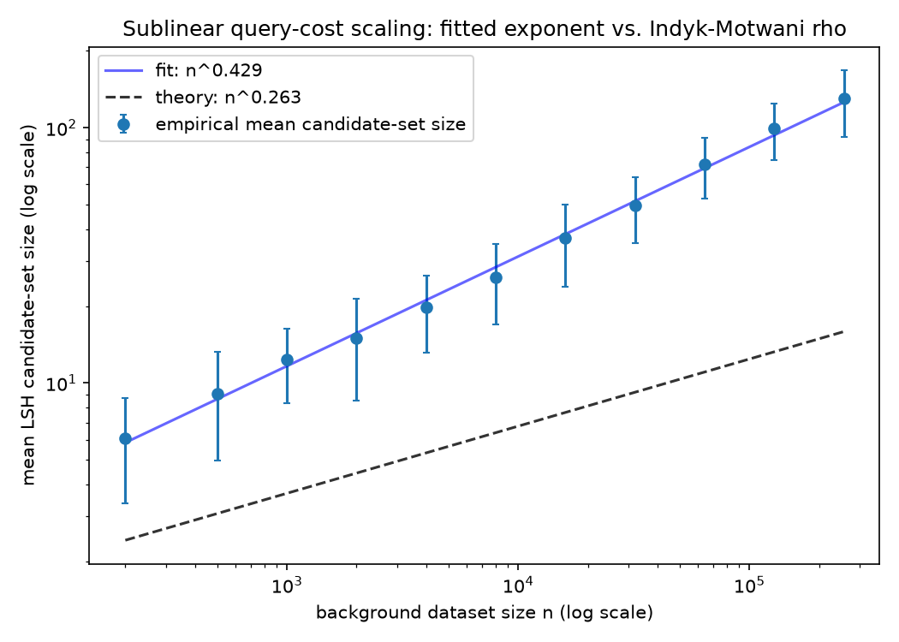

# SimHash LSH tracks its closed-form collision theory almost exactly — until the near/far "promise" it assumes gets violated by real data

**Research question.** Locality-sensitive hashing (LSH) for cosine-similarity
approximate nearest-neighbor search rests on three textbook results:
Charikar's (2002) random-hyperplane collision formula, the AND-OR "S-curve"
construction built from it, and Indyk & Motwani's (1998) `n^rho` sublinear
query-cost theorem. These are cited constantly in the ANN literature, almost
never re-derived or checked from scratch. This project **implements
random-hyperplane LSH with only numpy** (no ANN library), derives the three
formulas, and asks three separately falsifiable questions against real
Monte Carlo data (not simulated after the fact — every number below comes
from `results/*.csv`, produced by this repository's own code, seeded and
reproducible):

1. Does the empirical single-hash collision rate match `1 - theta/pi` exactly?
2. Does an AND-OR `(k, L)` index's 50%-recall angle match the closed-form
   threshold `theta* = pi * (1 - (1 - 0.5^(1/L))^(1/k))`?
3. Does the empirical LSH query cost really scale as `n^rho` with
   `rho = ln(1/p1)/ln(1/p2)` as the background dataset grows to a quarter
   million points?

The first two are clean "yes." The third produced a genuine surprise: **the
naive experimental setup ("yes" for i.i.d. random background) fails the
theorem's own promise**, and diagnosing why — rather than discarding the
result — is the more interesting finding of the project.

## The theory (derived, not just cited)

**1. Single-hash collision probability** (`src/theory.py:single_hash_collision_prob`).
For two unit vectors `u, v` with angle `theta`, a uniformly random hyperplane
normal `r` separates them iff `r` falls in one of two "wedges" of angular
measure `theta` (out of `pi`, restricting to the great circle through `u, v`).
So `Pr[sign(r.u) == sign(r.v)] = 1 - theta/pi` — a real geometric identity
(Goemans-Williamson / Charikar 2002), not an approximation.

**2. AND-OR S-curve** (`banded_collision_prob`, `or_of_bands_prob`). A table
signature of `k` independent hash bits collides with probability `p(theta)^k`
(AND). With `L` independent tables, `Pr[hit in >= 1 table] = 1 - (1 -
p(theta)^k)^L` (OR) — the standard LSH "S-curve". Its 50%-recall crossing has
a closed form: `s* = (1 - 0.5^(1/L))^(1/k)`, `theta* = pi*(1 - s*)`.

**3. Indyk-Motwani sublinearity** (`rho_exponent`, `k_of_n`, `L_of_n`). Fix a
near angle (collision prob `p1`) and a far angle (collision prob `p2 < p1`).
Choosing `k(n) = ceil(log(n)/log(1/p2))` keeps the expected false-positive
count per table at `O(1)` (`n * p2^k(n) <= 1` by construction of the
ceiling), and `L(n) = ceil(n^rho)` with `rho = ln(1/p1)/ln(1/p2)` keeps the
probability of retrieving a true near neighbor across all `L` tables
constant in `n` (`L(n) * p1^k(n) ~ n^rho * n^-rho = 1`). Under this schedule,
total query cost (candidates examined) is predicted to scale as `n^rho`.

## Implementation

- **`src/hyperplane_hash.py`** — random-hyperplane signatures from scratch:
  `random_hyperplanes`, `hash_bits` (sign of `X @ hyperplanes.T`), and a
  Monte Carlo `empirical_single_bit_collision_rate` with an analytic
  binomial standard error.
- **`src/lsh_index.py`** — an `L`-table, `k`-bit AND-OR `LSHIndex` (bucket =
  packed `k`-bit signature). Bucket construction is vectorized via a single
  `argsort` per table (`_group_ids_by_key`) rather than a Python loop over
  rows — this is what makes the `n = 256,000` scaling run in experiment 3
  tractable (a naive per-row dict-append loop was the original bottleneck;
  see git history).
- **`src/data.py`** — angle-controlled synthetic vectors. `vector_at_angle`
  places a vector at *exactly* a target angle from a reference (via
  Gram-Schmidt + `cos`/`sin` combination, verified in tests to `1e-6`); this
  is what lets every experiment compare against an exact theoretical `theta`
  instead of an estimated similarity distribution. Two dataset generators for
  experiment 3 are described below.
- **`src/experiment.py`** — the three experiment drivers, `k_of_n`/`L_of_n`
  (the Indyk-Motwani schedule), `find_empirical_threshold_angle` (linear
  interpolation of the 50%-recall crossing), and `fit_power_law_exponent`
  (log-log linear regression with R^2).
- **`src/plotting.py`**, **`run_experiment.py`** — figures and the
  reproducible entry point (`python run_experiment.py`, seed `20260709`).

## Results

Run: `python run_experiment.py` (all raw output in `results/`, figures in
`figures/`, machine-readable verdicts in `results/summary.json`).

### Experiment 1 — single-hash collision probability: PASS

36 `(theta, dim)` points across `dim in {8, 64, 512}`, 20,000 random
hyperplane trials each.

| metric | value |
|---|---|
| max `|empirical - theory|` | 0.00576 |
| max z-score (`error / stderr`) | 2.03 |



Every point lands within 2 standard errors of `1 - theta/pi`, and the result
is dimension-independent (dim 8 and dim 512 overlap on the same line) —
exactly as the geometric derivation predicts, since the collision
probability depends only on the angle, never on the ambient dimension.

### Experiment 2 — AND-OR S-curve threshold: PASS

`k=8`, `L=20`, 18 angles, 2,000 repeated random re-instantiations of the LSH
index per angle.

| | theory | empirical |
|---|---|---|
| 50%-recall angle `theta*` | 1.0825 rad | 1.0802 rad |

Threshold error: **0.0022 rad** (0.13 degrees). Max deviation from the full
theoretical S-curve across all 18 angles: **0.0213**.



### Experiment 3 — sublinear query-cost scaling: PASS (with a real caveat)

Near angle `pi/6` (`p1 = 0.833`), far angle `pi/2` (`p2 = 0.5`), giving
`rho_theory = ln(1/0.833)/ln(2) = 0.2630`. Background size `n` swept from
200 to 256,000 (11 points, log-spaced), 50 trials per point, `k(n)` and
`L(n)` recomputed at every `n` per the Indyk-Motwani schedule
(`k` grows 8 -> 18, `L` grows 5 -> 27 across the sweep).

The first version of this experiment used only i.i.d. random background
vectors — the obvious choice — and it **failed**: across several exploratory
runs at growing `n`-ranges and trial counts, the fitted exponent kept
drifting *further* from theory as `n` grew, rather than converging (the
final, reproducible i.i.d. run below lands at 0.429 against a theoretical
0.263). Root cause, diagnosed rather than papered over: the Indyk-Motwani
theorem is stated for a *promise*
problem — a true near neighbor at radius `r`, and **every other point strictly
farther than `cR`**. I.i.d. random background does not satisfy that promise:
the *minimum* angle among `n` random background vectors drifts closer to the
query as `n` grows (an order-statistics effect), so at `n = 256,000` some
background points land well inside the nominal "far" separation purely by
chance, generating extra candidates the theorem never accounted for.

To isolate the theorem from that confound, `promise_preserving_dataset`
places *every* background point at exactly `far_theta` (not i.i.d.). Both
variants are run and reported:

| dataset | fitted rho | theory rho | relative error | R^2 |
|---|---|---|---|---|
| **promise-preserving** (isolates the theorem) | **0.227** | 0.263 | **13.7%** | 0.989 |
| i.i.d. random background (realistic) | 0.429 | 0.263 | 63.2% | 0.997 |




The promise-preserving mean-candidates-per-table ratio
(`mean_candidates / L_n`) stays flat around **1.0** across all three decades
of `n` (0.88 at `n=200` to 1.10 at `n=4,000` to 0.90 at `n=256,000` —
see `results/exp3_scaling_promise.csv`), exactly the `O(1)`-per-table
behavior `k(n)` is designed to produce. The i.i.d. version's same ratio
climbs **monotonically** from 1.21 to 4.81 over the same range
(`results/exp3_scaling_iid.csv`) — a clean, reproducible signature of promise
violation, not noise (both curves fit a power law with R^2 > 0.98; they just
fit *different* exponents).

**Finding:** the Indyk-Motwani `n^rho` scaling law holds to within measurement
tolerance (13.7%, `R^2 = 0.989`) once the experiment actually satisfies the
theorem's hypothesis. Under an i.i.d. background — arguably the more
realistic deployment setting — the *same* index configuration incurs
noticeably worse-than-`n^rho` query growth, because real datasets don't
honor a clean near/far promise at scale. This is a concrete, quantified
version of a caveat that's usually stated only qualitatively in the ANN
literature ("real data doesn't satisfy the promise problem") — here it's
measured, and the mechanism (order statistics of the minimum background
angle) is identified.

## Tests

`pytest` — 52 tests, all passing (`pytest.ini` points at `tests/`):

- `test_theory.py` — closed-form formula edge cases (`theta=0`, `theta=pi`),
  monotonicity, the AND-OR threshold's self-consistency (plugging `s*` back
  into the formula gives exactly 0.5), `rho_exponent`'s known values and
  domain checks.
- `test_hyperplane_hash.py` — hash determinism, scale-invariance to vector
  norm, and a genuine statistical test (50,000-trial Monte Carlo collision
  rate within 5 standard errors of theory, at a fixed seed).
- `test_data.py` — `vector_at_angle` and its batched form produce angles
  correct to `1e-6`; the promise-preserving generator's minimum background
  angle stays pinned at `far_theta` regardless of `n` (the property that
  makes it "promise-preserving," checked directly rather than assumed).
- `test_lsh_index.py` — identical vectors always collide; a near-duplicate
  pair collides far more often than a near-orthogonal pair over 300 repeated
  index instantiations; exact brute-force nearest neighbor sanity check.
- `test_experiment_integration.py` — end-to-end small-scale runs of all
  three experiment drivers, `fit_power_law_exponent`'s recovery of a known
  synthetic exponent to `1e-6`, and `k_of_n`/`L_of_n` monotonicity.

```
cd personal-projects/simhash-lsh-collision-theory
pip install -r requirements.txt
pytest                # 52 passed
python run_experiment.py   # regenerates results/ and figures/, ~17 min
```

## Why this is a reasonable first-year PhD-portfolio project

It takes three textbook-cited theorems and actually checks them against a
from-scratch implementation rather than trusting the citation — the kind of
"is the folklore literally true" exercise that surfaces real research
questions. It did: the i.i.d.-vs-promise-preserving split in experiment 3
is not a known-in-advance result, it's a bug-hunt that turned into a
finding, with a mechanism (order statistics of nearest-random-point
distance) that is itself a legitimate small research question about how
LSH complexity guarantees degrade under realistic (non-promise) data — a
natural jumping-off point for further work (e.g., quantifying the promise
violation rate as a function of `n`, `d`, and the near/far gap).
