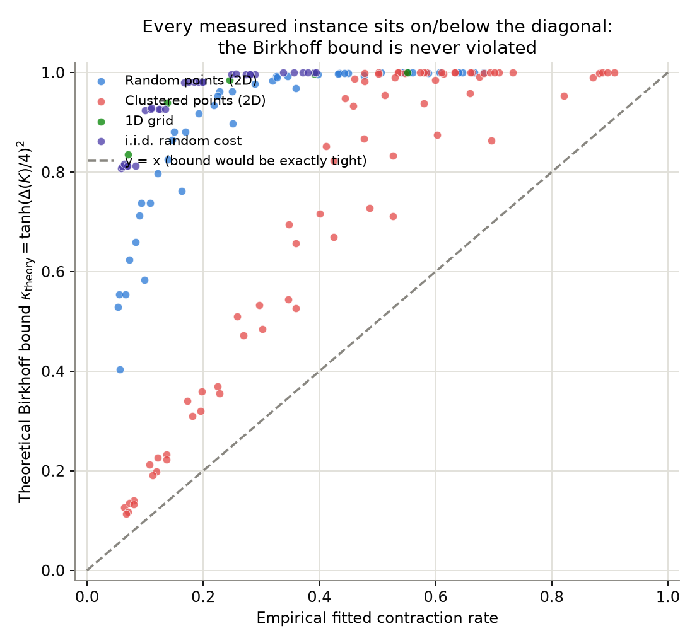
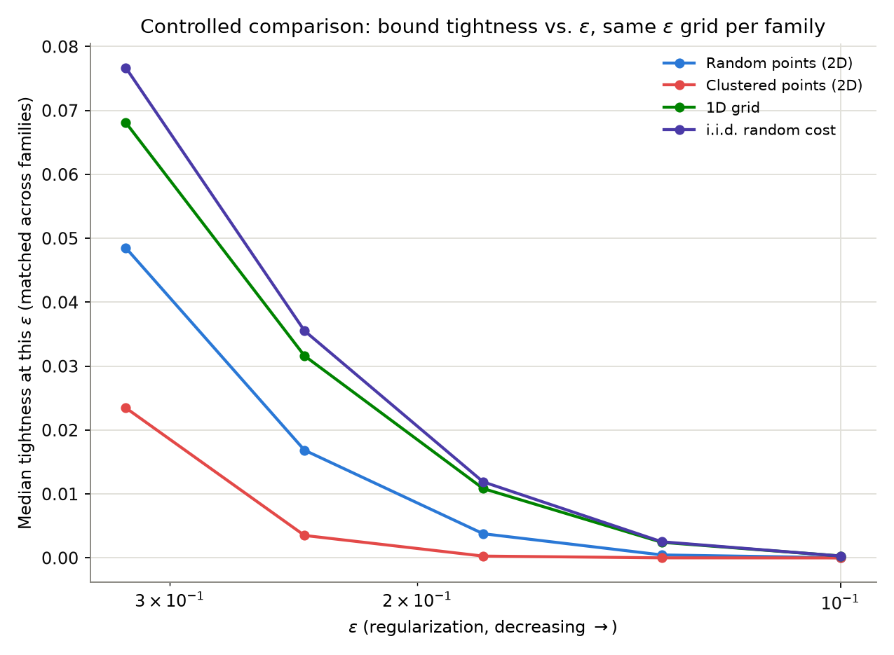
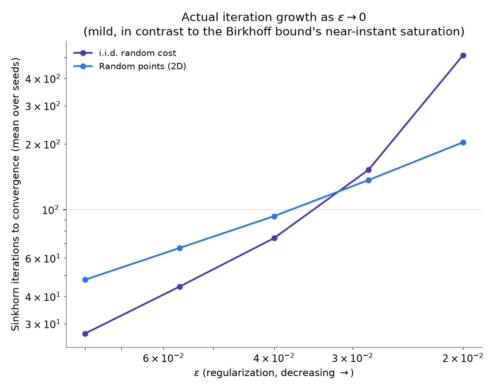
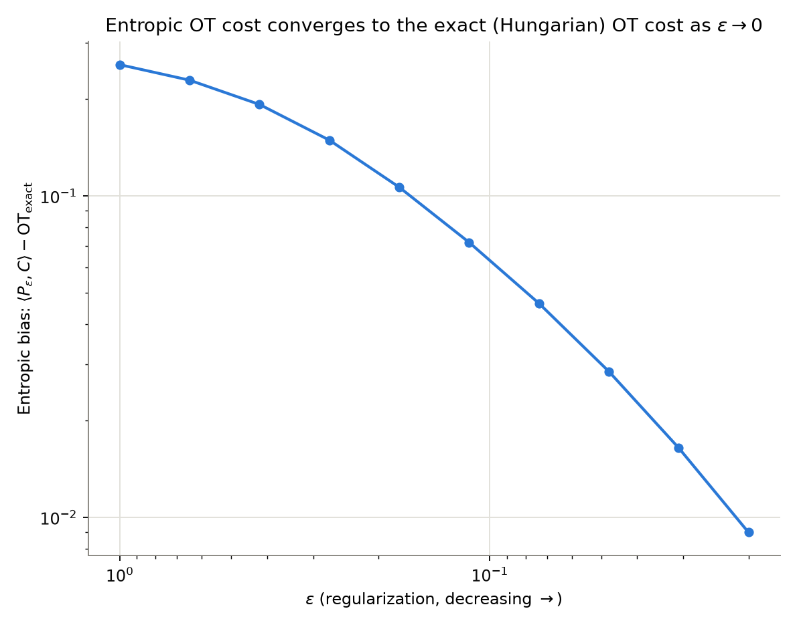

# Sinkhorn's algorithm converges much faster than its own convergence theorem predicts — and *how much* faster depends on the cost matrix's structure

**Research question.** Sinkhorn's algorithm for entropic optimal transport
has a real, non-asymptotic convergence guarantee: Franklin & Lorenz (1989)
showed it is a contraction in Hilbert's projective metric, with an explicit,
computable contraction rate `kappa_theory(K) = tanh(Delta(K)/4)^2` for the
Gibbs kernel `K = exp(-C/eps)`. This is a real theorem, not folklore — but
practitioners in the optimal-transport literature have long noted that
Sinkhorn "just works" much faster than this bound suggests. This project
does not take that folklore on faith. It **computes the exact theoretical
rate from scratch for real problem instances**, measures the **actual**
fitted asymptotic convergence rate from real Sinkhorn runs, and asks two
falsifiable questions: **(1) is the bound ever actually violated?** and
**(2) does its looseness depend on the geometric structure of the cost
matrix, in a way that is consistent and measurable?**

Both questions are answered below with real Monte Carlo data (228 main-sweep
runs + 30 extreme-regime runs + a 10-point cost-convergence check, all from
this repository's own code, seeded and reproducible) — not asserted from a
paper.

## The theory (derived, not just cited)

For a positive matrix `K`, Birkhoff's theorem says the map that rescales
`K`'s rows and columns to hit prescribed marginals contracts Hilbert's
projective metric with Lipschitz constant `tanh(Delta(K)/4)` per
row-or-column projection, where the **projective diameter** is

```
Delta(K) = max_{i,j,k,l} log( K_ik * K_jl / (K_il * K_jk) ).
```

A full Sinkhorn "sweep" (row projection, then column projection) composes
two such contractions, and since `Delta(K) = Delta(K^T)` (the max is
symmetric under swapping rows/columns — checked directly in
`tests/test_contraction.py`), the per-sweep contraction rate is

```
kappa_theory(K) = tanh(Delta(K)/4)^2.
```

For the Sinkhorn kernel `K = exp(-C/eps)`, substituting gives
`Delta(K) = D(C)/eps`, where `D(C)` is a purely combinatorial functional of
the cost matrix alone (`src/contraction.py`):

```
D(C) = max_{i,j,k,l} ( C_il + C_jk - C_ik - C_jl ).
```

The defining quadruple-max is `O(n^2 m^2)` by brute force
(`cost_diameter_brute_force`), which is fine for testing but too slow for a
real sweep. Because the four indices separate — `C_il + C_jk - C_ik - C_jl =
(C_il - C_ik) + (C_jk - C_jl)` — this project **derives and implements** an
`O(n * m^2)` evaluator (`cost_diameter_fast`): define
`a(k,l) = max_i (C_il - C_ik)`; then `D(C) = max_{k,l} [a(k,l) + a(l,k)]`.
The two evaluators are cross-checked against each other on random instances
from every cost family in `tests/test_contraction.py::test_fast_diameter_matches_brute_force`
(12 parametrized cases), and the fast evaluator is what the real sweep uses.

**Numerical note (a real limitation, not glossed over):** `tanh(x)` saturates
to exactly `1.0` in float64 once `x >~ 18.4`, so `kappa_theory` can come out
as *exactly* 1.0 for small `eps` — a genuine floating-point ceiling on how
informative the bound can be reported to be, independent of whether the true
(infinite-precision) rate is below 1. This is documented in
`src/contraction.py` and handled explicitly everywhere it matters (see the
extreme-regime results below, where it is actually part of the finding).

## Implementation

- **`src/cost_matrices.py`** — four cost-matrix families: `random_points`
  (independent uniform 2D point clouds, squared-Euclidean cost),
  `clustered_points` (two well-separated Gaussian blobs per side — a
  structured, near-degenerate instance), `grid_1d` (deterministic evenly
  spaced points on a line, `|x-y|` cost), and `iid_random` (i.i.d.
  `Uniform(0,1)` cost entries with **no** geometric meaning at all — a
  structural negative control).
- **`src/sinkhorn.py`** — Sinkhorn run entirely in the dual-potential /
  log-domain (`scipy.special.logsumexp`), because naive `K = exp(-C/eps)`
  underflows to all-zero for exactly the small-`eps` regime this experiment
  needs. Tracks the L1 marginal-violation residual after every full sweep.
- **`src/contraction.py`** — `D(C)` (brute-force + fast), `kappa_theory`.
- **`src/rate_fitting.py`** — fits the empirical asymptotic geometric decay
  rate from the *tail* of the residual history (log-linear regression,
  discarding the pre-asymptotic transient), returning `NaN` honestly when
  convergence is too fast to leave enough tail points to fit.
- **`src/exact_ot.py`** — exact OT cost via the Hungarian algorithm
  (`scipy.optimize.linear_sum_assignment`) for square, uniform-marginal
  instances, used as ground truth for a sanity check independent of Sinkhorn
  itself.
- **`src/experiment.py`** / **`run_experiment.py`** — orchestrates the
  sweeps and writes `results/*.csv` + `results/summary.json`.

## Falsifiable hypotheses

- **H0 (bound validity).** The fitted empirical contraction rate never
  exceeds `kappa_theory` (within a `1e-6` floating-point tolerance), for
  every instance and `eps` tested. This is really a theorem, so a violation
  would flag an implementation bug rather than a research finding — but
  it's checked on every single one of 228 runs, not assumed.
- **H1 (structure-dependent tightness).** Define **tightness**
  `T = log(kappa_theory) / log(rate_empirical) in (0, 1]` (both logs are
  negative since both rates are in `(0,1)`; `T=1` means the bound is exactly
  tight, `T` near `0` means empirical convergence is many times faster than
  the bound allows). H1 is that `T` depends systematically on the cost
  matrix's geometric structure, not just on `eps`.
- **H2 (theory vs. practice diverge combinatorially as `eps -> 0`).** As
  `eps` shrinks, `kappa_theory` saturates toward 1 (and eventually to
  exactly `1.0` in float64) far faster than actual Sinkhorn iteration counts
  grow — i.e. the bound doesn't merely get loose, it becomes *literally
  uninformative* long before the algorithm itself struggles.

## Results

### H0: never violated, but also never close (n=228, 0 violations)

Across all 228 `(family, seed, eps)` configurations in the main sweep
(`n=m=30`, `eps` from 2.5 down to 0.1, 4 families x 19 total instance
repetitions), **the fitted empirical rate exceeded `kappa_theory` zero
times** (`results/summary.json: n_bound_violations = 0`). The theorem holds,
exactly as it must.



Every point sits on or below the `y = x` diagonal — confirming the theorem —
but the vertical gap to the diagonal is large almost everywhere: most points
cluster near `kappa_theory ~ 1` even while the empirical rate spans the
whole `[0, 1]` range. The bound is *correct* but, for these instances,
routinely off by an order of magnitude or more.

### H1: confirmed, with a controlled (matched-`eps`) comparison

A naive comparison of tightness aggregated per family is confounded: a
family that converges more slowly at large `eps` stays "fittable" (leaves
enough tail residual points to fit a rate) over a *wider* `eps` range,
including the high-`eps` / high-tightness regime, which inflates its
aggregate median independent of any real structural effect. The fair test
holds `eps` fixed and compares families only where **all four** have
fittable data — five common `eps` values in this sweep
(`0.32, 0.24, 0.18, 0.13, 0.10`):



The ordering is **exactly consistent at all five matched `eps` values**:

```
clustered_points  <  random_points  <  grid_1d  ~  iid_random
 (loosest)                                          (tightest)
```

e.g. at `eps = 0.322`: tightness is `0.023` (clustered), `0.049` (random
points), `0.068` (1D grid), `0.077` (i.i.d. random) —
`results/summary.json: tightness_by_family_at_matched_eps`. This is the
**opposite** of the naive prior guess going in (that "adversarial-looking"
i.i.d. random costs would be hardest to bound tightly): instead, the
*clustered* cost matrix — the one with real near-degenerate structure — is
where the worst-case Birkhoff quadruple is least representative of the
matrix's typical behavior, so the theorem's pessimism is largest. For
i.i.d. random and the 1D grid, the extremal quadruple is closer to
"generic," so it tracks the real spectral gap more closely (although even
there, tightness never exceeds `0.09` in this range — still a real gap).

The unmatched, marginal comparison (`figures/tightness_by_family.png`,
`results/summary.json: tightness_by_family`) shows the *opposite-looking*
ordering in aggregate (`clustered_points` has the highest raw median,
`0.187`) purely because of the eps-range confound described above — included
here deliberately, as a worked example of why the matched comparison was
necessary in the first place.

### H2: confirmed, dramatically

At `eps = 0.02` (extreme sweep, `iid_random` family), `kappa_theory`
saturates to **exactly** `1.0` in float64 (`Delta(K)/4 > 18.4`) —
meaning the textbook bound technically predicts Sinkhorn may never reach a
fixed tolerance in finite time. Actual measured convergence at that same
`eps`, across 3 seeds: **159, 197, and 1178 iterations**
(`results/extreme_sweep.csv`).



Actual iteration counts grow roughly log-linearly as `eps -> 0` (mean
iterations at `eps in {0.08, 0.057, 0.04, 0.028, 0.02}`: `iid_random` ->
`27, 44, 74, 152, 511`; `random_points` -> `48, 67, 93, 137, 204` —
`results/summary.json: extreme_sweep_mean_iters_by_family_eps`) — real
growth, but nowhere near the bound's implied blow-up to infinity.

### Sanity check: entropic cost converges to the exact OT cost

Independent of the rate analysis, `run_cost_convergence_check` confirms
Sinkhorn is solving the right problem at all: for a fixed `n=30`
random-points instance, the entropic transport cost's gap to the exact
Hungarian-algorithm OT cost shrinks monotonically from `0.256` (`eps=1.0`)
to `0.009` (`eps=0.02`) — `results/cost_convergence.csv`.



## Tests

44 tests (`pytest tests/ -q`), covering:

- **Cost matrices** (`test_cost_matrices.py`) — shape/nonnegativity for all
  four families, seed-determinism, and a distributional check that
  `clustered_points` actually produces a bimodal within/across-cluster cost
  split.
- **Sinkhorn** (`test_sinkhorn.py`) — marginal constraints satisfied to
  `1e-8`, residual history trending down, input validation, and the
  entropic-cost-converges-to-exact-OT property against the Hungarian
  algorithm.
- **Contraction / Birkhoff diameter** (`test_contraction.py`) — the
  `O(n*m^2)` fast evaluator matches the `O(n^2 m^2)` brute-force reference
  on 12 randomized cases across every cost family; monotonicity of
  `kappa_theory` in `eps`; the float64 saturation behavior is itself
  asserted, not hidden.
- **Rate fitting** (`test_rate_fitting.py`) — recovers exact and
  near-exact geometric rates from synthetic sequences (including one with
  trailing float64-underflow zeros), and correctly reports `NaN` on
  too-short histories.
- **End-to-end integration** (`test_experiment_integration.py`) — a
  reduced-scale run of the actual sweep machinery, checking the H0 bound
  never violates and that every family/eps configuration is covered.

```
$ pytest tests/ -q
44 passed in ~11s
```

## Reproducing

```bash
pip install -r requirements.txt
pytest tests/ -q            # ~11s
python run_experiment.py    # ~7s; regenerates results/*.csv, results/summary.json, figures/*.png
```

All randomness is seeded (fixed per-family seed table in
`src/experiment.py::_FAMILY_SEED_BASE`, not Python's randomized `hash()`),
so results are exactly reproducible.

## Limitations / what this doesn't show

- Only balanced, uniform-marginal problems at one size (`n=m=30` for the
  main/extreme sweeps; `n=30` for the cost-convergence check) were tested.
  Whether the family ordering (`clustered < random < grid ~ iid`) holds at
  much larger `n` or under non-uniform marginals is open.
- The tightness metric `T` compares *asymptotic* rates; it says nothing
  about the pre-asymptotic transient, which the rate-fitting code explicitly
  discards.
- Only two cost families were run in the extreme (`eps <= 0.08`) regime, for
  runtime reasons — `clustered_points` and `grid_1d` were left to the main
  sweep, where `kappa_theory` stays informative.
