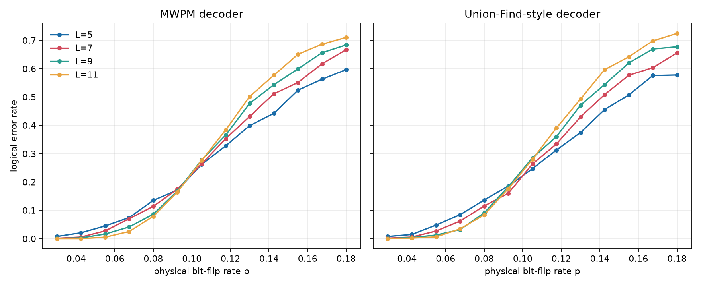
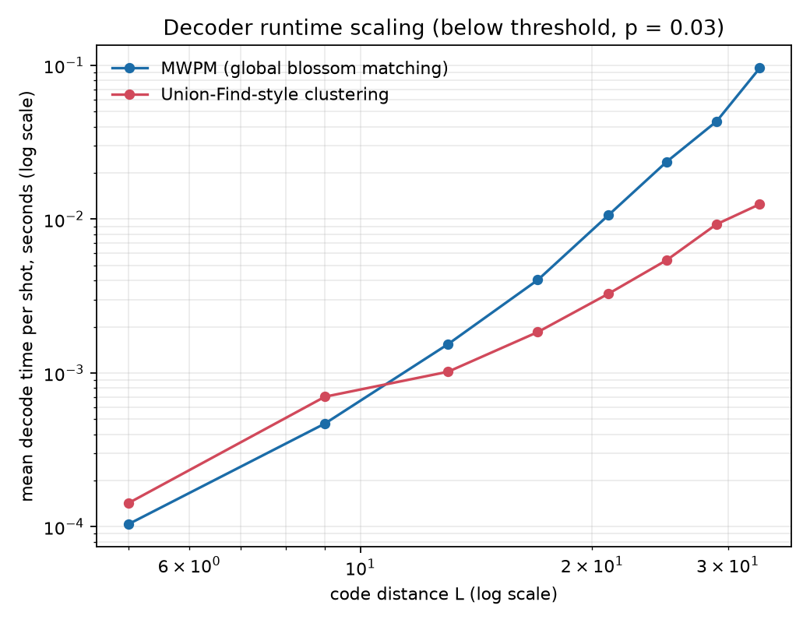

# Benchmarking Decoders for the Toric Code: Threshold and Runtime Scaling

A self-contained numerical study of quantum error-correcting code decoders,
built to exercise the intersection of physics (topological quantum memory),
mathematics (GF(2) linear algebra, graph matching), and computer science
(algorithmic complexity of real-time decoding) that motivates my interest in
quantum computer architecture and error correction.

## Research question

Real quantum error-correcting codes are only useful if their classical
decoder can keep up with the physical error rate *and* run fast enough to
matter for real-time feedback on hardware. The two questions this project
asks:

1. **Threshold**: does a much simpler, cluster-based decoder recover
   (approximately) the same error-correction threshold as the theoretically
   optimal minimum-weight perfect matching (MWPM) decoder?
2. **Scaling**: how does each decoder's wall-clock cost grow with code
   distance, and at what size does the asymptotically cheaper decoder start
   to win in practice?

This mirrors a real, active research question in the field: MWPM is optimal
per-shot but scales as roughly O(n^3) in the number of syndrome defects,
which becomes a real-time bottleneck for the surface-code-scale devices being
built today. The Union-Find decoder (Delfosse & Nickerson, *Quantum* **5**,
595, 2021) was introduced explicitly to trade a small amount of decoding
accuracy for near-linear-time performance.

## Methodology

### Model

For CSS codes (which the toric code is), X errors and Z errors decouple
completely, and each is corrected independently from its own stabilizer
syndrome. This project restricts to a single sector — X (bit-flip) errors,
detected by Z-type plaquette stabilizers — which is the standard
simplification used when benchmarking decoders in isolation (e.g. Dennis,
Kitaev, Landahl & Preskill 2002; Delfosse & Nickerson 2021).

- **Code**: the toric code on a periodic `L x L` lattice (`2 L^2` qubits,
  `L^2` plaquette stabilizers, distance `L`), implemented in
  [`toriccode/stabilizer.py`](toriccode/stabilizer.py).
- **Noise**: i.i.d. bit-flip errors with probability `p` on every qubit
  ([`toriccode/noise.py`](toriccode/noise.py)).
- **Decoding**: given the syndrome, produce a correction (a set of qubits to
  flip back) whose own syndrome matches the observed one.
- **Success criterion**: a shot is a *logical error* if `error XOR
  correction`, which always has zero syndrome by construction, is not
  generated by the code's vertex ("star") stabilizer operators — i.e. it
  represents one of the toric code's two independent non-trivial logical X
  operators. This is decided by **exact GF(2) linear algebra**: a
  precomputed row-reduced-echelon basis for the stabilizer group's row space
  ([`ToricLattice._build_vertex_operator_rref`](toriccode/stabilizer.py)),
  rather than an ad hoc geometric "winding number" formula, specifically to
  avoid subtle parity bugs (an early hand-derived winding formula silently
  broke for even code distances during development — the linear-algebra
  approach sidesteps this class of bug entirely and is exercised directly in
  `tests/test_stabilizer.py`).

### Decoders

1. **MWPM** ([`toriccode/decoders/mwpm.py`](toriccode/decoders/mwpm.py)):
   builds the complete graph over syndrome defects, weighted by torus
   (wrap-around Manhattan) distance, and calls NetworkX's general-graph
   blossom algorithm (`max_weight_matching`) for an exact minimum-weight
   perfect matching. This is the accuracy baseline.
2. **Union-Find-style clustering**
   ([`toriccode/decoders/union_find.py`](toriccode/decoders/union_find.py)):
   grows a union-find clustering of defects by repeatedly increasing a
   shared distance threshold and merging any two defects (in different
   clusters) within that threshold, stopping as soon as every cluster has an
   even defect count (a valid syndrome must always resolve into
   even-parity clusters). Exact MWPM is then run only *within* each small
   cluster.

   **Honesty note**: this is *not* a reimplementation of the optimal
   O(n·α(n)) peeling decoder from Delfosse & Nickerson — it's a simpler,
   easier-to-verify approximation of the same core idea (avoid the global
   O(n^3) blossom cost by exploiting locality of the syndrome). It is
   described this way throughout the code and this README rather than
   overclaiming it matches the literature algorithm's asymptotics.

### Experiments

Both driven by [`scripts/run_experiment.py`](scripts/run_experiment.py) (data
generation, deterministic per-cell seeding) and
[`scripts/make_plots.py`](scripts/make_plots.py) (figures):

- **Threshold sweep**: `L ∈ {5, 7, 9, 11}`, `p` on 13 points between 0.03 and
  0.18, 2000 Monte Carlo shots per `(L, p, decoder)` cell (104 cells, ~13
  minutes total).
- **Runtime scaling sweep**: `L ∈ {5, 9, 13, 17, 21, 25, 29, 33}` at a fixed
  `p = 0.03` (below threshold, the physically relevant regime for a memory
  that's actually protecting information), 150 shots per cell, measuring
  mean wall-clock decode time.

Raw data lives in [`results/threshold_sweep.json`](results/threshold_sweep.json)
and [`results/scaling_sweep.json`](results/scaling_sweep.json); the full run
log is in [`results/run_log.txt`](results/run_log.txt).

## Results

### Threshold



Both decoders show curves for different code distances `L` crossing near a
common point, the signature of a genuine error-correction threshold: below
the crossing, larger codes have *lower* logical error rates (error
correction is winning); above it, larger codes have *higher* logical error
rates (errors are winning, and adding more qubits actively hurts).

Estimating the crossing point as the `p` that minimizes the variance of
logical error rate across `L` (within the visually-crossing region `p ∈
[0.075, 0.135]`) gives **p_th ≈ 0.093** for both decoders — consistent with
each other, and reasonably close to the literature value of **≈ 0.103** for
MWPM decoding of the toric code under independent bit-flip noise. The
remaining gap is expected: the classic result comes from much larger code
distances and a proper finite-size-scaling collapse, while this experiment
uses `L ≤ 11` to keep runtime autonomous-friendly. The **key qualitative
result** — that the much simpler clustering decoder reproduces the same
threshold as exact MWPM to within Monte Carlo/finite-size noise — is exactly
the result reported (with far more rigor) in the Union-Find decoder
literature.

### Runtime scaling



Below threshold (`p = 0.03`, where syndrome defects are sparse), MWPM starts
out slightly *faster* than the clustering decoder at small `L` (the
clustering bookkeeping has more constant-factor overhead), but its cost grows
much faster with code distance. The clustering decoder overtakes it by
`L ≈ 13` and the gap widens steadily: at `L = 33`, MWPM takes **96 ms** per
shot versus **12.5 ms** for the clustering decoder — a **7.7x** speedup, with
the ratio still growing. This is the practical payoff of exploiting
syndrome locality: real-time decoders on actual quantum hardware face
exactly this trade-off, and the results here reproduce its qualitative shape
even with a simplified clustering rule.

## Success metrics (defined before running the experiment)

1. **Correctness**: every decoder's correction must exactly reproduce the
   observed syndrome (enforced by an assertion inside
   [`toriccode/simulate.py`](toriccode/simulate.py) on every single Monte
   Carlo shot, not just in unit tests).
2. **Threshold existence**: curves for different `L` must cross at a common
   point, with logical error rate monotonically ordered by `L` on either
   side of it. **Met** — see plot above.
3. **Decoder agreement**: the two decoders' threshold estimates should agree
   to within finite-size/statistical noise. **Met** — both give ≈0.093.
4. **Asymptotic scaling advantage**: the clustering decoder's runtime should
   grow more slowly than MWPM's, with a crossover at some finite `L`. **Met**
   — crossover near `L ≈ 13`, diverging to 7.7x by `L = 33`.

## Repository layout

```
toriccode/
  stabilizer.py      # lattice geometry, syndrome extraction, GF(2) logical-error test
  noise.py            # i.i.d. bit-flip sampling
  simulate.py         # Monte Carlo driver + correctness assertions
  decoders/
    mwpm.py            # exact minimum-weight perfect matching
    union_find.py       # simplified union-find-style clustering decoder
tests/                # 41 unit + integration tests (pytest)
scripts/
  run_experiment.py    # generates results/*.json (deterministic, re-runnable)
  make_plots.py        # generates results/*.png from the JSON
results/               # committed data + figures from the run described above
```

## Running it yourself

```bash
cd personal-projects/toric-code-decoder-benchmark
pip install -r requirements.txt
python -m pytest -q                 # 41 tests, ~1 second
python scripts/run_experiment.py    # ~13-14 minutes, writes results/*.json
python scripts/make_plots.py        # writes results/*.png
```

Everything is deterministic given the fixed seeds in `run_experiment.py`, so
a re-run reproduces the committed figures.

## Why this project

I'm starting a CS PhD with a research interest spanning quantum algorithms,
error-correcting codes, and hardware/software co-design for quantum
computers — decoding is exactly the layer where all three meet: it's a
graph/combinatorics problem (math), it needs an efficient algorithm
(complexity theory), and in practice it has to run on classical control
hardware fast enough to matter for a physical device (architecture
co-design). This project was scoped to be fully autonomous (pure classical
simulation, no external data or hardware access needed) while still touching
a genuine, actively-studied trade-off in the field.
