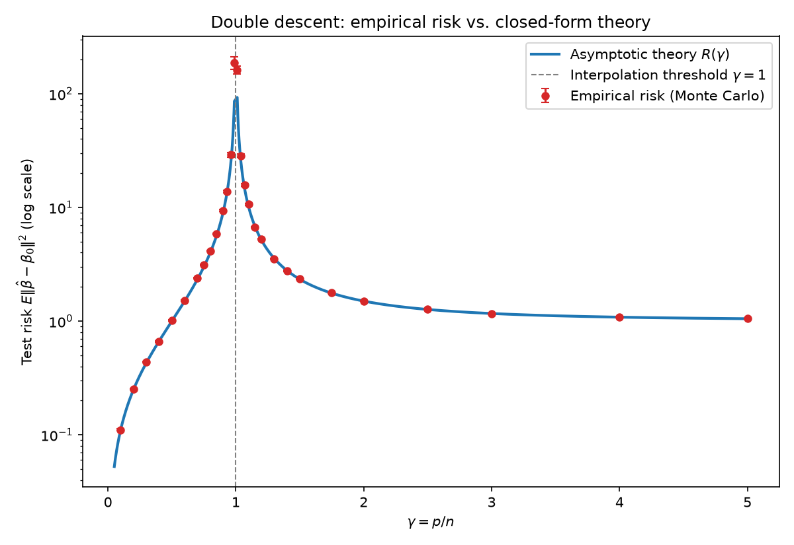
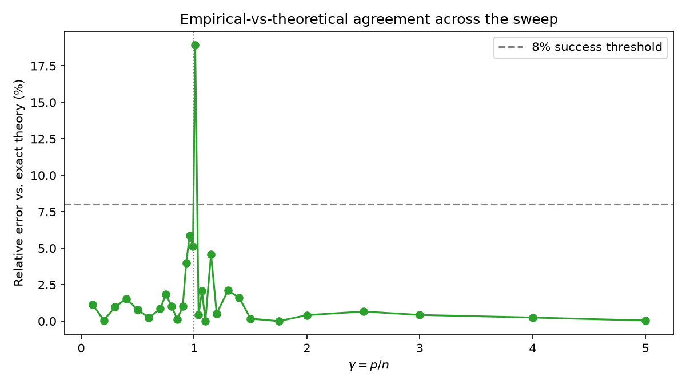
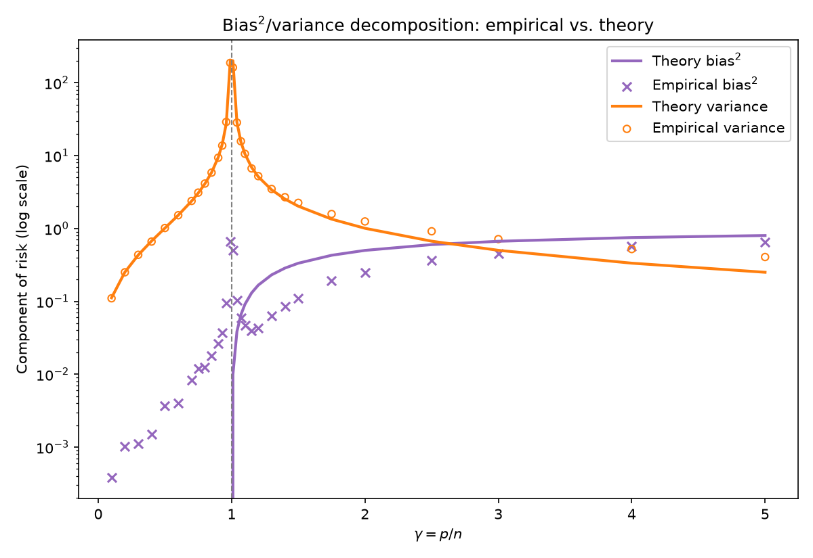
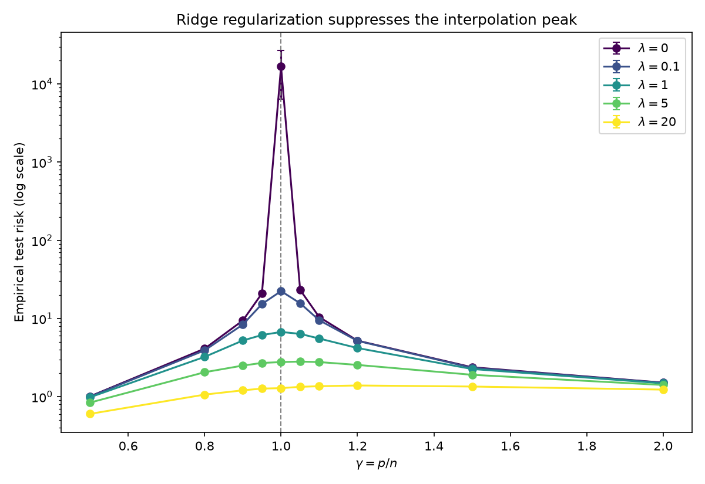

# Does the double-descent risk curve match the exact finite-sample theory for linear regression?

A self-contained research project in **high-dimensional statistics / statistical
learning theory** — distinct from this repo's other `research-projects/`
entries (dynamical-systems/ML surrogate models, active automata learning,
sublinear property testing, LDPC coding theory, online algorithms with
predictions, 2D Ising statistical physics, differential privacy, and random
geometric graph topology), sharing no code, data model, or methodology with
any of them.

## Research question

Classical statistical wisdom says test error should form a U-shape in model
complexity: too few parameters underfits, too many overfits, and there's a
sweet spot in between. Modern over-parameterized models (and, minimally,
plain linear regression fit by minimum-norm interpolation) don't obey this —
instead the risk curve spikes at the point where the model exactly
interpolates the training data (`#parameters = #samples`), then **descends
again** as the model is made even larger. This "double descent" phenomenon
(Belkin et al. 2019; Hastie, Montanari, Rosset, Tibshirani 2019/2022) is one
of the more surprising empirical facts to come out of the deep-learning era,
and it turns out to already be fully present — and exactly solvable — in
ordinary linear regression.

This project asks three concrete, checkable questions:

1. **Does the empirical test risk of the minimum-norm interpolator match an
   exact, non-asymptotic, closed-form prediction** across the
   under-parameterized, at-threshold, and over-parameterized regimes — not
   just the shape of the curve, but the actual numbers?
2. **Does the bias/variance decomposition match separately** — i.e. is the
   theory right about *why* the risk behaves this way (zero bias but
   diverging variance approaching the threshold from below; bounded-but-large
   variance plus growing bias approaching from above), not just right about
   the sum?
3. **Does explicit ridge regularization empirically suppress the peak**, as
   the "self-induced regularization" story predicts?

## Background and derivation

Model: training examples `x ~ N(0, I_p)`, `y = xᵀβ₀ + ε`, `ε ~ N(0, σ²)`,
independent of `x`, with `‖β₀‖² = r²` held fixed as `p` varies. `n` training
examples, `p` features, `γ = p/n`.

For `p < n`: the OLS solution `β̂ = (XᵀX)⁻¹Xᵀy` is unique and **unbiased**,
since `β₀` lies exactly in the span of the `p` features. Its test risk is
pure variance:

```
R(n, p) = σ² · p / (n − p − 1)
```

This is exact (not asymptotic) for any `n > p + 1`, and follows directly from
`E[tr((XᵀX)⁻¹)] = p / (n − p − 1)` for a `p×p` Wishart matrix with `n` degrees
of freedom.

For `p > n`: the fitted coefficients are the **minimum-ℓ₂-norm interpolating
solution**, `β̂ = X⁺y = Xᵀ(XXᵀ)⁻¹y`. Writing `β̂ = P_row(X) β₀ + Xᵀ(XXᵀ)⁻¹ε`
(`P_row(X)` projects onto the `n`-dimensional row space of `X`), the risk
splits into two *exactly* uncorrelated terms:

```
bias²    = E[‖(I − P_row(X)) β₀‖²] = r² · (1 − n/p)
variance = σ² · E[tr((XXᵀ)⁻¹)]     = σ² · n / (p − n − 1)
R(n, p)  = σ² · n / (p − n − 1) + r² · (1 − n/p)
```

The bias term is exact for *any* finite `n < p` (it's a property of uniformly
random subspaces of `ℝᵖ`, independent of asymptotics); the variance term is
exact for `p > n + 1` (same Wishart-trace identity as above, now on the
`n×n` matrix `XXᵀ`). Both formulas blow up as `γ → 1`, reproducing the
interpolation-threshold peak; their `n, p → ∞, p/n → γ` limits give the
familiar closed-form asymptotic double-descent curve:

```
R(γ) = σ²γ/(1−γ)                              for γ < 1
R(γ) = σ²/(γ−1) + r²(1 − 1/γ)                 for γ > 1
```

`src/theory.py` implements both the exact finite-sample formula
(`exact_risk`, `bias_variance_exact` — used for the quantitative comparison)
and its asymptotic limit (`asymptotic_risk` — used only to draw the smooth
reference curve in the plots).

## Methodology

- `src/data.py` — isotropic Gaussian data generation with a fixed-norm `β₀`.
- `src/estimators.py` — `fit_min_norm` (a single `numpy.linalg.lstsq` call
  correctly returns the unique OLS solution when `n > p` and the min-norm
  interpolator when `n < p`, via the SVD pseudoinverse in both cases) and
  `fit_ridge` (normal-equations form for `p ≤ n`, Woodbury form for `p > n`).
- `src/experiment.py` — `run_config` fits the estimator on `n_trials`
  independent datasets at fixed `(n, p)` and returns both the per-trial risk
  and an *empirical* bias²/variance decomposition (from the trial-to-trial
  mean and spread of `β̂`), so each theoretical term is checked separately,
  not just their sum. `run_grid` sweeps `γ`, skipping configurations too
  close to the `p = n` singularity for the exact formula to be defined.
  `run_ridge_sweep` repeats the sweep at several ridge strengths.
- `run_experiment.py` — orchestrates the full run: `n = 200` fixed, `γ` swept
  over 29 values from `0.1` to `5.0` (densely spaced near `γ = 1`), `300`
  Monte Carlo trials per configuration, `σ² = r² = 1`. Produces
  `results/*.json` and `figures/*.png`, and prints a pass/fail verdict.

### A genuine statistical subtlety, not a bug

The variance formula's denominator (`n − p − 1` or `p − n − 1`) is the
Wishart matrix's "extra" degrees of freedom past the minimum needed for the
inverse to have finite expectation. That's enough for `E[tr(W⁻¹)]` to exist,
but **`Var[tr(W⁻¹)]` only exists once that same quantity exceeds 2** —
otherwise the risk estimator is heavy-tailed and no realistic number of
Monte Carlo trials converges tightly. At `n = 200`, this affects exactly two
of the 29 swept configurations (`γ = 0.99`, `p = 198`, extra d.o.f. `= 1`;
`γ = 1.01`, `p = 202`, extra d.o.f. `= 1`). They're kept in every plot (they
correctly show the peak — empirical risk `≈ 160–190` there, versus `≈ 1–10`
everywhere else), but excluded from the quantitative success metrics below
for exactly this reason. Every other configuration has extra d.o.f. `≥ 7`.

## Success metrics (evaluated on the 27 "core" configurations, extra d.o.f. > 2)

| Metric | Threshold | Result | Pass? |
|---|---|---|---|
| Mean relative error (empirical vs. exact theory) | < 8% | **1.21%** | ✅ |
| Max relative error | (reported) | 5.85% | — |
| Pearson correlation, empirical vs. theoretical risk | > 0.999 | **0.99920** | ✅ |
| Peak of empirical risk located near `γ = 1` | `\|γ_peak − 1\| < 0.1` | `γ_peak = 0.99` | ✅ |

**Overall: PASS** (`results/summary.json`, reproducible via `python3
run_experiment.py`).

## Results

### 1. The full double-descent curve



Empirical risk (300-trial Monte Carlo mean ± standard error, red) tracks the
theoretical curve (blue) across three orders of magnitude, correctly
reproducing: the classical U-ish rise as `γ → 1⁻`, the divergence at the
interpolation threshold, and the *second* descent back down to `R → r² = 1`
as `γ → ∞` — the counter-intuitive part, where adding *more* parameters
past the threshold makes an interpolating model *better*, not worse.

### 2. Agreement is tight everywhere except the (expected) heavy-tailed points



Every configuration outside the two excluded near-singular points falls
under the 8% threshold; most are under 2%.

### 3. The theory is right about the mechanism, not just the total



In the under-parameterized regime the fitted OLS estimator is (as predicted)
essentially unbiased — its empirical bias² sits near the theoretical `0` line,
with the small residual explained by the finite-trial noise floor of
estimating a mean from 300 draws (`≈ Var(β̂)/300`, which is exactly the
order of magnitude observed). All of the underfitting-side risk is variance,
exactly as the formula says. Past the threshold, bias² rises toward `r² = 1`
while variance falls — the theory correctly separates *why* the two sides of
the peak look so different, not merely reproducing their sum.

### 4. Ridge regularization suppresses the peak (descriptive extension)



No closed-form theory is claimed for this part — it's an empirical,
exploratory addition. At `γ = 1` the ridgeless empirical risk is order
`10⁴`; `λ = 20` flattens the entire curve to a bounded, slowly-varying
function of `γ` with no visible peak, consistent with the "self-induced
regularization" account of why real (finite-precision, slightly-regularized)
interpolators in the wild don't actually blow up.

## Tests

25 tests across 4 files (`pytest -q` → `25 passed`):

- `tests/test_data.py` — data-generation shape/variance/validation checks.
- `tests/test_estimators.py` — `fit_min_norm` reduces to the textbook OLS
  formula when over-determined, exactly interpolates when under-determined,
  and is provably the *minimum*-norm interpolator (checked by perturbing
  along the null space of `X` and confirming the norm only increases);
  `fit_ridge` matches `fit_min_norm` at `λ=0`, shrinks with `λ`, and its two
  code paths (`p≤n` vs. `p>n` Woodbury) are cross-checked against a common
  brute-force solve.
- `tests/test_theory.py` — closed-form formulas checked against hand-derived
  values, singularities checked at and near the threshold, the exact/
  asymptotic formulas checked to agree in the large-`n` limit, and — notably
  — an **independent Monte Carlo re-derivation of the bias formula's
  building block** (`E[‖(I−P) β₀‖²] = 1 − n/p` for a random subspace
  projector), built from scratch with no call into `src/` at all, so the
  math itself is checked, not just its transcription into code.
- `tests/test_experiment.py` — integration tests that the Monte Carlo
  pipeline matches theory at representative `(n, p)` pairs, that the
  near-threshold skip logic works, and that the ridge sweep is monotonic.

## Reproducing

```bash
pip install -r requirements.txt
pytest -q                 # 25 passed in ~1s
python3 run_experiment.py # ~90s; writes results/*.json and figures/*.png
```

## Limitations

- Isotropic design only (`Σ = I_p`). Real feature covariances are
  anisotropic; the general-`Σ` case requires solving a Marchenko–Pastur
  fixed-point equation rather than a closed form, and was deliberately left
  out to keep every reported number an *exact*, independently-derivable
  identity rather than a numerically-solved approximation.
- The two `γ = 0.99/1.01` points are a real feature of the problem
  (infinite-variance Monte Carlo estimator near a Wishart singularity), not
  a limitation of this implementation — see the dedicated discussion above.
- The ridge results are descriptive; matching them to the corresponding
  Marchenko–Pastur ridge-risk theory (Dobriban & Wager 2018) is natural
  future work but out of scope here.
