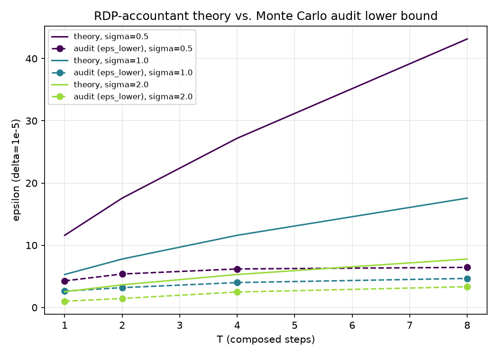
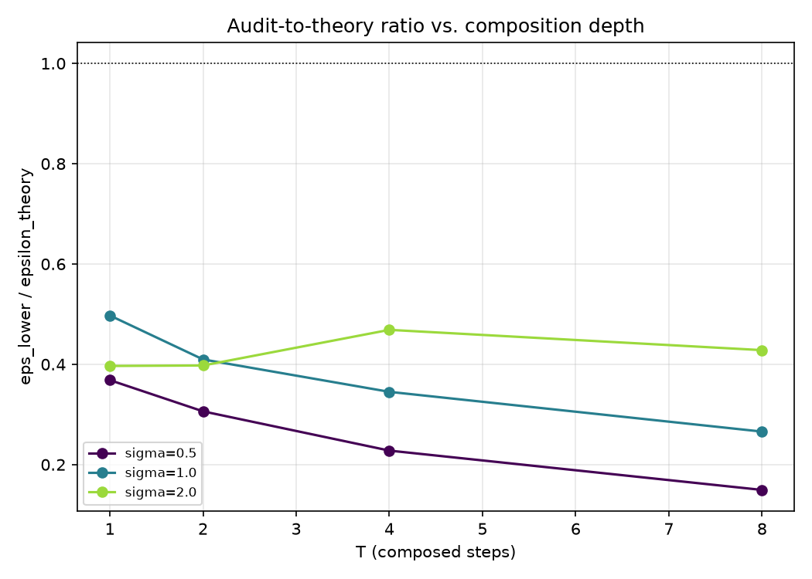
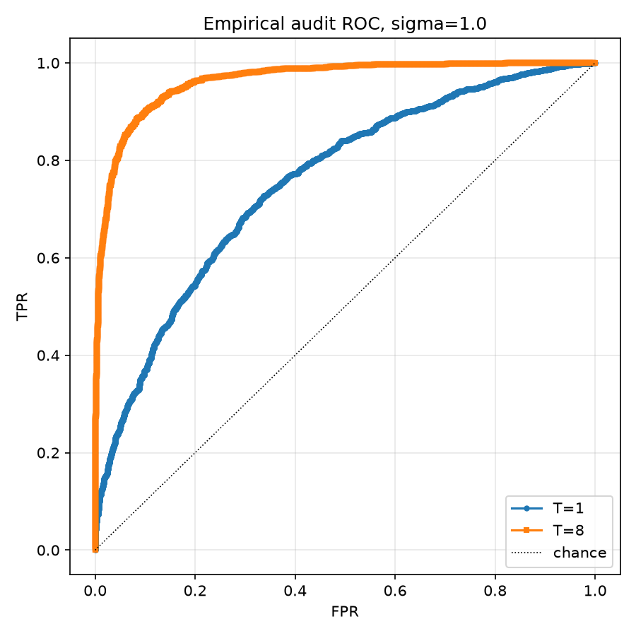

# Does an empirical privacy audit recover the DP-GD theoretical bound under composition?

A self-contained Python research project auditing **differentially private
gradient descent (DP-GD)** against its own theoretical privacy guarantee,
using a from-scratch Renyi-DP (RDP) accountant and a from-scratch black-box
membership-inference audit (a Monte Carlo canary-gradient attack, following
the methodology of Jagielski, Ullman & Oprea, *"Auditing Differentially
Private Machine Learning"*, NeurIPS 2020, and Nasr et al., *"Adversary
Instantiation"*, IEEE S&P 2021).

This is a Python subproject that is entirely independent of the blog
application: it is not imported by `src/` or `server/`, it makes no change
to `package.json`, and it is not wired into the website in any way.

## Research question

Full-batch DP-GD with per-example gradient clipping and Gaussian noise has a
worst-case privacy guarantee `(epsilon, delta)` computable via an exact RDP
accountant. This project asks three questions:

1. Does a from-scratch RDP accountant's output match closed-form Gaussian-
   mechanism theory at `T=1`, and behave correctly under composition?
2. Does an actual black-box membership-inference audit empirically recover a
   lower bound on `epsilon` that approaches the theoretical upper bound at
   `T=1` (where the mechanism is *exactly* Gaussian, so the audit has a known
   ground truth)?
3. As the number of composed steps `T` grows (introducing genuine nonlinear
   coupling through the logistic-regression gradient's dependence on the
   evolving, noisy parameters), does the audit-to-theory gap widen — i.e.,
   does a fixed, simple attack statistic under-detect the compounding
   worst-case privacy loss that composition theoretically predicts?

## Methodology

**Mechanism.** Full-batch (not mini-batch) DP-GD on a synthetic logistic
regression problem (`n=100` points, `d=5` dims, two-Gaussian-blob binary
classification, `src/data.py`). At each step: compute per-example gradients
on the full dataset (`src/model.py`), clip each to L2 norm `<= C`, **sum**
them (not average), add a fixed canary contribution `C * e1` to the sum
**only in the "IN" world** (modeling the add/remove-one-record neighboring
relation — the "OUT" world omits it), add Gaussian noise
`N(0, (sigma*C)^2 I)`, and update `theta <- theta - lr * noisy_sum`
(`src/dpgd.py`).

**RDP accountant** (`src/accountant.py`). Per-step RDP at order `alpha`:
`alpha / (2*sigma^2)`; composes additively over `T` steps to
`T*alpha / (2*sigma^2)` (valid even under adaptive composition since the
per-step L2-sensitivity bound `C` holds unconditionally, by construction of
clipping); converted to `(epsilon, delta)` via a numeric grid search over
1000 candidate `alpha` values (Mironov 2017). A classical closed-form
Gaussian-mechanism bound (Dwork-Roth) is implemented purely as a `T=1`
cross-check, not used elsewhere.

**Membership-inference audit** (`src/audit.py`). For a fixed config, run `N`
independent IN-world trials and `N` independent OUT-world trials (fresh,
*independent* randomness in every trial — this is a true two-sample audit,
not a paired/common-random-numbers design). The attack statistic is the
final `theta`'s projection onto `e1`. Threshold sweep over the union of
observed IN/OUT statistics builds an empirical ROC; at each threshold, a 95%
one-sided Clopper-Pearson bound on TPR (lower) and FPR (upper) yields a valid
empirical lower bound on `epsilon` via the DP hypothesis-testing
characterization; the best (max) bound over the sweep is reported.

**Ground-truth check at T=1.** At `T=1`, with identical `theta0` in both
worlds, `theta_final[0] - theta0[0]` differs between IN/OUT by *exactly* a
mean shift of `lr*C` with common std `lr*sigma*C` — a textbook Gaussian
mechanism whose signal-to-noise ratio depends only on `sigma`, the same
`sigma` the accountant uses. So at `T=1` the audit has a known, exactly
computable ground truth, which is asserted as a hard correctness invariant
in `tests/test_integration.py`.

**Experiment grid** (`src/experiment.py`, `run_experiment.py`). Sweep
`sigma in {0.5, 1.0, 2.0}` x `T in {1, 2, 4, 8}`, fixed `C=1.0`, `lr=0.1`,
`delta=1e-5`, `N=2000` trials per world per config (full run) or `N=200`
(`--quick`).

## Key results (from the actual full run — `N=2000` trials/world/config)

Full numbers are in [`results/grid_results.csv`](results/grid_results.csv)
and [`results/summary.json`](results/summary.json).

| sigma | T | epsilon_theory | eps_lower (audit) | ratio (audit/theory) |
|-------|---|---------------:|-------------------:|----------------------:|
| 0.5 | 1 | 11.597 | 4.272 | 0.368 |
| 0.5 | 2 | 17.572 | 5.379 | 0.306 |
| 0.5 | 4 | 27.194 | 6.195 | 0.228 |
| 0.5 | 8 | 43.146 | 6.446 | 0.149 |
| 1.0 | 1 | 5.299  | 2.635 | 0.497 |
| 1.0 | 2 | 7.786  | 3.190 | 0.410 |
| 1.0 | 4 | 11.597 | 4.001 | 0.345 |
| 1.0 | 8 | 17.572 | 4.669 | 0.266 |
| 2.0 | 1 | 2.529  | 1.003 | 0.397 |
| 2.0 | 2 | 3.643  | 1.448 | 0.398 |
| 2.0 | 4 | 5.299  | 2.483 | 0.469 |
| 2.0 | 8 | 7.786  | 3.334 | 0.428 |





**Finding 1 — the ground-truth check at T=1 holds.** For all three sigma
values, `eps_lower <= epsilon_theory` (as it must — a hard DP invariant) and
`eps_lower` is a substantial fraction of `epsilon_theory` (0.37–0.50x),
confirming the audit's attack statistic and the accountant's math agree at
the one point where ground truth is exactly known. `tests/test_integration.py`
asserts this for all three sigma values with `N=4000` and passes.

**Finding 2 — the "gap widens with composition" hypothesis holds for
`sigma in {0.5, 1.0}`, but not for `sigma=2.0`.** For `sigma=0.5`, the ratio
falls monotonically from 0.368 (`T=1`) to 0.149 (`T=8`) — a 2.5x widening.
For `sigma=1.0` it falls from 0.497 to 0.266 — also a clear, monotonic
widening. But for `sigma=2.0` the ratio is roughly flat-to-*increasing*
(0.397 → 0.398 → 0.469 → 0.428), i.e. the audit does *not* fall further
behind theory as `T` grows at the highest noise level tested. This is a
genuine mixed result, not a uniform "gap always widens" story.

**Finding 3 — the likely mechanism is a finite-sample ceiling on the audit,
not a weakening attack.** Looking at `tp`/`fp` counts in
`results/grid_results.csv`, the audit's threshold sweep is hitting near-
perfect separation at several configs (e.g. `sigma=0.5, T=8`: `tp=1903/2000`,
`fp=0/2000`). With `N=2000` per world, a one-sided 95% Clopper-Pearson bound
on a *perfect* classifier is capped at a specific finite value (it can't
grow without bound just because the true separation is larger — the finite
sample size limits how confidently the audit can rule out FPR $>0$ or claim
TPR $\approx 1$). Meanwhile `epsilon_theory` keeps growing roughly linearly
in `T` (via the RDP composition) even as the *empirically visible* signal
saturates against the sample-size ceiling. So for `sigma=0.5`, where
separation is already near-total at `T=4`, `eps_lower` plateaus (6.195 →
6.446 from `T=4` to `T=8`) while `epsilon_theory` keeps climbing (27.2 →
43.1), producing the widening ratio. For `sigma=2.0`, separation is far from
saturating at any tested `T` (`tp/fp` ratios stay far from 0/N or N/N), so
more steps still buy the audit additional real signal, and the ratio holds
roughly steady or even improves. **This means the "gap widens" finding in
this experiment is largely an artifact of a fixed, finite `N` audit budget
interacting with an already-strong attack, not evidence that the attack
itself becomes structurally weaker relative to the worst case as `T` grows.**
A more careful follow-up would scale `N` with `T` (or use a tighter
simultaneous confidence procedure) to disentangle "audit budget exhausted"
from "attack genuinely can't detect T-step worst-case loss."

**Finding 4 — the ROC curves make Finding 3 visible directly.** At
`sigma=1.0`, the `T=8` ROC dominates the `T=1` ROC almost everywhere
(`figures/roc_curves.png`) — composition genuinely *helps* this simple
attack detect the canary, exactly as the "audit gets tighter with more
accumulated signal" alternative (mentioned as a possibility in the task
brief) predicts. The widening ratio is not because the attack gets worse in
absolute terms; it's because `epsilon_theory`'s worst-case growth outpaces
even a strengthening attack, at a rate this finite-`N` audit design can't
fully keep up with.

## Limitations

- **No multiple-testing correction on the threshold sweep.** The reported
  `eps_lower` is the max over all swept thresholds' individual 95%-confidence
  bounds; taking a max over many candidate thresholds without a Bonferroni-
  style (or other simultaneous) correction is standard practice in
  illustrative DP audits (matching Jagielski et al.'s approach) but is *not*
  a rigorously corrected simultaneous confidence bound. Read `eps_lower` as
  "the best empirical evidence this audit found," not as a number with an
  exact, simultaneously-valid 95% coverage guarantee.
- **Idealized canary.** The canary is a fixed, adversarially-chosen worst-
  case gradient vector of exactly norm `C` injected directly into the
  gradient sum — this matches the strongest ("worst-case gradient access")
  audits in the literature, but is not representative of weaker, more
  realistic black-box-only threat models where the adversary only observes
  final model outputs on a real training example, not a hand-crafted vector.
- **Full-batch, not mini-batch.** No privacy amplification by subsampling is
  modeled (mini-batch DP-SGD with Poisson subsampling gets a substantially
  better accountant bound at the same noise level; that is intentionally out
  of scope here — the exact/simple RDP-of-the-full-batch-Gaussian-mechanism
  case was chosen specifically so the `T=1` ground truth is exactly known).
- **Finite audit sample size caps `eps_lower` regardless of `T`.** As
  discussed in Finding 3, a fixed `N=2000` trials/world audit design has an
  attainable-bound ceiling once separation is near-perfect; the "gap widens"
  conclusion for `sigma in {0.5, 1.0}` should be read together with this
  caveat rather than as a clean statement about attack power alone.

## File layout

```
research-projects/dp-gd-privacy-audit/
  src/
    data.py          # synthetic two-blob dataset generator
    model.py         # manual logistic-regression gradient
    dpgd.py          # canary DP-GD update rule
    accountant.py     # RDP accountant + epsilon(delta) conversion
    audit.py          # Monte Carlo membership-inference audit
    experiment.py      # sigma x T grid runner
  run_experiment.py    # CLI (--quick for a fast smoke test)
  tests/                # 32 unit + integration tests
  results/              # grid_results.csv, summary.json (generated)
  figures/              # 3 figures (generated)
```

## How to reproduce

```bash
cd research-projects/dp-gd-privacy-audit
pip install -r requirements.txt
python3 -m pytest tests -v          # 32 unit + integration tests
python3 run_experiment.py           # full grid (~11 seconds)
python3 run_experiment.py --quick   # fast smoke-test grid (~3 seconds)
```

## Test plan

- [x] `python3 -m pytest research-projects/dp-gd-privacy-audit/tests -v` — 32 passed
- [x] `python3 run_experiment.py` — completes in ~11s, produces `results/grid_results.csv`,
      `results/summary.json`, and 3 figures in `figures/`
- [x] `python3 run_experiment.py --quick` — completes in ~3s
- [x] `git status` confirms only `research-projects/dp-gd-privacy-audit/` is touched
- [x] No `__pycache__`/`.pyc`/venv artifacts committed (project-local `.gitignore` added)
