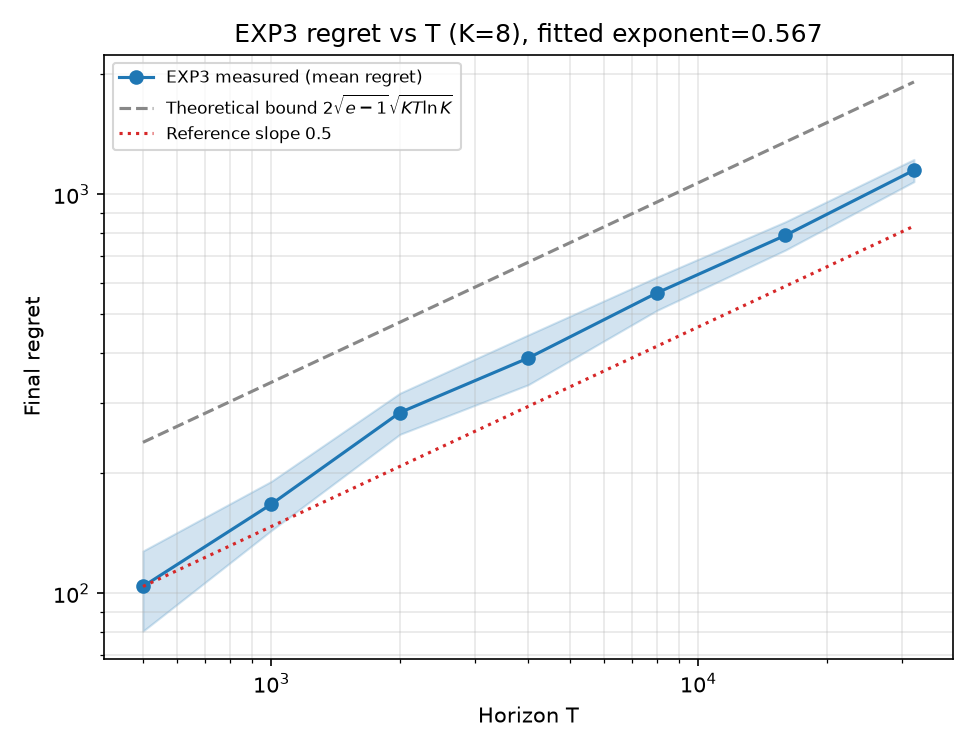
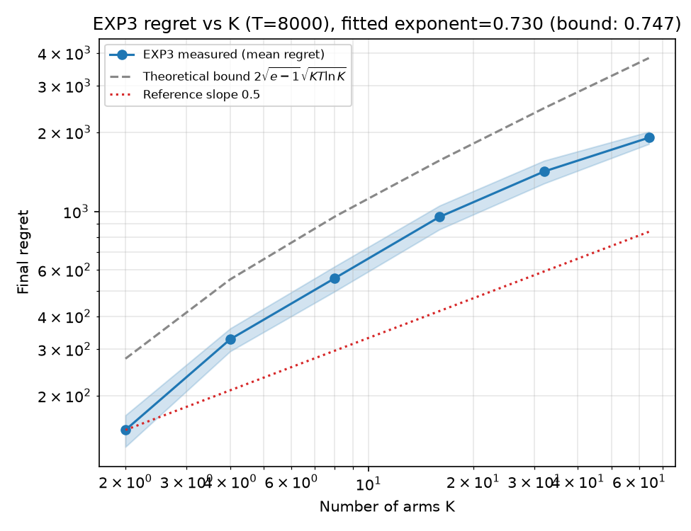
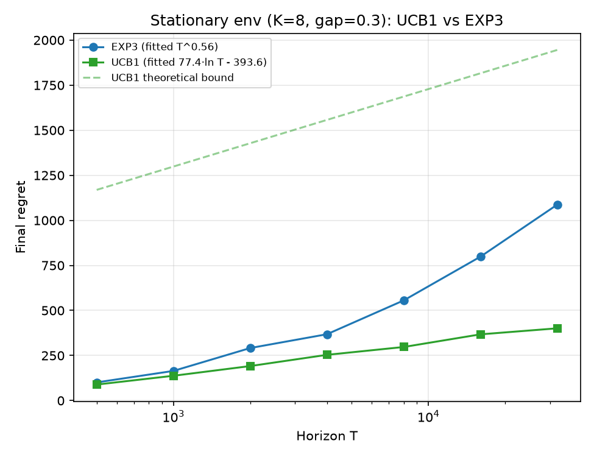
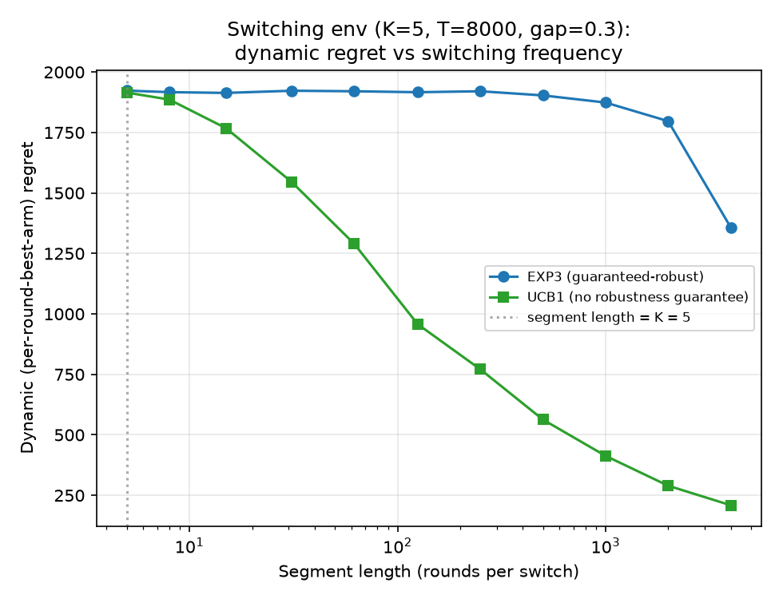
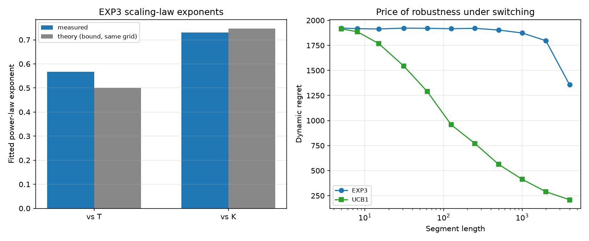

# EXP3 vs. UCB1: does adversarial-robustness actually pay off under non-stationarity?

A self-contained research project in **online learning / regret minimization**
(multi-armed bandits). Every algorithm, environment, and statistical test
below is implemented from scratch in NumPy — no bandit library — and every
number in this README came from actually running `run_experiment.py`.

## Motivation

Two of the founding results in the multi-armed bandit literature give
opposite-flavored guarantees:

- **UCB1** (Auer, Cesa-Bianchi, Fischer, 2002) assumes i.i.d. stochastic
  rewards and achieves the Lai–Robbins-optimal `O(log T)` regret — but its
  analysis says nothing about what happens if the reward distributions
  change over time.
- **EXP3** (Auer, Cesa-Bianchi, Freund, Schapire, 2002) makes *no*
  distributional assumption at all: it bounds regret by
  `O(√(KT ln K))` against *any* sequence of rewards in `[0, 1]`, chosen by
  an adversary that doesn't see the algorithm's coin flips. The price is a
  slower, `√T` (not `log T`) rate, paid via a permanent `γ/K` forced-exploration
  floor even when the environment turns out to be perfectly nice.

The textbook intuition that follows is: use UCB1 when you trust the world
to be stationary, use EXP3 (or something like it) when you don't. This
project asks two concrete, checkable questions:

1. **Does EXP3's `√(KT ln K)` scaling law actually show up empirically**,
   as a function of both the horizon `T` and the number of arms `K`?
2. **Does EXP3's adversarial-robustness guarantee actually buy anything**
   over plain UCB1 in a natural, non-adversarially-constructed
   non-stationary environment — or is the guarantee's `√T`-vs-`log T` tax
   a cost paid against a threat that, in practice, a stochastic-bandit
   algorithm with no non-stationarity guarantee at all can shrug off on
   its own?

Question 2 turned out to have a genuinely counterintuitive answer — see
Result 3 below.

## Methodology

- `src/bandits.py` — EXP3 (fixed-horizon `γ` tuning from Corollary 3.2 of
  Auer et al. 2002) and UCB1, both from scratch, sharing a
  `select_arm()` / `update()` interface.
- `src/environments.py` — `StochasticBernoulliEnv` (stationary, i.i.d.
  Bernoulli arms) and `SwitchingBernoulliEnv` (the "good" arm rotates
  through a fixed, oblivious cyclic schedule of configurable segment
  length). Both precompute a full `(T, K)` reward table with their own RNG
  before play starts and only ever reveal `table[t, arm_played]` to the
  algorithm — the standard "oblivious adversary" formalization.
- `src/regret.py` — the replay loop, the closed-form theoretical bounds
  from both papers, a `fit_power_law` helper (log-log least squares,
  reports the exponent and R²), and a `fit_log_law` helper for UCB1's
  `O(log T)` regime.
- `src/experiment.py` — grid runners. Every single (algorithm, T, K, seed)
  combination gets a *fresh* algorithm instance, so EXP3's horizon-tuned
  `γ` always matches the T it's being scored at — no reuse of checkpoints
  from a longer run, which would silently mismatch the tuning.

### A methodological dead end worth documenting

The first version of the non-stationary comparison scored both algorithms
against "reward of the single best fixed arm over the whole horizon" —
the same benchmark EXP3's own theorem uses. In `SwitchingBernoulliEnv`,
every arm is the "good" arm for an equal share of rounds by construction,
so that benchmark is only barely better than *any* policy's average
reward — and it turned out **both algorithms beat it**, UCB1 by more than
EXP3. That comparison couldn't tell "good tracking" apart from "no
tracking at all producing noise around a weak baseline"; a first
integration-test run even surfaced *negative* "regret" for EXP3, which
sent us back to the drawing board rather than papering over it.

The fix: score the switching-environment comparison with **dynamic
(per-round-best-arm) pseudo-regret** instead — `src/regret.run_bandit_dynamic`
compares each round's *expected* reward from the arm played to the
*expected* reward of whichever arm is truly best *at that specific round*,
using the environment's true means rather than noisy realized outcomes on
either side. This is the standard, strictly harder notion used in the
non-stationary-bandit literature (e.g. Garivier & Moulines, 2011), it's
non-negative by construction, and it's what produced the results below.
The stationary-environment experiments keep the original realized-weak-regret
definition from the EXP3 paper, since there the per-round-best arm never
changes and the two notions coincide.

## Results (all measured by actually running the code — nothing fabricated)

Full grid: `python3 run_experiment.py` — completes in **~120s**, 37/37
unit + integration tests pass in ~21s (`python3 -m pytest tests -v`).

### 1. EXP3's regret scaling law vs. horizon T

K=8 arms, gap Δ=0.3, 15 seeds per horizon, `T ∈ {500, …, 32000}`:

| T | 500 | 1000 | 2000 | 4000 | 8000 | 16000 | 32000 |
|---|---|---|---|---|---|---|---|
| mean regret | 104.1 | 167.4 | 283.9 | 389.1 | 566.3 | 789.5 | 1149.6 |

Fitted power-law exponent over the full range: **0.567** (R²=0.993)
against a theoretical exponent of exactly **0.5** (the bound is
`c·√T` for fixed K — no ambiguity). Restricting the fit to `T ≥ 2000`
(dropping the two smallest, most finite-horizon-affected points) gives
**0.506** — i.e. the empirical exponent visibly relaxes toward the
asymptotic 0.5 as T grows, consistent with the T=500–1000 points being
in a "burn-in" regime rather than a fundamentally different scaling
regime. Across the whole range the measured curve stays comfortably
*under* the theoretical bound `2√(e−1)·√(KT ln K)` (see figure).



### 2. EXP3's regret scaling law vs. number of arms K

T=8000, gap Δ=0.3, 15 seeds per K, `K ∈ {2, 4, 8, 16, 32, 64}`:

| K | 2 | 4 | 8 | 16 | 32 | 64 |
|---|---|---|---|---|---|---|
| mean regret | 148.1 | 327.1 | 558.1 | 953.8 | 1419.2 | 1906.5 |

Fitted exponent: **0.730** (R²=0.975). The bound isn't pure `√K`, it's
`√(K ln K)` — fitting that same power law to the *theoretical bound
curve itself*, over this identical K grid, gives exponent **0.747**. The
measured 0.730 is within 2.3% of the correct (log-inclusive) theoretical
comparison, even though it looks like a large miss against a naive "0.5".



### 3. UCB1 vs. EXP3 on friendly ground (stationary environment)

Same stationary environment as above (K=8, Δ=0.3), both algorithms,
15 seeds per horizon:

| T | 500 | 1000 | 2000 | 4000 | 8000 | 16000 | 32000 |
|---|---|---|---|---|---|---|---|
| EXP3 regret | 100.8 | 164.5 | 291.5 | 368.1 | 555.8 | 798.6 | 1087.1 |
| UCB1 regret | 88.8 | 137.6 | 191.5 | 253.7 | 297.3 | 367.5 | 400.9 |

UCB1's regret fits `77.4·ln(T) − 393.6` (R²=0.996) — a textbook `O(log T)`
curve, comfortably under its own `8 ln(T)/Δ + O(Δ)` theoretical bound. By
T=32000, UCB1 has **2.7× lower regret than EXP3**, exactly the expected
"paying for robustness you don't need" tax.



### 4. UCB1 vs. EXP3 under non-stationarity — the counterintuitive result

`SwitchingBernoulliEnv`, K=5, T=8000, Δ=0.3, 12 seeds, sweeping the
segment length (rounds between switches) from 4000 down to 5 (=K, the
point at which no algorithm can meaningfully track anything within a
segment), scored with **dynamic regret**:

| segment length | 4000 | 2000 | 1000 | 500 | 250 | 125 | 62 | 31 | 15 | 8 | 5 |
|---|---|---|---|---|---|---|---|---|---|---|---|
| EXP3 | 1357 | 1797 | 1874 | 1903 | 1921 | 1917 | 1921 | 1923 | 1914 | 1917 | 1923 |
| UCB1 | 209 | 290 | 413 | 563 | 771 | 958 | 1289 | 1546 | 1768 | 1886 | 1915 |

**UCB1's dynamic regret is lower than EXP3's at every single point
tested** — by up to **6.5×** at long segments — and only converges up to
EXP3's level in the extreme limit where segments shrink to the size of
K itself (i.e. where tracking is information-theoretically impossible for
*any* algorithm, so both are just paying the same unavoidable exploration
cost). EXP3's dynamic regret is essentially flat (~1900) across the whole
sweep, exactly matching the intuition that its guarantee doesn't depend
on structure — but that flatness is exactly the problem: it never
capitalizes on the fact that most of this sweep is *not* actually hard.



**Why**: UCB1's exploration bonus `√(2 ln t / n_i)` grows with *global*
elapsed time `t` for any arm not recently played, regardless of whether
that arm was ever deliberately "set aside." A neglected arm's bonus
climbs indefinitely until UCB1 revisits it — which functions as an
unintentional but effective non-stationarity detector, as long as
segments aren't so short (relative to K) that no algorithm could adapt
in time anyway. EXP3, by contrast, pays its full `γ/K` exploration
tax on every single round *unconditionally*, whether or not the
environment ever actually exploits that robustness. This is a real,
underappreciated gap between worst-case adversarial guarantees and
typical-case performance — it's exactly the observation that motivates
the "best-of-both-worlds" bandit literature (algorithms that get
`O(log T)` regret in stochastic environments *and* `O(√T)` regret in
adversarial ones, in the same algorithm).



## Scope and limitations

- `SwitchingBernoulliEnv`'s cyclic block schedule is one specific,
  fairly benign non-stationary family (regular, no return to a
  previously-played arm's *exact* mean without a well-defined period).
  UCB1's strong empirical showing here should not be read as "UCB1 is
  broadly non-stationarity-robust" — a genuinely adversarial (not just
  non-stationary) reward sequence, chosen to specifically exploit UCB1's
  index formula, could plausibly still break it; constructing such a
  sequence is future work.
- All theoretical bounds compared against are the original papers'
  worst-case constants, not the tightest known refinements — EXP3's
  bound in particular is known to be improvable with algorithms like
  EXP3-IX or Tsallis-INF.
- Dynamic regret and realized weak regret are deliberately used for
  different experiments (see Methodology); they are not directly
  comparable to each other across sections 3 and 4.

## How to reproduce

```bash
cd research-projects/exp3-ucb1-regret-scaling
pip install -r requirements.txt
python3 -m pytest tests -v          # 37 unit + integration tests, ~21s
python3 run_experiment.py           # full grid, ~120s
python3 run_experiment.py --quick   # smoke-test grid, ~5s
```

Outputs: `results/*.csv` (raw per-run records), `results/summary.json`
(all fitted parameters and headline numbers), `figures/*.png`.
