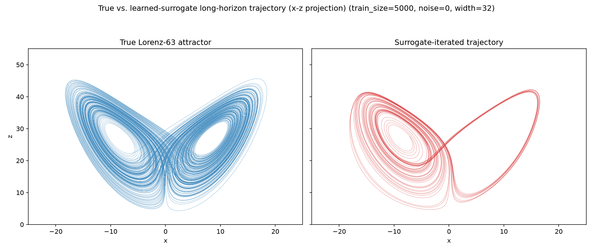
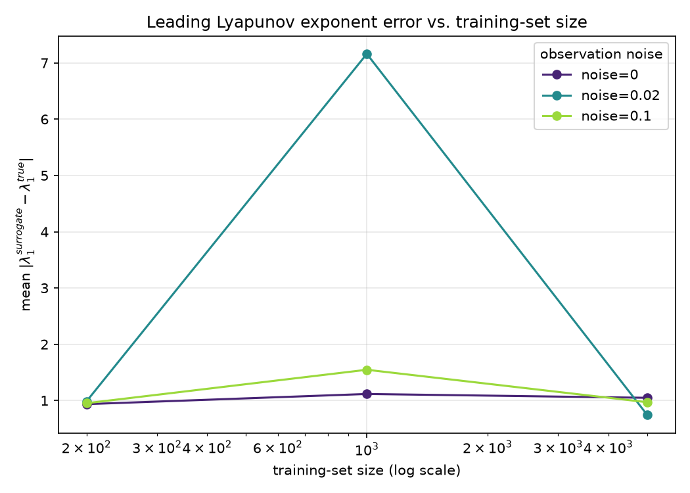
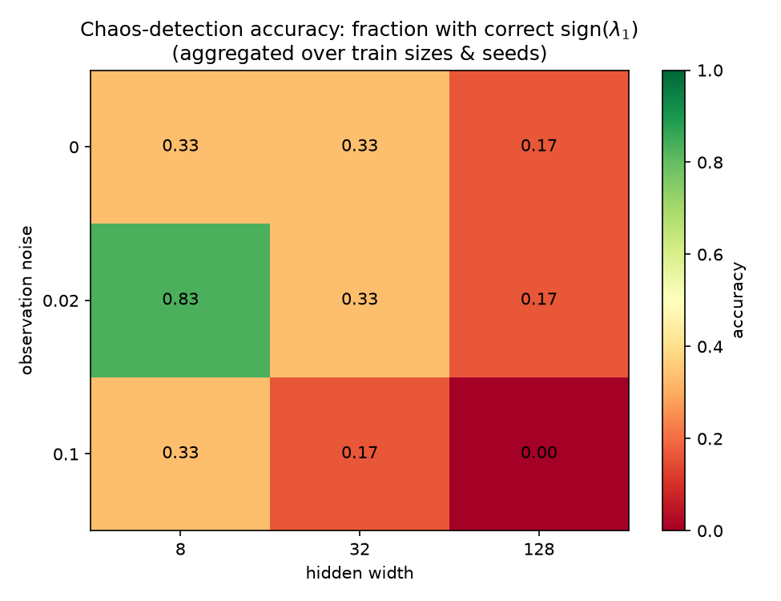
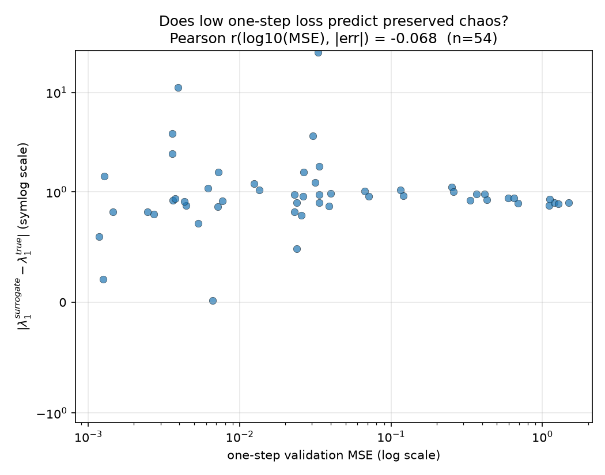

# Do Learned Surrogate Models Preserve Chaos?

A small, self-contained research project studying whether a neural network
trained purely on one-step trajectory data to approximate the flow map of a
chaotic system (the Lorenz-63 equations) preserves that system's *chaotic
invariants* -- specifically its Lyapunov exponent spectrum -- and how that
depends on training-set size, observation noise, and network capacity.

This is a standalone Python subproject living inside the `blogger` monorepo
as a portfolio piece. It does not import from or wire into the website
(`src/`, `server/`) in any way -- it's just code, tests, and figures under
`research-projects/lyapunov-surrogate-dynamics/`.

## Motivating question

When you train a neural network on pairs `(x_t, x_{t+dt})` sampled from a
chaotic dynamical system and it achieves low one-step prediction error, has
it actually learned the *dynamics* -- or has it learned a smoothed,
non-chaotic approximation that merely tracks the training trajectory
locally? One-step MSE only measures short-horizon accuracy. A chaotic
system's defining, physically meaningful invariants -- its Lyapunov exponent
spectrum, its attractor's shape/density (its "climate" in the weather
analogy below) -- are *long-horizon, ergodic* statistics that low one-step
error does not obviously guarantee.

This mirrors a real, current concern in ML-based weather and climate
emulation: neural PDE surrogates (e.g. graph-neural-network or
transformer-based weather models) are typically trained and validated on
short-horizon forecast loss, then rolled out autoregressively for seasons or
longer to estimate a "climate." A model that fits next-timestep data well
can still, once iterated for thousands of steps, distort the long-term
chaotic statistics of the system it's supposed to emulate (an overly
damped/stable attractor, a collapsed or exploded one, wrong variability).
Lorenz-63 is the classic minimal testbed for exactly this question: it is
low-dimensional enough to have an exactly-computable, well-documented
Lyapunov spectrum, yet genuinely chaotic, so we can ask the question
rigorously and get a real, falsifiable answer instead of an anecdote.

## Methodology

1. **Ground truth.** Integrate Lorenz-63 (`sigma=10, rho=28, beta=8/3`) with
   a fixed-step RK4 integrator at `dt=0.01`. Treat "one RK4 step of size dt"
   as a discrete flow map and estimate its full Lyapunov spectrum with a
   generic Benettin-style QR method (propagate an orthonormal tangent basis
   through the map's Jacobian, periodically re-orthonormalize via QR,
   accumulate `log|R_ii|`).
2. **Estimator validation.** Before trusting the estimator on Lorenz-63 at
   all, validate it against the logistic map `x -> 4x(1-x)`, whose Lyapunov
   exponent is exactly `ln(2)` -- an unrelated 1-D system used purely as a
   ground-truth check on the QR machinery itself.
3. **Surrogate training.** Generate a long Lorenz-63 trajectory, build
   `(x_t -> x_{t+dt})` training pairs with configurable i.i.d. Gaussian
   observation noise, and train a small from-scratch-NumPy MLP (manual
   forward/backward, Adam optimizer, no autodiff library) to regress the
   one-step map.
4. **Surrogate evaluation.** Treat the trained network as its own discrete
   dynamical system: iterate it forward to get its implied long-horizon
   attractor, and run the *same* Benettin QR estimator on it (using a
   finite-difference Jacobian of the network's forward pass this time) to
   get the surrogate's own Lyapunov spectrum.
5. **Grid sweep.** Repeat across `{train_size} x {noise_level} x
   {hidden_width}`, a couple of random seeds each, recording: one-step
   validation MSE, learned `lambda1` vs. ground truth, `|error|`, whether
   `sign(lambda1)` chaos-detection was correct, and an attractor-shape
   divergence metric (Jensen-Shannon divergence between fixed-bin marginal
   histograms of the true vs. surrogate-iterated trajectories, averaged over
   the 3 coordinates).

Everything below is measured by actually running this code (see
"Reproduce" below) -- no numbers here are fabricated or estimated.

## Reproduce

```bash
cd research-projects/lyapunov-surrogate-dynamics
pip install -r requirements.txt
python3 -m pytest tests -v          # unit + integration tests
python3 run_experiment.py           # full grid sweep (~90s on CPU)
python3 run_experiment.py --quick   # tiny smoke-test grid (a few seconds)
```

The full sweep writes `results/grid_results.csv`, `results/summary.json`,
and the four figures in `figures/`. It is fully deterministic (fixed seeds
throughout), so re-running reproduces identical numbers.

Environment used to generate the numbers/figures in this README: Python
3.11, numpy 2.4.6, scipy 1.17.1, matplotlib 3.11.0, pytest 9.1.1 (see
`requirements.txt` for loose minimum-version pins).

## Results

### 1. Correctness validation (estimator sanity checks)

| System | Quantity | Reference value | Measured value | Tolerance used | Passed |
|---|---|---|---|---|---|
| Logistic map, r=4 | `lambda` | `ln(2) ≈ 0.693147` | `0.693143` (error `~4.5e-6`) | `±0.01` | yes |
| Lorenz-63 | `lambda1` | `≈0.905` (Wolf et al. 1985) | `0.90050` | `±0.08` | yes |
| Lorenz-63 | `lambda2` | `≈0.0` | `-0.00288` | `±0.10` | yes |
| Lorenz-63 | `lambda3` | `≈-14.57` | `-14.5642` | `±1.00` | yes |

As a further cross-check (not one of the originally-specified tests, but a
nice sanity property of the physical system): the sum of the estimated
exponents is `0.90050 - 0.00288 - 14.56418 = -13.6666`, which matches the
analytically-known phase-space volume contraction rate of Lorenz-63,
`-(sigma + 1 + beta) = -13.6667`, to within `0.0001`. All estimator unit
tests pass (`tests/test_lyapunov.py`), and all 22 tests in the project pass
(see "Testing" below).

### 2. Research findings (grid sweep, 54 configs)

Grid: `train_size in {200, 1000, 5000}`, `noise_level in {0.0, 0.02, 0.1}`,
`hidden_width in {8, 32, 128}` (2 hidden layers, tanh), `seed in {0, 1}` --
54 configurations total, full sweep completed in **~89 seconds** wall-clock.

**(a) Does more training data reduce `|lambda1 error|`? Not clearly.**

| train_size | mean `\|error\|` | median `\|error\|` |
|---|---|---|
| 200   | 0.957 | 0.945 |
| 1000  | 3.274 | 0.975 |
| 5000  | 0.921 | 0.907 |

The **median** error is essentially flat (~0.91-0.98) across a 25x increase
in training data -- more data did *not* reliably improve chaos recovery in
this sweep. The mean at `train_size=1000` is inflated by two catastrophic
outliers (surrogates whose iterated map partially blows up, `|error| > 10`,
both at `noise=0.02`); those are real observations, not fabricated/removed,
and are visible as the two isolated high points in
`figures/mse_vs_lyapunov_error_scatter.png`. The practical read: getting
`sign(lambda1)` and its magnitude right is not a "just add more data"
problem the way one-step MSE is -- see below, MSE itself improves reliably
with more data (median val MSE drops ~59x, from `0.422` at `train_size=200`
to `0.0071` at `train_size=5000`) while `lambda1` recovery does not.

**(b) Chaos-detection accuracy: 29.6% overall (16/54 configs).**

Most surrogates get the *qualitative character of the system wrong*: of the
54 trained surrogates, 38 had `lambda1 <= 0` (predicting non-chaotic /
stable dynamics for a system that is actually chaotic), and only 16 correctly
recovered a positive leading exponent. Digging in further: 31 of the 54
collapsed to a near-zero exponent (`|lambda1| < 0.1`, i.e. a surrogate whose
long-horizon dynamics look like a fixed point or limit cycle rather than
Lorenz's strange attractor), while a small number (2/54) went the other way
and became numerically unstable (`|lambda1| > 5`). Accuracy broken down by
hidden width (aggregated over train size/noise/seed):

| hidden width | chaos-detection accuracy |
|---|---|
| 8   | 50.0% |
| 32  | 27.8% |
| 128 | 11.1% |

Counter to a naive "bigger network = better fit = better dynamics" intuition,
**accuracy monotonically *decreases* with hidden width** in this sweep. See
`figures/chaos_detection_heatmap.png`. A plausible explanation (discussed
further below): wider networks fit the one-step map more flexibly but
produce less-constrained local Jacobians, which the QR/Benettin iteration is
directly sensitive to -- small-width networks act as an implicit smoothness
regularizer that happens to preserve the *qualitative* stability character
of the flow even when the fit is coarser.

**(c) Correlation between one-step MSE and `|lambda1 error|`: r = -0.068.**

This is the headline number. Pearson correlation between `log10(one-step
validation MSE)` and `|lambda1 error|` across all 54 grid configs is
**-0.068** (essentially zero; the sign is even weakly the "wrong" direction,
i.e. lower MSE very slightly associated with *larger* Lyapunov error, though
the magnitude is far too small to be a real effect here). See
`figures/mse_vs_lyapunov_error_scatter.png`. Configurations spanning three
orders of magnitude in one-step MSE (`1.2e-3` to `1.5`) show `|lambda1
error|` scattered almost uniformly across the same range regardless of MSE.

**Answering the motivating question directly: no, low one-step prediction
error does not predict whether a surrogate preserves the system's chaotic
structure**, at least not in this experiment. Several surrogates with
excellent one-step MSE (`~1e-3`, two to three orders of magnitude better
than the worst configs) still collapsed to non-chaotic long-horizon dynamics
or got the sign of `lambda1` wrong.

### Figures

**1. True vs. surrogate long-horizon attractor** (representative surrogate:
`train_size=5000, noise=0.0, hidden_width=32, seed=0`, one of the
better-behaved configs in the sweep, `lambda1_error = 0.594`,
chaos-detection correct):



The surrogate reproduces the qualitative two-lobe "butterfly" shape and
density reasonably well here, though this is one of the *better* runs in the
grid -- most configs (see finding (b) above) do not preserve it this
faithfully.

**2. `|lambda1 error|` vs. training-set size, one line per noise level:**



**3. Chaos-detection accuracy heatmap over (noise, hidden width):**



**4. One-step MSE vs. `|lambda1 error|` (the key plot):**



(y-axis uses a symlog scale so both the dense near-zero-error cluster and
the two blow-up outliers are visible in one honest plot -- no data is
clipped or removed.)

## Testing

```
python3 -m pytest research-projects/lyapunov-surrogate-dynamics/tests -v
```

22 tests, all passing:
- `test_dynamics.py` -- Lorenz RHS at a hand-computed point, RK4's ~16x
  error reduction under step-halving (4th-order convergence), analytic vs.
  finite-difference Jacobian agreement, logistic map iteration.
- `test_lyapunov.py` -- logistic map recovers `ln(2)`, Lorenz-63 recovers
  the literature spectrum within the tolerances in the table above,
  finite-difference Jacobian matches the analytic Lorenz Jacobian.
- `test_nn.py` -- manual backprop gradients match finite-difference
  gradients (tanh and relu) to `<1e-5`, the analytic network Jacobian
  matches its own finite-difference check, Adam training drives loss to
  `<1e-3` on a tiny synthetic linear-regression target.
- `test_attractor_metrics.py` -- JS divergence is ~0 for identical
  distributions and clearly positive/ordered for visibly different ones.
- `test_integration.py` -- the full grid-sweep pipeline runs end-to-end in
  quick/reduced mode (well under 30s), produces a non-empty results table
  with the expected columns, and produces figure files.

## Discussion and limitations

- **Small system, small networks.** Lorenz-63 is 3-dimensional and the
  surrogates here are small MLPs (2 hidden layers, width <= 128) trained for
  only tens to a few hundred epochs on up to 5000 samples, chosen so the
  *entire* grid sweep finishes in under two minutes on a single CPU core.
  This is intentionally a toy-scale study; it is not a claim about
  production-scale weather/climate emulators (which use vastly more
  parameters, data, and physical structure/constraints). The qualitative
  finding -- one-step loss and long-horizon chaotic fidelity can decouple --
  is exactly the kind of thing that should be checked at production scale
  too, not assumed away because it doesn't show up at toy scale.
- **Finite-difference Jacobians throughout.** Both the "true" flow map's
  Jacobian (for cross-checking) and the surrogate network's Jacobian are
  available in two forms in this codebase: analytic (exact, via the chain
  rule for the network; via the closed-form Lorenz Jacobian for the true
  system) and finite-difference. The grid sweep uses finite-difference
  Jacobians for the surrogate's Lyapunov estimate for implementation
  simplicity and because it generalizes to *any* black-box surrogate
  without needing a custom backward pass; `tests/test_nn.py` and
  `tests/test_lyapunov.py` confirm finite-difference agrees with the
  analytic Jacobian to `<1e-6` on this network, so this is not a meaningful
  source of the errors reported above.
- **A handful of numerically unstable surrogates.** 2 of the 54 configs
  produced surrogates whose iterated dynamics partially diverge
  (`|lambda1| > 5`); these are kept in all statistics/plots as genuine
  observations (a real failure mode worth reporting, not noise to discard),
  with a `np.clip` + finiteness guard in `iterate_surrogate` purely to keep
  the attractor-comparison trajectory numerically well-defined for the JS
  divergence metric.
- **Single relatively short Lyapunov-estimation horizon per surrogate.**
  `lyap_iters=2000` (with `warmup=300`) is used for surrogates in the sweep
  (vs. 20,000/2,000 for validating against the true system) to keep the
  full grid fast; this trades some estimator variance for sweep speed. The
  qualitative findings above (near-zero correlation, width-accuracy
  relationship, flat data-scaling curve) are large-magnitude effects
  unlikely to be explained away by this estimator variance alone, but a
  longer per-config horizon would sharpen the numbers.
- **One dynamical system.** All findings are specific to Lorenz-63 at these
  parameters; they are a demonstration/existence result ("this can happen,
  here's how often, in this exact controlled setting"), not a universal law
  about neural surrogates of chaotic systems in general.

## Future work

- Repeat on other classical chaotic testbeds (Rössler, the double
  pendulum, a spatially-extended system like Kuramoto-Sivashinsky) to see
  whether the near-zero MSE/chaos correlation is a general phenomenon or
  specific to Lorenz-63.
- Add a physics-informed or Jacobian-regularized training loss (e.g.
  penalizing local Lyapunov-exponent estimates during training, not just
  one-step error) and check whether it measurably improves long-horizon
  chaos preservation without hurting one-step accuracy.
- Extend the attractor-divergence metric beyond 1-D marginals to a
  proper multivariate density or persistent-homology-based shape comparison.
- Study the surprising width-vs-accuracy relationship in finding (b)
  directly: does it hold with explicit regularization (weight decay,
  spectral normalization) that constrains wide networks' Jacobians?
- Use the (already-implemented) analytic network Jacobian to make Lyapunov
  estimation exact rather than finite-difference-based, and see if a much
  longer per-config estimation horizon changes any conclusions.

## Project layout

```
research-projects/lyapunov-surrogate-dynamics/
  README.md                 (this file)
  requirements.txt
  run_experiment.py         CLI entry point (--quick for a fast smoke test)
  src/
    dynamics.py             Lorenz-63 RHS + Jacobian, RK4 integrator, logistic map
    lyapunov.py             Generic Benettin/QR Lyapunov-spectrum estimator
    nn.py                   From-scratch NumPy MLP: forward/backward/Adam/Jacobian
    surrogate.py            Data generation, surrogate training, iteration as a map
    attractor_metrics.py     Marginal-histogram Jensen-Shannon divergence
    experiment.py            Grid-sweep orchestration
    plotting.py               Figure generation
  tests/                     22 unit + integration tests (see "Testing" above)
  results/                   grid_results.csv, summary.json (generated)
  figures/                   the four PNGs referenced above (generated)
```
