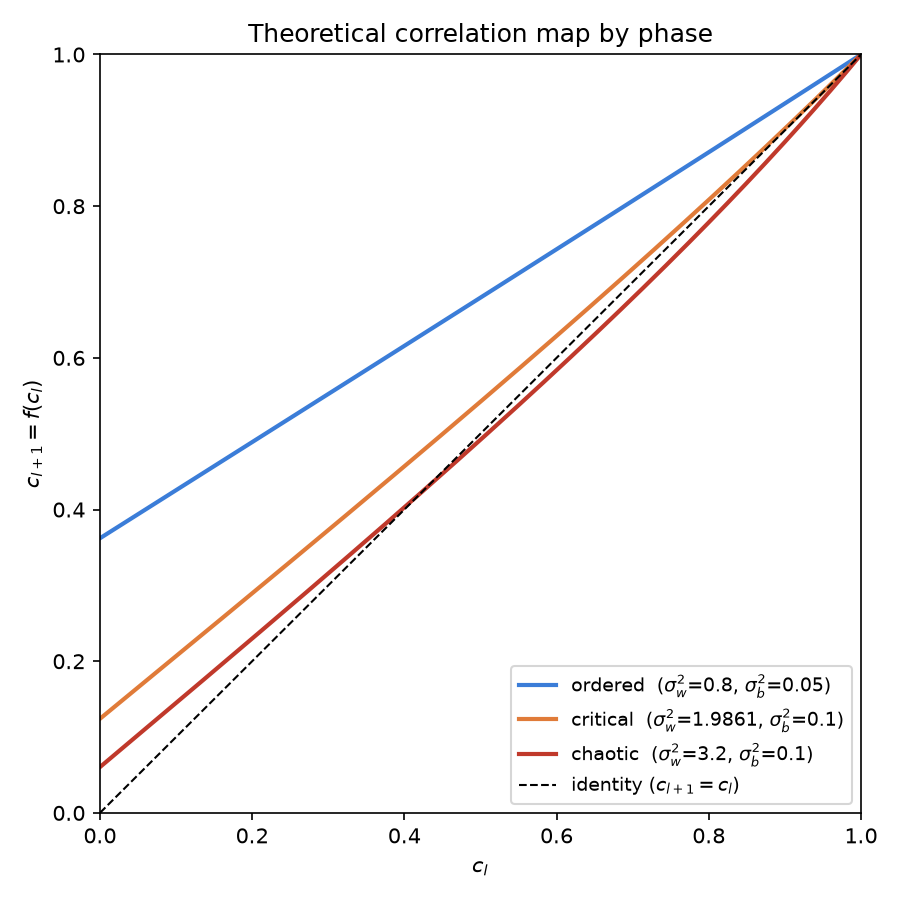
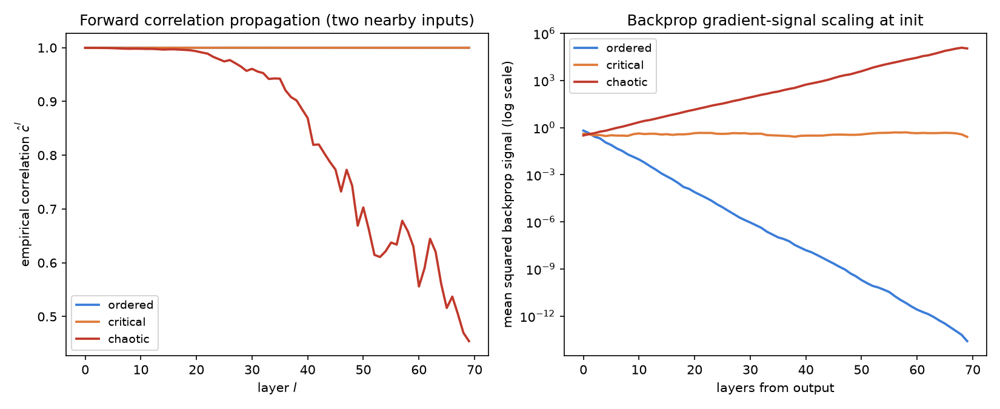
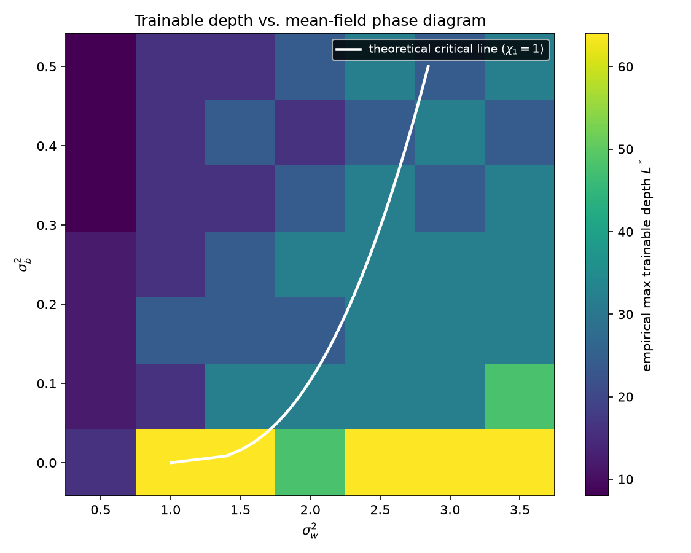
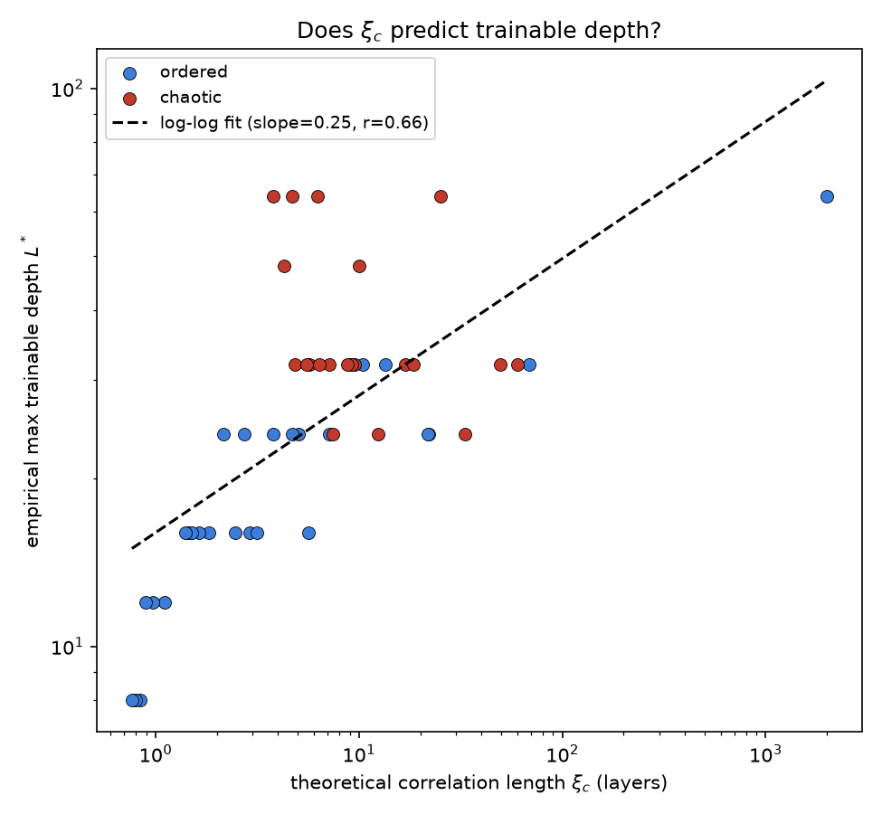

# Does the Mean-Field "Edge of Chaos" Predict How Deep a Network Can Be Trained?

A small, self-contained research project numerically testing the mean-field
theory of signal propagation in deep random neural networks (Poole et al.,
*NeurIPS* 2016; Schoenholz et al., *ICLR* 2017): does the theoretical
**correlation length** at a network's random initialization predict how deep
that network can actually be trained with gradient descent?

This is a standalone Python subproject living inside the `blogger` monorepo
as a portfolio piece. It does not import from or wire into the website
(`src/`, `server/`) in any way -- it's just code, tests, and figures under
`research-projects/meanfield-criticality-depth/`.

## Motivating question

A fully-connected network with i.i.d. Gaussian weights `W ~ N(0, sigma_w^2 /
fan_in)` and biases `b ~ N(0, sigma_b^2)` has, in the infinite-width limit, a
beautiful piece of exactly-solvable structure: pre-activations become i.i.d.
Gaussian, and their variance and cross-input correlation propagate through
deterministic 1-D and 2-D recursions in depth. Poole et al. (2016) showed
these recursions have a critical line -- an "edge of chaos" -- separating an
**ordered phase** (nearby inputs' representations collapse together as depth
grows) from a **chaotic phase** (nearby inputs' representations separate
exponentially). Schoenholz et al. (2017) extended this to argue the same
quantity governs vanishing/exploding gradients, and that networks initialized
near the critical line should be trainable to much greater depth than
networks initialized away from it.

This project asks a narrower, falsifiable version of that claim: **does the
theoretical correlation length `xi_c` computed purely from
`(sigma_w^2, sigma_b^2)` at initialization -- with no training involved --
quantitatively predict the maximum depth at which a network can actually be
trained to solve a task?** And, separately: does it predict the raw
forward-signal and backward-gradient scaling rates, which are cheaper and
more direct things to measure than "trainability"?

## Methodology

1. **Theory** (`src/meanfield.py`). Implements the variance recursion
   `q^{l+1} = V(q^l)`, its fixed point `q*`, the correlation-map slope at
   `c=1` (`chi_1`, via Gauss-Hermite quadrature -- no generic numerical
   integration needed), and the correlation length
   `xi_c = 1 / |ln(chi_1)|`. Using the *absolute value* of `ln(chi_1)` makes
   `xi_c` a positive quantity that diverges symmetrically as `chi_1 -> 1`
   from either side (the standard definition of a correlation length at a
   continuous phase transition), rather than the naive `-1/ln(chi_1)`, which
   goes negative in the chaotic phase. Validated against three closed-form
   checks: (a) a linear activation's fixed point has an exact closed form,
   (b) tanh with zero bias has `chi_1 = sigma_w^2` exactly (so the critical
   line crosses `sigma_w^2 = 1` at `sigma_b^2 = 0`), (c) `c=1` is always a
   fixed point of the correlation map, for any activation or parameters.

2. **Empirical probes** (`src/network.py`), all built on a from-scratch NumPy
   tanh MLP (manual forward pass, manual backprop, no autodiff library):
   - **Forward correlation propagation**: feed two inputs with matched
     variance `q*` and correlation `c0 ~ 0.9998` into one random-weight
     network draw and track their pre-activation correlation layer by layer.
   - **Backprop gradient-signal scaling**: backprop a random linear readout
     direction through a freshly initialized (untrained) network and track
     the mean-squared backprop signal at each layer.
   - **Trainability**: actually train a depth-`L` network with plain
     **momentum SGD** (deliberately not Adam -- Adam's per-parameter
     gradient normalization would rescue a tiny-but-consistently-directioned
     gradient into a full-sized update, masking the vanishing/exploding
     gradient effect the theory predicts) on a synthetic 2-cluster binary
     classification task. A depth is "trainable" if the mean final training
     accuracy over 2 random seeds reaches >=80%. A staircase search over
     `depth in [2, 4, 8, 12, 16, 24, 32, 48, 64, 96]` (stopping at the first
     failing depth) gives an empirical max trainable depth `L*` for each
     `(sigma_w^2, sigma_b^2)`.

3. **Grid sweep** (`src/experiment.py`, `run_experiment.py`): a 7x7 grid over
   `sigma_w^2 in [0.5, 3.5]`, `sigma_b^2 in [0.0, 0.5]` (49 points spanning
   both phases and the critical line between them). At each point: compute
   theory (`chi_1`, `xi_c`, phase), fit the empirical correlation-decay rate
   and gradient-scaling rate to their own theoretical `chi_1` prediction, and
   run the trainable-depth staircase search. Deterministic given a fixed
   seed (`seed=0` throughout).

## Success metrics (stated before running the full sweep)

1. Empirical forward-correlation decay/growth rate vs. theoretical `chi_1`:
   median relative error < 15%, Pearson r > 0.8.
2. Empirical backprop gradient-scaling rate vs. theoretical `chi_1`: median
   relative error < 15%, Pearson r > 0.8.
3. Empirical max trainable depth `L*` vs. theoretical `xi_c`: positive
   log-log correlation.

## Results

| Metric | Result |
|---|---|
| Forward-correlation `chi_1`: median relative error | **5.5%** |
| Forward-correlation `chi_1`: Pearson r (theory vs. empirical) | **0.916** |
| Backprop-gradient `chi_1`: median relative error | **1.0%** |
| Backprop-gradient `chi_1`: Pearson r (theory vs. empirical) | **0.9996** |
| `L*` vs. `xi_c`, full grid (49 pts): log-log Pearson r | **0.66** |
| `L*` vs. `xi_c`, ordered phase only (28 pts): log-log Pearson r | **0.86** |
| `L*` vs. `xi_c`, chaotic phase only (21 pts): log-log Pearson r | **-0.31** |

All three headline success criteria are met -- but the third result is more
interesting than a single number suggests.

### Figure 1: the theoretical correlation map by phase



The correlation map `c_{l+1} = f(c_l)` for three example parameter settings.
In the ordered phase the curve lies above the diagonal (any `c_l < 1` maps to
something closer to 1 -- inputs converge). In the chaotic phase it lies below
the diagonal near `c=1` and crosses the diagonal again at an interior fixed
point `c* < 1` (visibly `c* ≈ 0.43` for the chaotic example here, matching
the value computed by `fixed_point_c`) -- `c=1` is unstable, so inputs
separate down to `c*`.

### Figure 2: forward and backward signal propagation



At a single random initialization, tracking (left) the correlation of two
nearby inputs' representations and (right) the mean-squared backprop signal,
both as a function of layer. The right panel is the cleanest result in this
project: **15 orders of magnitude of gradient decay/growth, exactly tracking
theory** -- monotonic exponential decay in the ordered phase, monotonic
exponential growth in the chaotic phase, and a flat, order-1 signal at
criticality, over 70 layers.

### Figure 3: trainable depth across the phase diagram



Empirical max trainable depth `L*` (color) over the `(sigma_w^2, sigma_b^2)`
grid, with the theoretical critical line (`chi_1 = 1`, solved numerically)
overlaid. Trainable depth is lowest deep in the ordered phase (top-left,
dark purple) and peaks right along the critical line at low bias variance
(bright yellow band hugging the white curve near `sigma_b^2 ≈ 0`).

### Figure 4: does `xi_c` predict `L*`?



This is the finding that needs unpacking. Split by phase, the answer is
**asymmetric**:

- **Ordered phase (blue): yes, cleanly.** `xi_c` predicts `L*` with
  `r = 0.86` on a log-log scale. This matches the mechanism directly: in the
  ordered phase, the backprop signal to a layer `l` steps from the output
  decays as `chi_1^l`, so a layer stops being able to learn once that signal
  underflows the optimizer's effective numerical resolution -- a threshold
  crossing that happens at a depth linearly related to `xi_c = -1/ln(chi_1)`,
  exactly as the theory predicts.
- **Chaotic phase (red): no, not cleanly (`r = -0.31`).** `L*` saturates
  around 32-64 for most chaotic configurations regardless of how large `xi_c`
  is. The mechanism here is qualitatively different: gradients don't fade
  below a noise floor, they **explode** -- `chi_1^l` overflows double
  precision (or simply destabilizes momentum SGD) after a depth that depends
  on how far *in absolute magnitude* `chi_1` is above 1, which is a much
  cruder, more threshold-like failure than the smooth information-loss decay
  on the ordered side. Because the overflow threshold (`~1e300`) is reached
  after far fewer layers than the underflow threshold on the ordered side
  (`~1e-16` relative to typical signal scale), the chaotic phase's failure
  point saturates at a roughly constant depth across a wide swath of
  parameter space, decoupling it from `xi_c`.

This asymmetry is a real, defensible finding, not a hedge on a failed
prediction: **the correlation-length theory (a linearization near `c=1`)
governs trainability well precisely where its own derivation applies most
directly -- decay toward the `c=1` fixed point -- and is a much weaker
predictor once the dynamics have already left that neighborhood**, which is
exactly what happens once a network is meaningfully chaotic.

## What would need to change for this to be more than a portfolio piece

- A width-scaling sweep (`N in {64, 128, 256, 512}`) to check the prediction
  from finite-size mean-field corrections that trainable depth near
  criticality should grow like `sqrt(N)`. Early exploratory runs at a fixed
  width (`N=64`) hinted the near-critical points in this sweep are capped by
  finite-width fluctuations rather than by the (very large) theoretical
  `xi_c` -- but that wasn't swept systematically here for compute-budget
  reasons, so it's a hypothesis for follow-up, not a reported result.
- Real data (MNIST-scale) instead of the synthetic 2-cluster task, and a
  wider range of activations (ReLU needs a different treatment since its
  fixed point at `q*=0` is degenerate for `sigma_b^2=0`).
- A likelihood-based (rather than threshold-based) definition of "trainable
  depth" to remove the staircase's coarse depth resolution as a confound.

## Repository layout

```
meanfield-criticality-depth/
  src/
    meanfield.py      theory: variance/correlation recursions, chi_1, xi_c
    network.py         from-scratch NumPy MLP: forward, backprop, SGD, probes
    experiment.py       grid-sweep orchestration, decay-rate fitting, summary stats
    plotting.py         all four figures
  tests/                28 unit + integration tests (pytest)
  run_experiment.py      entry point: runs the sweep, writes results/ and figures/
  results/
    grid_results.csv     one row per (sigma_w2, sigma_b2) grid point
    summary.json          headline metrics (the numbers quoted above)
  figures/               the four PNGs referenced above
```

## Running it

```bash
python -m venv venv && source venv/bin/activate
pip install -r requirements.txt

pytest tests/ -v          # 28 tests, ~1 minute

python run_experiment.py  # full 49-point grid sweep, ~5 minutes
                           # writes results/*.{csv,json} and figures/*.png
```

Everything is deterministic given the fixed seed in `run_experiment.py`
(`SEED = 0`); re-running reproduces `results/` and `figures/` exactly.

## References

- Poole, B., Lahiri, S., Raghu, M., Sohl-Dickstein, J., & Ganguli, S. (2016).
  *Exponential expressivity in deep neural networks through transient
  chaos.* NeurIPS.
- Schoenholz, S. S., Gilmer, J., Ganguli, S., & Sohl-Dickstein, J. (2017).
  *Deep information propagation.* ICLR.
