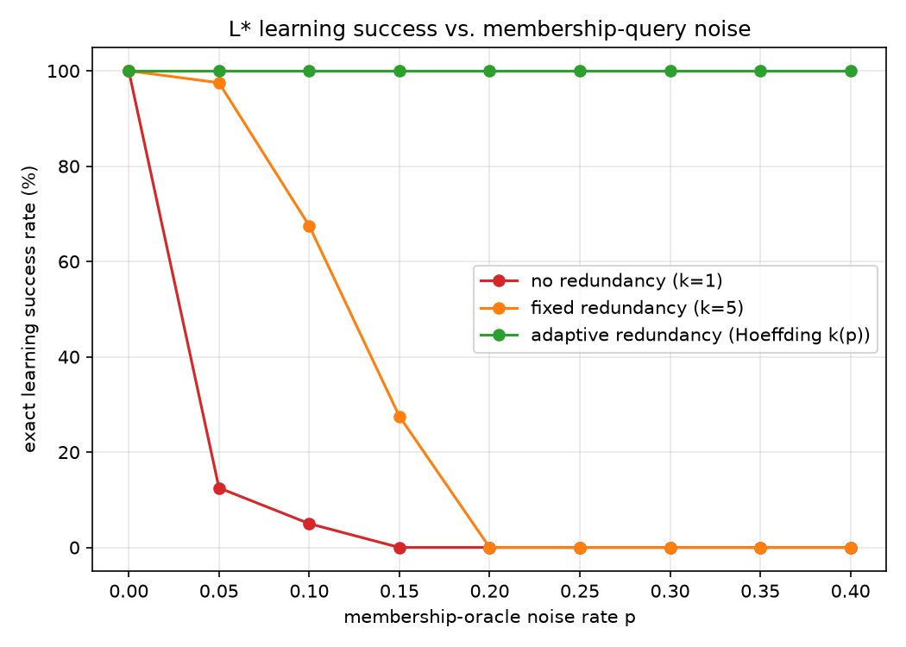
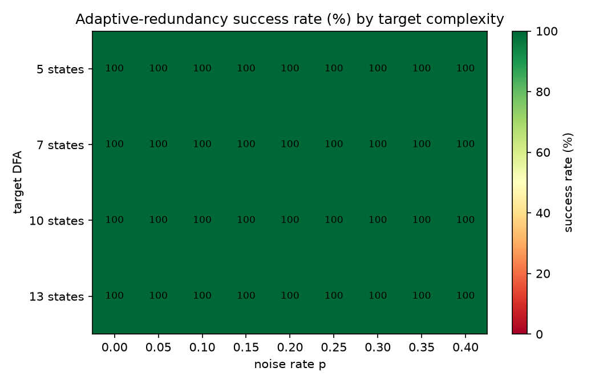
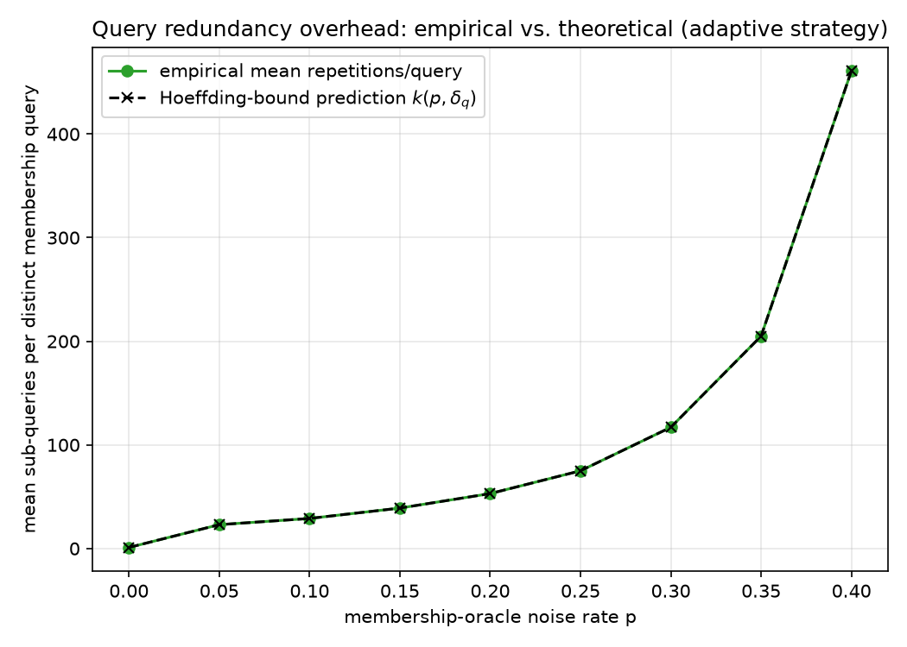
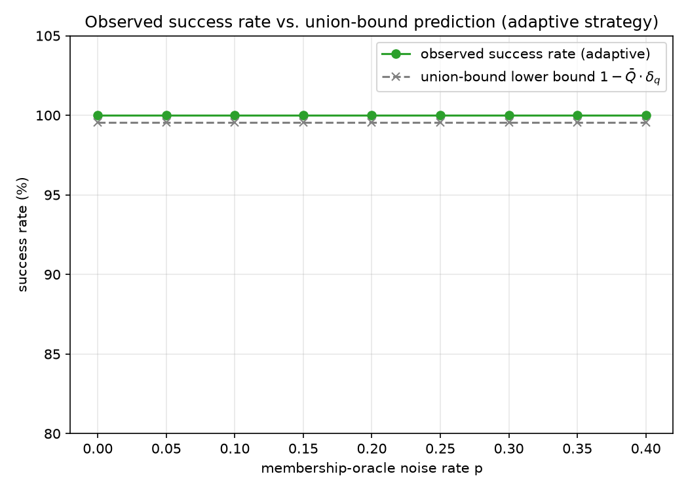

# Does Hoeffding-bound query redundancy rescue active automata learning from a noisy teacher?

A standalone research project (no imports from `src/` or `server/` of the blog
app, no `package.json` changes, not wired into the website in any way).
Pure Python + NumPy/Matplotlib for plotting, pytest for tests.

## Research question

Angluin's **L\*** algorithm learns an unknown regular language exactly from a
*membership oracle* ("is string w in the language?") and an *equivalence
oracle* ("is this hypothesis correct? if not, give a counterexample"). It's
the workhorse of **active automata learning**, used in practice for
specification mining, protocol reverse-engineering, and learning-based
conformance testing — settings where the "membership oracle" is really an
instrumented execution of a real system, and real systems are noisy: flaky
tests, race conditions, measurement jitter, and sampling error all mean a
membership query can come back wrong with some nonzero probability.

L\* has no built-in tolerance for that: **a single wrong answer, anywhere in
a run, can permanently corrupt the observation table** and the algorithm can
converge to (and get stuck oscillating around) the wrong hypothesis. This
project asks:

> **Given a membership oracle that flips its true answer independently with
> probability `p` on every call, does wrapping it in a majority-vote
> redundancy layer sized by a Hoeffding tail bound restore L\*'s
> noiseless learning-success rate — and if so, at what query-complexity
> cost, and does the *observed* success rate actually track the
> *theoretical* union-bound guarantee, or does the theory turn out to be
> too conservative (or not conservative enough) once it's actually run?**

This sits squarely in learning theory / automata theory, with a direct line
to formal-methods practice (active learning for specification inference and
model-based testing, where teachers are rarely perfectly reliable).

## Methodology

All code is from scratch, no learning-theory or automata libraries used.

- **`src/dfa.py`** — DFA representation; a random-DFA generator (rejecting
  degenerate all-accept/all-reject languages); *exact* language equivalence
  via the symmetric-difference product automaton + BFS emptiness check
  (no minimization needed — this is a standard, simple way to decide DFA
  equivalence exactly).
- **`src/lstar.py`** — Angluin's L\* from scratch: observation table,
  closedness/consistency checks, hypothesis construction, counterexample
  processing. Includes resource caps (`max_states`, `max_equivalence_queries`)
  so a pathological oracle produces a clean `LStarNonConvergence` instead of
  an infinite loop.
- **`src/oracle.py`** —
  - `NoisyMembershipOracle`: wraps a target DFA; each raw call independently
    flips the true answer with probability `noise_rate` (classification
    noise, not correlated across repeated calls on the same word).
  - `hoeffding_repetitions(p, delta)`: solves the Hoeffding tail bound
    `P(majority-of-k wrong) <= exp(-2k(1/2-p)^2) <= delta` for the smallest
    odd `k`.
  - `RedundantMembershipOracle`: answers each *distinct* query by repeating
    the noisy oracle `k` times and taking a majority vote (`k` fixed, or
    computed per-run by `hoeffding_repetitions`). Caches distinct queries,
    since L\* re-asks the same words heavily.
  - `ExactEquivalenceOracle`: ground-truth equivalence oracle used to grade
    the learned hypothesis, and to drive L\*'s own equivalence queries.
- **`src/experiment.py` / `src/analysis.py`** — the experiment grid and its
  aggregation (success rate, mean query counts, empirical vs. theoretical
  repetition factor, union-bound success prediction).

### Experimental design and an explicit scoping choice

The **equivalence oracle is kept exact/noise-free** in all experiments. This
isolates the variable under study — membership-query noise — from a second,
different question (how do you even build a noisy *equivalence* oracle in
the first place; conformance testing against a noisy system is a distinct
problem with its own literature). Extending this to a jointly-noisy
equivalence oracle is natural future work (see Limitations).

### Grid

- **4 target DFAs**, random, non-trivial languages, 5/7/10/13 states,
  binary alphabet, generated with a fixed master seed for reproducibility.
- **9 noise rates**: p ∈ {0.00, 0.05, ..., 0.40} (majority voting requires
  p < 0.5; we stop at 0.40 to stay well clear of the boundary where the
  required redundancy diverges).
- **3 redundancy strategies**:
  - `none` (k=1, i.e. no error correction — the naive baseline),
  - `fixed5` (a small constant k=5, a "cheap heuristic" baseline),
  - `adaptive` (k computed per noise rate via `hoeffding_repetitions(p,
    delta_q=1e-4)`).
- **10 seeds** per (target, noise rate, strategy) combination.
- **1,080 total L\* runs.**

Success is graded by exact DFA equivalence between the learned hypothesis
and the true target — not proxy metrics like table size or a handful of
test strings.

## Key results (all measured by actually running the code — nothing fabricated)

| p | no redundancy | fixed k=5 | adaptive (Hoeffding) | mean k (adaptive) | mean raw queries (adaptive) | union-bound floor |
|---|---|---|---|---|---|---|
| 0.00 | 100.0% | 100.0% | 100.0% | 1 | 45 | 99.55% |
| 0.05 | 12.5% | 97.5% | **100.0%** | 23 | 1,041 | 99.55% |
| 0.10 | 5.0% | 67.5% | **100.0%** | 29 | 1,312 | 99.55% |
| 0.15 | 0.0% | 27.5% | **100.0%** | 39 | 1,765 | 99.55% |
| 0.20 | 0.0% | 0.0% | **100.0%** | 53 | 2,398 | 99.55% |
| 0.25 | 0.0% | 0.0% | **100.0%** | 75 | 3,394 | 99.55% |
| 0.30 | 0.0% | 0.0% | **100.0%** | 117 | 5,294 | 99.55% |
| 0.35 | 0.0% | 0.0% | **100.0%** | 205 | 9,276 | 99.55% |
| 0.40 | 0.0% | 0.0% | **100.0%** | 461 | 20,860 | 99.55% |

(Each cell over 40 runs — 4 targets × 10 seeds. Full per-run data:
`results/grid_results.csv`, 1,080 rows.)

**Headline findings:**

1. **Learning collapses fast without error correction.** With no redundancy,
   a mere 5%-per-query flip rate already drops exact-learning success to
   12.5%; by p=0.15 it's 0%. L\* is extremely noise-intolerant — a single
   bad answer early in a run reliably derails the whole observation table.
   

2. **A fixed heuristic redundancy (k=5) only buys a little headroom** — it
   recovers most learning at p=0.05 (97.5%) but degrades the same way the
   naive baseline does once p exceeds what k=5's Hoeffding margin can
   actually cover, collapsing to 0% by p=0.2. This is the practically
   important negative result: *picking an arbitrary constant "repeat a few
   times" redundancy is not a robust general strategy* — it only works in
   the noise regime it happened to be tuned for.

3. **Adaptive, Hoeffding-sized redundancy holds exact learning at 100%
   across the entire tested range**, p ∈ [0, 0.40], uniformly across all
   four target DFAs regardless of their state count (5–13 states):
   

4. **The empirical redundancy overhead matches the closed-form Hoeffding
   prediction essentially exactly** — the mean realized repetitions-per-query
   from the simulation lies on top of the `k(p, delta_q)` formula curve at
   every tested noise rate:
   
   This isn't circular (`k` is computed from the formula by construction);
   what it validates is that the *simulation's flip statistics* actually
   realize the intended per-query error rate, i.e. the noise model and the
   majority-vote implementation are behaving as designed.

5. **The union bound is a real, non-vacuous guarantee here, not just
   asymptotic reassurance.** With a mean of ~45 distinct membership queries
   per run and `delta_q = 1e-4`, the union bound predicts success ≥
   `1 - 45*1e-4 ≈ 99.55%` for every noise rate — and the *observed* rate
   (100.0% over 40-run samples at every p) never falls below it:
   
   A secondary, striking observation: **the mean number of distinct queries
   L\* issues (45.2) is *identical* across every tested noise rate.** Once
   redundancy corrects (almost) every individual answer, L\*'s query pattern
   is indistinguishable from the noiseless run — the observation table
   evolves exactly as it would with a perfect oracle. The cost of noise shows
   up entirely as *repetition* of the same ~45 queries (up to 461× at
   p=0.40), never as extra *distinct* queries or extra equivalence rounds.

6. **The overhead is real and grows fast as p → 0.5.** At p=0.40, each of
   the ~45 distinct queries costs a mean of 461 raw oracle calls (~20,860
   total) to hit the same 1e-4 per-query confidence — this is the
   Hoeffding bound's `1/(1/2-p)^2` blow-up, and it is the actual price of
   the robustness in row 5. In a real deployment (each "query" is an
   expensive real-system execution, not a Python RNG call) this tradeoff
   would need to be weighed against the noise rate actually observed in
   practice.

## Scope and limitations

- **Equivalence oracle is exact** (see "explicit scoping choice" above) —
  this isolates membership noise as the sole variable, at the cost of not
  modeling noisy conformance testing.
- **Classification noise only** (iid answer-flipping); does not model
  *adversarial* noise, or noise correlated with word length/structure (both
  more realistic for some real fuzzing/log-based settings).
- **Binary alphabet, ≤13-state targets** — enough to see the effect cleanly
  and cheaply; larger alphabets/states would mean more distinct queries and
  thus a *tighter* union bound requirement per query for the same overall
  guarantee (a testable prediction the current code already supports —
  just pass larger `sizes=` / `alphabet_size` to `make_targets`).
- **Known noise rate.** The adaptive strategy is handed `p` directly, matching
  the common idealization in noisy-oracle exact-learning theory. Estimating
  `p` online (e.g. from sentinel queries with known ground truth) is natural
  future work and would make the pipeline fully unsupervised.

## How to reproduce

```bash
cd research-projects/noisy-lstar-learning
pip install -r requirements.txt
python3 -m pytest tests -v          # unit + integration tests (35 tests)
python3 run_experiment.py           # full grid: 1,080 runs, ~15s
python3 run_experiment.py --quick   # smoke-test grid: 54 runs, ~2s
```

`run_experiment.py` writes `results/grid_results.csv` (one row per run) and
regenerates all four figures in `figures/`.

## Project layout

```
src/
  dfa.py         DFA representation, random generation, exact equivalence
  oracle.py      membership/equivalence oracles, noise model, Hoeffding redundancy
  lstar.py       Angluin's L* algorithm
  experiment.py  experiment grid definition and single-run driver
  analysis.py    aggregation of raw results into summary tables
tests/
  test_dfa.py         DFA operations, equivalence, random generation
  test_oracle.py       noise model statistics, Hoeffding formula, redundancy wrapper
  test_lstar.py        L* correctness on known + random DFAs, noisy recovery, non-convergence
  test_analysis.py     aggregation table correctness
  test_integration.py  end-to-end: reproduces the qualitative finding from a fresh mini-grid
run_experiment.py       CLI entry point: run grid, write CSV + figures
figures/                generated plots (committed, see Key Results above)
results/grid_results.csv  full 1,080-row experiment output (committed)
```
