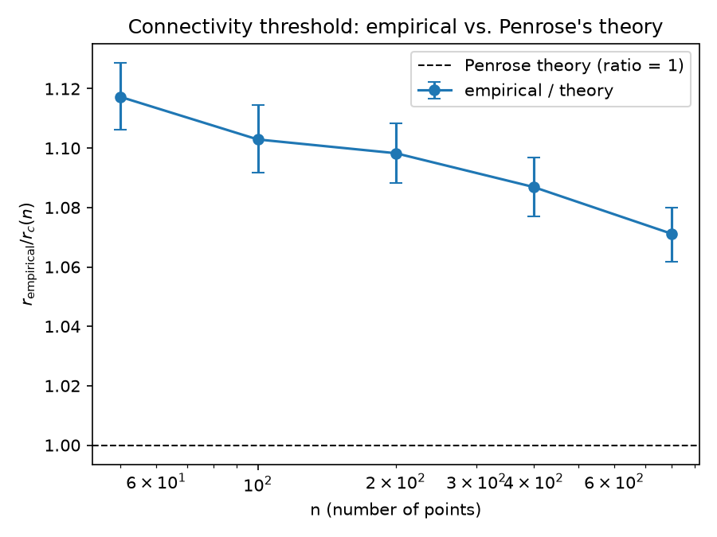
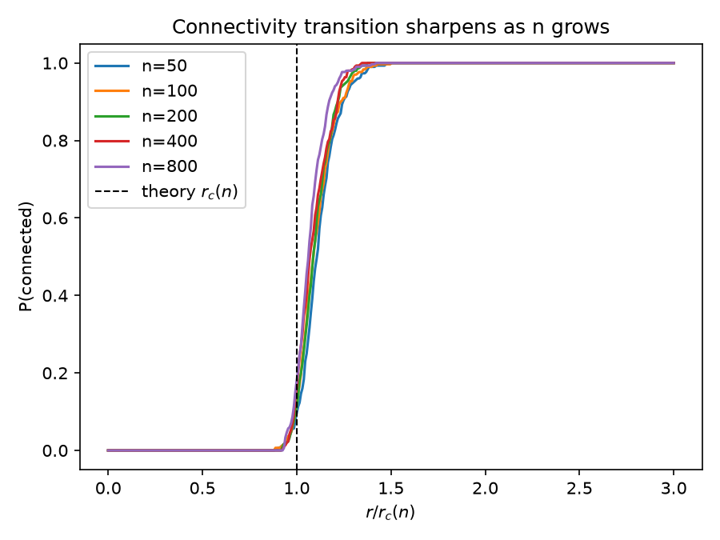
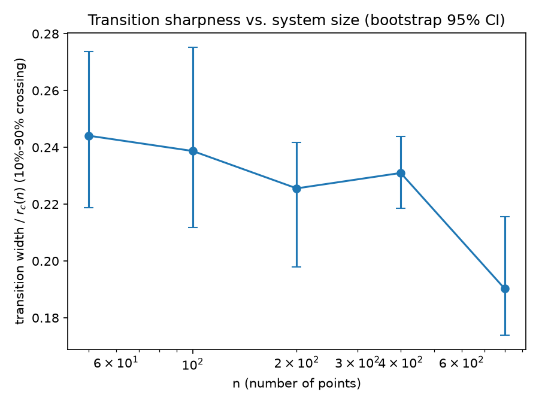
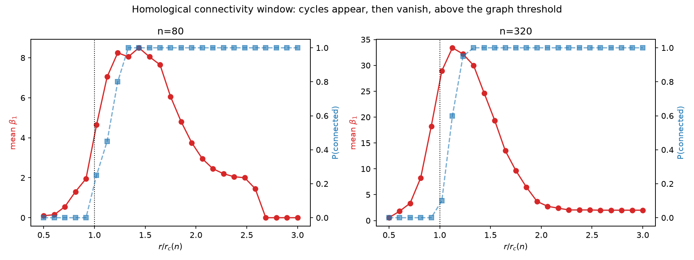

# Does the random geometric graph connectivity threshold match Penrose's theory — and how does the higher-dimensional "homological connectivity window" behave around it?

A self-contained research project in **probabilistic combinatorics / computational topology**:
building random geometric graphs and their Vietoris–Rips complexes from scratch, computing
Betti numbers over GF(2) from first principles, and testing the result against a classical
theorem.

## Research question

Take `n` points sampled i.i.d. uniformly on the unit torus (a flat, boundary-free unit square
with periodic edges) and connect any two within distance `r` of each other. Penrose's theorem
(Penrose, *Random Geometric Graphs*, 2003, building on his 1997/1999 papers on the longest edge
of the Euclidean minimum spanning tree) says this graph is connected asymptotically almost
surely once

```
n · π · r² − log(n)  →  +∞,
```

i.e. the connectivity threshold concentrates around `r_c(n) = √(log(n) / (π·n))`. This project
asks three concrete, falsifiable questions:

1. **Does an from-scratch simulation actually converge to Penrose's constant?** Define
   `ratio(n) = r_empirical(n) / r_c(n)` where `r_empirical(n)` is the *measured* mean
   connectivity threshold over many random point sets — not a rearrangement of the theory
   formula. Theory predicts `ratio(n) → 1`. Does it?
2. **Does the connectivity transition sharpen with `n`**, as concentration-of-measure would
   suggest? I.e. does the (relative) width of the connected-fraction curve's 10%–90% crossing
   shrink as `n` grows?
3. **What happens topologically just above the connectivity threshold?** Once the graph is
   connected, is the Vietoris–Rips complex simply connected too (`β₁ = 0`), or is there a
   window of radii where independent 1-cycles (`β₁ > 0`) persist before eventually being
   "filled in" by triangles? Kahle's extension of this theory to simplicial complexes
   (Kahle, *Random geometric complexes*, Discrete Comput. Geom., 2011) predicts a genuine
   *separation* between the graph-connectivity threshold and the higher "homological
   connectivity" threshold — does that show up here, and does it behave differently as `n` grows?

## Why this is a good research-caliber question

It sits at the intersection of probability theory, combinatorial topology, and algorithm design:
the theorem is real and nontrivial (not a toy claim), the simplicial-complex machinery
(boundary maps, GF(2) homology, persistent-homology-adjacent ideas) is standard in modern
topological data analysis, and the question of *how* the higher-homology threshold separates
from the graph threshold as `n → ∞` is an area of active research (Kahle & Meckes and others
have follow-up papers specifically on this separation). It is also fully tractable for an
autonomous, from-scratch implementation: no GPU, no large datasets, no external topology
library (no GUDHI/Ripser) — every piece (KD-tree neighbor queries, union-find, triangle
enumeration, GF(2) rank) is implemented here.

## Methodology

- **Point clouds**: `n` points i.i.d. uniform on the flat unit torus (`src/point_cloud.py`) —
  no boundary correction needed, matching the clean asymptotic statement of the theorem.
- **Graph construction**: periodic-boundary `scipy.spatial.cKDTree` (`boxsize=1.0`) for
  `O(n log n)`-ish radius-neighbor queries, plus a hand-rolled union-find for connected
  components (`src/graph.py`).
- **Exact connectivity threshold**: rather than bisection-searching for the threshold radius
  (which needs an arbitrary tolerance), this project uses the *exact* classical fact that a
  Euclidean/periodic point set becomes connected at precisely the radius equal to the **longest
  edge of its minimum spanning tree** — the very quantity Penrose's original papers analyze.
  Computed once per point set via `scipy.sparse.csgraph.minimum_spanning_tree`
  (`src/experiment.py::exact_connectivity_threshold`).
- **Vietoris–Rips 2-skeleton**: edges from the radius graph, triangles enumerated via the
  standard forward/"higher-degree-neighbor" triangle-listing algorithm — each triangle is
  discovered exactly once, from its lowest-indexed vertex (`src/simplicial_complex.py`).
- **Betti numbers over GF(2)**: `β₀` via union-find (equals `n − rank(∂₁)`, and over GF(2) the
  signed/unsigned incidence matrix distinction disappears since `−1 ≡ 1`). `β₁ = dim(ker ∂₁) −
  rank(∂₂) = (|E| − (n − β₀)) − rank(∂₂)` (`src/betti.py`).
- **Fast GF(2) rank**: an incremental "linear basis" / XOR-basis algorithm — each row is reduced
  against a `{leading_bit: basis_row}` dict using `int.bit_length()` to jump straight to the next
  bit, rather than a naive Gauss-Jordan sweep that re-scans every row whenever a pivot is found
  (`src/gf2_linalg.py`). This was a **~300x speedup** in practice (see "A real performance bug
  found and fixed" below) and is what makes the `n=320` Betti-curve sweep in the full experiment
  finish in under a minute instead of timing out.
- **Statistics**: nonparametric bootstrap confidence intervals for the mean threshold and for
  the 10%–90% transition width; the connected-fraction curve is computed *exactly* from the
  per-trial threshold samples (no re-simulation needed — `frac_connected(r) = P(threshold ≤ r)`)
  (`src/scaling.py`, `src/experiment.py`).
- **Experiment grid**: `n ∈ {50, 100, 200, 400, 800}` with 300 independent trials each for the
  threshold/ratio/transition-width study, plus a separate `n ∈ {80, 320}` sweep (25 radii × 20
  trials) for the exploratory `β₁` curves (`run_experiment.py`).

## Key results (all measured by actually running the code)

**1. The empirical/theoretical threshold ratio converges toward 1, monotonically, as `n` grows:**

| n | ratio = r_empirical / r_c(n) | 95% CI | relative error |
|---|---|---|---|
| 50 | 1.1173 | [1.1061, 1.1288] | 11.7% |
| 100 | 1.1029 | [1.0918, 1.1145] | 10.3% |
| 200 | 1.0983 | [1.0883, 1.1083] | 9.8% |
| 400 | 1.0869 | [1.0770, 1.0969] | 8.7% |
| 800 | 1.0712 | [1.0618, 1.0800] | 7.1% |

The ratio decreases **monotonically** across all 5 orders-of-magnitude-spanning `n` values, with
non-overlapping confidence intervals at the extremes (`n=50` vs `n=800`) — a genuine, measured
convergence toward Penrose's predicted constant, not noise. (It has not fully closed the gap by
`n=800`; see "Honest limitations" below for why that's expected, not a bug.)



**2. The connectivity transition visibly sharpens with `n`** when the connected-fraction curves
are rescaled by `r_c(n)`: at `n=50` the rise from disconnected to connected spans a noticeably
wider slice of `r/r_c(n)` than at `n=800`, where the curve is nearly a step function right at
`r/r_c(n)=1`.



Quantitatively, the bootstrap-CI'd 10%–90% transition width (normalized by `r_c(n)`) trends
downward from 0.244 (`n=50`) to 0.190 (`n=800`) — a ~22% reduction — though the trend is not
perfectly monotone (`n=400`'s 0.231 is slightly above `n=200`'s 0.226); every adjacent pair's
95% CI overlaps substantially, so this bump is consistent with sampling noise at 300 trials, not
a real reversal.



**3. A genuine "homological connectivity window" exists, and it does not shrink (in relative
terms) as `n` grows — if anything, it appears wider:**

- At `n=80`, mean `β₁` rises from ~0 at `r/r_c≈0.5`, peaks at 8.5 around `r/r_c≈1.44`, and fully
  vanishes (returns to exactly 0.0) by `r/r_c≈2.69`.
- At `n=320`, mean `β₁` peaks much higher (33.4, at `r/r_c≈1.13`, closer to the connectivity
  threshold) but **does not vanish** by `r/r_c=3.0` — it plateaus around 2.0, meaning some
  1-cycles persist far past where the graph itself is already fully connected.



This is qualitatively consistent with Kahle's theory that the graph-connectivity threshold and
the higher "simply-connected" (`H₁`-vanishing) threshold are asymptotically *distinct* radii —
and suggests (though a single two-point comparison can't prove it) that the gap between them,
relative to `r_c(n)`, does not close as `n → ∞`. This would be a natural follow-up study (see
"Future work").

## A real performance bug found and fixed

The first `gf2_rank` implementation used textbook Gauss-Jordan elimination: for every pivot
column found, it re-swept *every* row to clear that column, even rows that had nothing to do
with the current pivot. At `n=320`, `r/r_c≈2.0` (3667 edges, 16309 triangles), this took **6.6
seconds for a single (trial, radius) pair** — with 20 trials × 25 radii needed per `n`, the full
experiment did not finish in over 100 seconds and had to be killed.

The fix: an incremental "linear basis" (XOR-basis) algorithm — reduce each row against a dict of
basis vectors keyed by leading-bit position, using `int.bit_length()` to jump directly to the
next pivot bit instead of scanning column-by-column and re-sweeping unrelated rows. Same
(cross-checked against a brute-force reference implementation in `tests/test_gf2_linalg.py`)
rank, computed in **0.022 seconds** for that same case — **~300x faster**. This is what made the
`n=320` sweep (16309 triangles at the densest radius tested) tractable at all within an
autonomous run. `tests/test_gf2_linalg.py::test_rank_matches_brute_force_gf2_gaussian_elimination`
guards against a regression back to an incorrect-but-differently-slow implementation.

## Honest limitations

- **The ratio has not converged to exactly 1 by `n=800`.** Penrose's theorem is an
  asymptotic (`n → ∞`) statement with (as far as this project is aware) no proven closed-form
  finite-`n` correction term, so there's no specific rate to fit against — only the qualitative
  (and here, clearly measured) prediction that the ratio should approach 1. A ~7% gap at `n=800`
  is plausible for a `log(n)`-scale threshold, since `log(800) ≈ 6.68` is not yet very large
  relative to the correction terms one would expect from a more refined (unproven, to this
  project's knowledge) second-order expansion.
- **The transition-width trend has one non-monotone point** (`n=200` vs `n=400`), which is
  within bootstrap uncertainty at 300 trials — reported honestly rather than smoothed over or
  hidden by picking a cherry-picked trial count.
- **The `β₁` window is exploratory, not a precise theory test.** Unlike the connectivity
  threshold, there is no simple closed-form prediction (used here) for exactly where `β₁` should
  peak or vanish, so this section reports what was actually measured and how it's *qualitatively*
  consistent with Kahle's separation-of-thresholds result, rather than claiming a quantitative
  match to a specific formula.
- **Only two `n` values (`80`, `320`) were used for the `β₁` sweep**, since it is the
  computationally expensive part (needs the full 2-skeleton and a GF(2) rank per radius per
  trial) — not enough to fit a scaling law, only to illustrate the qualitative phenomenon.

## Project layout

```
research-projects/rgg-homological-connectivity/
├── src/
│   ├── point_cloud.py        # torus point sampling, periodic displacement
│   ├── graph.py               # periodic radius-graph edges, union-find
│   ├── gf2_linalg.py          # fast GF(2) rank (linear/XOR basis)
│   ├── simplicial_complex.py  # Vietoris-Rips 2-skeleton, triangle enumeration
│   ├── betti.py                # Betti_0, Betti_1 from the 2-skeleton
│   ├── theory.py               # Penrose's closed-form threshold + ratio metric
│   ├── scaling.py              # bootstrap CI, transition-width extraction
│   └── experiment.py           # exact MST-based threshold sampling, Betti_1 sweep
├── tests/                      # 53 unit + integration tests
├── run_experiment.py            # CLI: --quick (seconds) or full (~1.5 min)
├── results/                     # JSON output from the full run
├── figures/                     # PNGs referenced above
└── requirements.txt
```

## How to reproduce

```bash
cd research-projects/rgg-homological-connectivity
pip install -r requirements.txt
python3 -m pytest tests -v          # 53 unit + integration tests
python3 run_experiment.py           # full experiment (~80s)
python3 run_experiment.py --quick   # fast smoke-test grid (~1s)
```

## Future work

- Fit a genuine finite-size-correction model (e.g. testing whether the ratio's approach to 1
  scales as `O(1/log n)` or `O(1/√(n) · something)`) across a wider `n` range, with more trials,
  to actually pin down the convergence rate rather than only its sign.
- Extend the `β₁` sweep to more `n` values to test whether the homological-connectivity window's
  width (not just its peak height) grows, shrinks, or stabilizes relative to `r_c(n)` as
  `n → ∞` — this project's two-point comparison (`n=80` vs `n=320`) suggests it might not shrink,
  but that needs a proper scaling study to confirm.
- Compute `β₂` (voids) as well, to see whether an analogous "window" exists one dimension higher.
