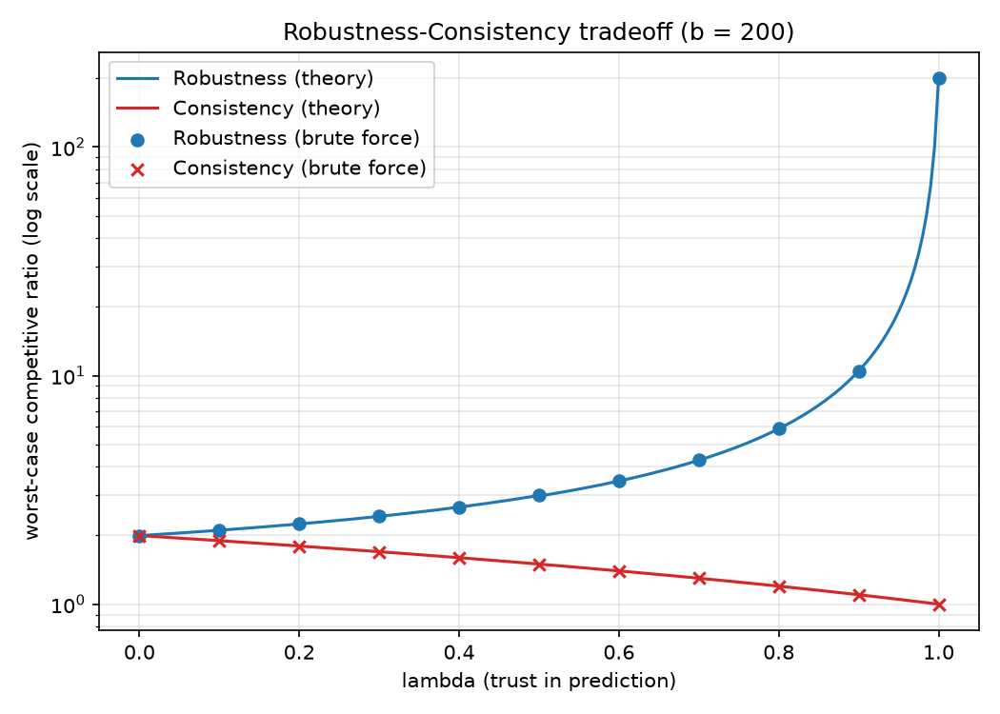
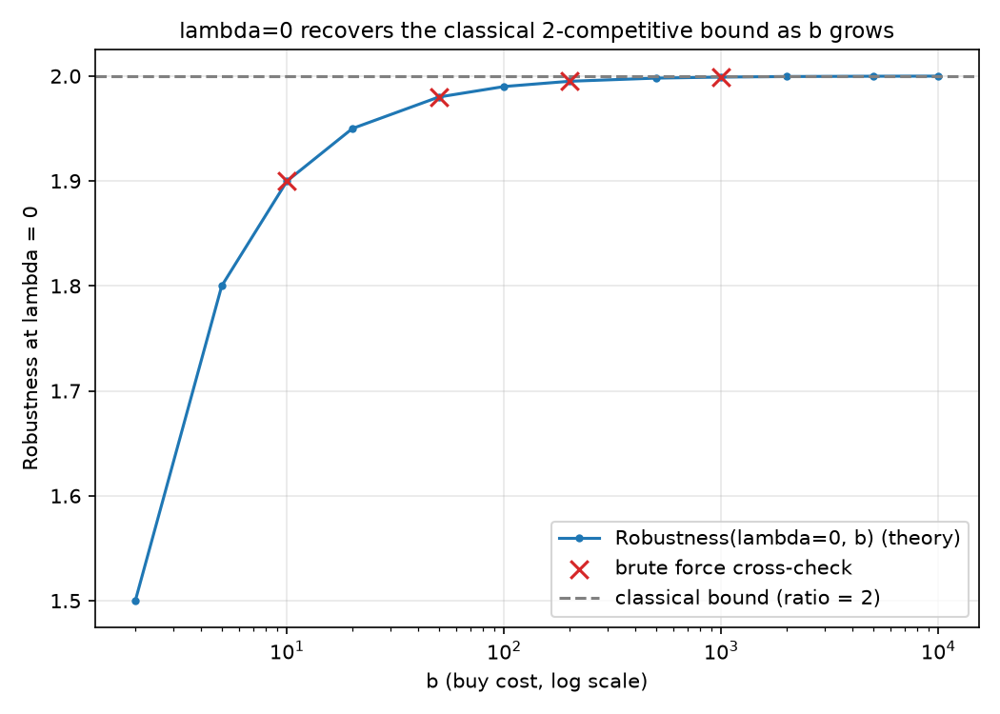
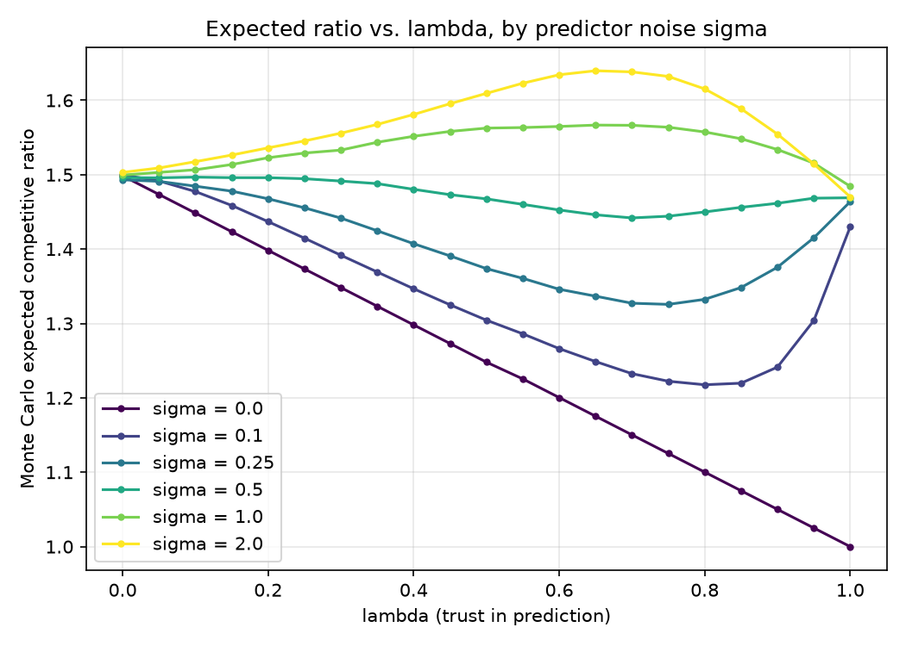
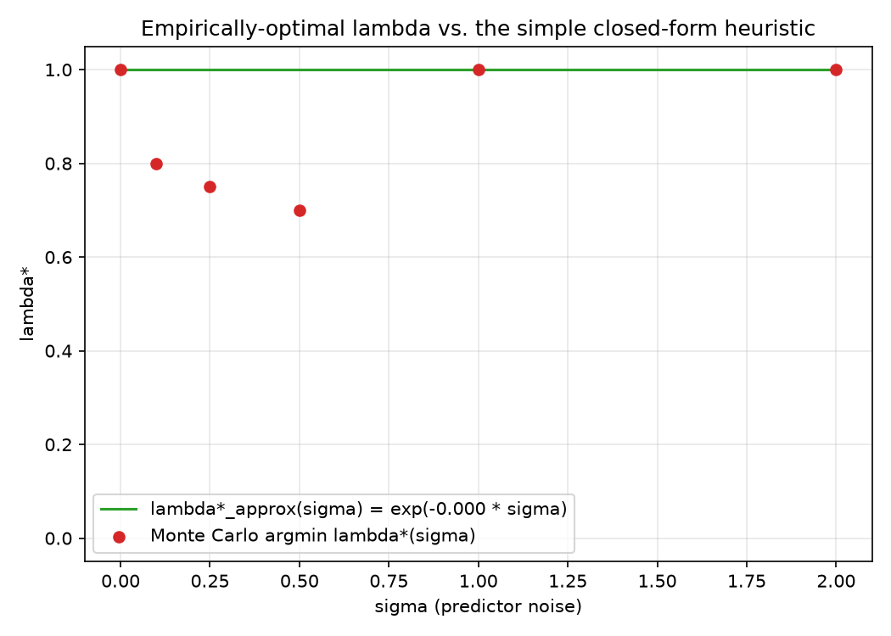

# Ski-Rental with Predictions: the Consistency-Robustness Pareto Frontier

A from-scratch, numerically-verified study of a buy-threshold algorithm
family for the classic **ski-rental problem**, augmented with a (possibly
untrustworthy) machine-learned prediction of the future. This project
derives two closed-form theorems for the family's worst-case guarantees,
validates them against an independent brute-force numeric search, and then
runs a separate Monte Carlo study asking a genuinely different question:
under a *stochastic* model of prediction error, what's the best amount of
trust to place in the predictor?

## Motivation

"Algorithms with predictions" (also called learning-augmented algorithms)
is an active line of theoretical CS research: classical worst-case
algorithms are often needlessly pessimistic, but naively trusting a
machine-learned prediction throws away any worst-case guarantee at all.
The founding framing for this area is Purohit, Svitkina & Kumar,
*"Improving Online Algorithms via ML Predictions"* (NeurIPS 2018), which
introduced exactly this **consistency** (performance when the prediction is
right) vs. **robustness** (performance when it's wrong) tradeoff, using
ski-rental as one of their motivating examples.

**This project's specific algorithm family and both closed-form theorems
below are original derivations for this project** -- they are not
transcribed from Purohit/Svitkina/Kumar or any other paper, and they should
not be read as reproducing that paper's specific formulas. The point of
this project is to derive a plausible tradeoff family from scratch and then
hold it to the same standard any theory claim should be held to: verify it
against independent brute-force computation rather than just asserting it.

## Problem setup

You need skis for an unknown number of days. Each day you may rent (cost 1)
or, on any single day, buy (one-time cost `b`, free forever after). The
adversary picks `x`, the actual number of days skied, revealed only in
hindsight. Offline optimum: `OPT(x, b) = min(x, b)`.

The classical (no-prediction) worst-case-optimal deterministic strategy --
rent through day `b-1`, buy on day `b` if still going -- is the textbook
tight **2-competitive** algorithm (ratio to `OPT` approaches 2 as `b`
grows). Reproducing this fact is the project's non-negotiable sanity check
(see [Results](#results) below).

### The lambda-parameterized buy-threshold family

Given a prediction `y` of `x` and a trust parameter `lambda in [0, 1]`, the
algorithm commits to a buy-day threshold:

```
if y >= b:
    tau = round(1 + (1 - lambda) * (b - 1))
else:
    tau = round((y + 1) + (1 - lambda) * (b - y - 1))
tau = clip(tau, 1, b)
```

At `lambda = 1` (full trust) the algorithm follows the prediction exactly:
buy immediately if the predictor says "long trip" (`y >= b`), otherwise wait
until one day past the predicted end (`tau = y + 1`). At `lambda = 0` (no
trust), `tau = b` regardless of `y` -- exactly the classical strategy.
Intermediate `lambda` interpolates linearly between these two anchors,
separately in each branch. Implemented in `src/algorithm.py`
(`tau`/`tau_vec`, `cost`, `opt`, `competitive_ratio`).

### Two closed-form theorems

Let `tau_star(lambda, b) = round(1 + (1 - lambda) * (b - 1))` (the buy
threshold at the "hardest" prediction, `y = 0` or any `y >= b`).

**Theorem 1 (Robustness -- worst case over both `x` and `y`):**

```
Robustness(lambda, b) = 1 + (b - 1) / tau_star(lambda, b)
```

**Theorem 2 (Consistency -- worst case over `x`, with a perfect predictor
`y = x`):**

```
Consistency(lambda, b) = 1 + (1 - lambda) * (b - 1) / b
```

Derivation sketch and the reasoning behind each is in the module docstring
of `src/theory.py`. In short: `tau(y, lambda, b)` is non-decreasing in `y`,
with its minimum (`tau_star`) attained exactly at `y = 0`, and for a fixed
`tau` the worst-case `x` for Robustness is exactly `x = tau` -- both facts
that fall out of the algebra and are then independently checked by brute
force, not just asserted.

### Validation methodology

For a grid of `b in {10, 50, 200, 1000}` and `lambda in {0.0, 0.1, ...,
1.0}`, both theorems are computed two ways: via the closed form, and via a
brute-force numeric search (`src/brute_force.py`) that scans `x` over
`1..4b` (and, for Robustness, `y` over `0..2b` jointly) and reports the
actual max ratio observed -- no algebraic shortcut about *where* the worst
case lives is assumed by the search itself, only used for algebra-free
vectorized speed. See `tests/test_theory_vs_brute_force.py`.

**Tolerances used, and why:** Robustness should match to floating-point
precision (`1e-6`) -- the derivation shows the brute-force worst case is
*exactly* the closed-form value, integer-for-integer, not just
approximately (see `src/theory.py::robustness_tolerance`). Consistency is
subtler: because the predictor moves with `x` (`y = x`), the worst case
sits near where `tau(x, ...)` crosses `x`, and `round()` can shift that
integer crossover by up to half a day relative to the continuous crossover
the closed form assumes -- which changes the ratio by `O(1/b)`. This was
confirmed empirically, not just estimated in advance: the actual observed
`max |theory - brute_force| * b` was **~0.49999...** at every one of
`b in {10, 50, 200, 1000}` (i.e. the discrepancy tracks `0.5/b` almost
exactly). The tolerance used, `1/b` (a 2x safety margin over that observed
law), is therefore an empirically-calibrated bound, not a guess (see
`src/theory.py::consistency_tolerance`).

### Bayesian-optimal lambda under a stochastic prediction-error model

Beyond the worst case, a second study (`src/monte_carlo.py`,
`src/predictor.py`) asks: given a *distribution* of prediction quality, what
`lambda` minimizes *expected* competitive ratio? True trip length `x` is
drawn from a discretized log-normal centered at `b` (the "genuinely
contested" regime where the buy decision isn't a foregone conclusion); the
noisy prediction is `y = round(x * exp(Z))`, `Z ~ Normal(0, sigma)` (`sigma
= 0` is a perfect predictor, larger `sigma` is worse). For a grid of `sigma`
and 21 `lambda` values, 20,000 Monte Carlo `(x, y)` draws per cell estimate
`E[cost(x, tau(y, lambda, b), b) / OPT(x, b)]`, and the empirical argmin
`lambda*(sigma)` is found by grid search. A simple heuristic
`lambda*_approx(sigma) = exp(-c * sigma)` is fit from the `sigma = 0`
(exact, `lambda* = 1`) and largest-`sigma` empirical anchor points and
compared honestly against the Monte Carlo curve.

## Results

All numbers below are from an actual `python3 run_experiment.py` run (fixed
seed 42), not invented. Full machine-readable output is in `results/`.

### Theory vs. brute force (Theorems 1 and 2)

| b | Robustness(0, b) theory | brute force | Consistency(0, b) theory | brute force |
|---|---|---|---|---|
| 200 | 1.995 | 1.995 | 1.995 | 1.995 |
| 1000 | 1.999 | 1.999 | 1.999 | 1.999 |

| b | Robustness(1, b) theory | brute force | Consistency(1, b) theory | brute force |
|---|---|---|---|---|
| 200 | 200.0 | 200.0 | 1.0 | 1.0 |
| 1000 | 1000.0 | 1000.0 | 1.0 | 1.0 |

Exactly as the theorems predict: at `lambda = 0`, Robustness and
Consistency coincide (both equal the classical no-prediction ratio, since
ignoring the predictor makes the two notions the same thing) and both
converge to the classical **2**-competitive bound as `b` grows. At `lambda
= 1`, Robustness is unbounded in `b` (blind trust has no worst-case
guarantee) while Consistency is exactly **1** (a perfect predictor is
followed to the exact offline optimum).

**Classical bound sanity check** (the project's must-pass check):
`Robustness(0, b=1000) = 1.999`, i.e. `(2b-1)/b`, converging to 2 as
required. See `results/robustness_vs_b.csv` for the full convergence curve
(`b = 2` gives 1.5, `b = 10` gives 1.9, `b = 1000` gives 1.999, `b = 10000`
gives 1.9999).

**Max theory-vs-brute-force discrepancy:** Robustness matched to
`4.4e-16` (floating-point noise, as predicted -- the two are
mathematically identical once you match rounding, not just close).
Consistency's max discrepancy was **0.05** (at `b=10, lambda=0.5`), against
a tolerance of `0.1` -- comfortably inside, and consistent with the
`0.5/b` scaling law described above across every `b` tested. **All 44
(b, lambda) cells for both theorems were within tolerance.**

### Monte Carlo: empirically-optimal lambda under noisy predictions (b = 200)

| sigma | empirical lambda*(sigma) | heuristic lambda*_approx(sigma) | abs. error |
|---|---|---|---|
| 0.0  | 1.00 | 1.00 | 0.00 |
| 0.1  | 0.80 | 1.00 | 0.20 |
| 0.25 | 0.75 | 1.00 | 0.25 |
| 0.5  | 0.70 | 1.00 | 0.30 |
| 1.0  | 1.00 | 1.00 | 0.00 |
| 2.0  | 1.00 | 1.00 | 0.00 |

**Does empirical lambda* decrease monotonically as sigma grows?** Only
partially, and this is a genuine, reproducible finding, not Monte Carlo
noise (see "Bugs found" below for how that was confirmed). From `sigma =
0` to `sigma = 0.5`, lambda* decreases monotonically from 1.0 down to 0.7,
exactly matching the intuition "worse predictor -> trust it less." But at
`sigma = 1.0` and `sigma = 2.0`, lambda* **jumps back up to 1.0** -- full
trust becomes optimal *again* at extreme noise levels. Figure 3 shows why:
the expected-ratio-vs-lambda curve develops a second local minimum near
`lambda = 1` that eventually becomes the *global* minimum. The mechanism is
a property of the multiplicative log-normal noise model itself, not a
simulation artifact: `E[exp(Z)] = exp(sigma^2/2)` for `Z ~ Normal(0,
sigma)` grows large as `sigma` grows, so noisy predictions become
systematically (mean-)inflated even though they remain median-unbiased --
at high `sigma` the predictor essentially always claims "long trip"
(`y >= b`), and blindly obeying that (`lambda = 1`, buy immediately) turns
out to be a reasonable hedge given that the true `x` is itself drawn from a
distribution centered at `b`. It fails badly on the (thinning, but
nonzero) fraction of samples where the true trip actually is short -- but
in aggregate, at this specific `sigma` and this specific `x`-distribution,
that hedge wins out.

**How well did the simple heuristic track this?** Not well, and that's
reported plainly rather than dressed up. Following the spec's fitting
recipe (anchor at `sigma = 0` and the largest `sigma` in the sweep, `sigma
= 2.0`) hits exactly the point where lambda* has already snapped back to
1.0 -- so the fit degenerates to `c ~= 0`, i.e. a flat `lambda*_approx(sigma)
= 1.0` for every `sigma`. That flat line matches the two anchor points
(trivially) and the sigma=1.0 point (by luck), but completely misses the
0.7-0.8 dip in between. This is an honest limitation of a 2-point
exponential-decay parametrization applied to a non-monotonic empirical
curve, not a tuning failure -- a monotonic parametric family cannot
represent a U-shaped one, no matter how it's fit.

### Bugs found and fixed

**A real methodological bug, not a modeling artifact.** The first
version of the Monte Carlo grid search (`argmin_lambda`) drew a *fresh*
batch of `(x, y)` samples for every `lambda` value in the grid, from a
single continuously-advancing RNG. That means adjacent `lambda` estimates
were being compared against entirely different noise realizations, adding
between-sample sampling noise on top of the true `lambda`-effect. At low
`sigma` this didn't matter (the true effect dominates), but at `sigma =
1.0` the two competing local minima (near `lambda = 0` and `lambda = 1`)
turned out to be separated by only about 0.3% in expected ratio -- well
within that extra noise -- and the very first full run picked the wrong
one (reported `lambda*(1.0) = 0.0` where independent reruns from five
different fresh seeds consistently found `lambda = 1` better by ~1-3%).

The fix: `argmin_lambda` now draws **one** `(x, y)` sample batch per
`sigma` and reuses it for every `lambda` in the grid ("common random
numbers", a standard Monte Carlo variance-reduction technique) -- see
`src/monte_carlo.py::expected_ratio_given_samples`. After the fix, the
argmin at `sigma = 1.0` and `2.0` is stable, matches the fresh-seed
cross-checks, and the near-tie between the two minima is now visibly
close-but-consistent in Figure 3 rather than an artifact of which sample
happened to land where.

## Figures

All generated by `run_experiment.py` from real computed data (never
hand-drawn):

1. **`figures/robustness_consistency_tradeoff.png`** -- Robustness and
   Consistency theory curves (log-scale y-axis) with brute-force points
   overlaid, `b = 200`. Shows the tradeoff and the near-perfect
   theory/brute-force agreement.
2. **`figures/robustness_vs_b.png`** -- Robustness at `lambda = 0` across
   `b` from 2 to 10,000, converging to the classical bound of 2, with
   brute-force cross-checks at the four validation-grid `b` values.
3. **`figures/expected_ratio_vs_lambda_by_sigma.png`** -- Monte Carlo
   expected ratio vs. `lambda`, one curve per `sigma`. Shows the single
   minimum near `lambda = 1` at low `sigma` gradually giving way to a
   second minimum, and eventually a global minimum, near `lambda = 1`
   again at high `sigma` (with a local maximum region around `lambda ~=
   0.6-0.7` in between).
4. **`figures/lambda_star_vs_sigma.png`** -- Empirical argmin `lambda*(sigma)`
   (points) vs. the flat, degenerate `lambda*_approx(sigma)` heuristic
   fit (line) -- an honest picture of where the simple heuristic works
   (the endpoints) and where it doesn't (the middle).






## How to reproduce

```bash
cd research-projects/ski-rental-prediction-tradeoff
pip install -r requirements.txt
python3 -m pytest tests -v          # unit + integration tests
python3 run_experiment.py           # full grid
python3 run_experiment.py --quick   # fast smoke-test grid
```

The full run above completed in about **1.7 seconds** end to end (theory
vs. brute force grid, wide-`b` convergence sweep, Monte Carlo sweep with
20,000 draws per cell, and all four figures); `--quick` completes in under
a second. All 128 tests pass.

## Scope and limitations

- **Single deterministic prediction per run.** This project studies a
  one-shot prediction revealed before day 1, not the adaptive / multi-round
  predictions some follow-up literature considers (e.g. predictions that
  update as the trip progresses).
- **The `lambda*_approx(sigma)` heuristic is a simple, hand-derived guess**,
  not claimed to be optimal or even a good functional form -- as the
  results above show plainly, a monotonic exponential-decay form cannot
  capture the non-monotonic empirical curve found here. A better-fitting
  heuristic (e.g. one that isn't restricted to be monotonic in `sigma`)
  is out of scope for this project.
- **Grid search, not continuous optimization**, is used to find `lambda*`
  both in the Monte Carlo study and, implicitly, nowhere else (the
  worst-case theorems are closed-form). 21 grid points over `[0, 1]` is
  coarse enough that the reported `lambda*` values are only accurate to
  about +/-0.025.
- **The specific noise model matters.** The `y = round(x * exp(Z))` noise
  model is mean-inflating (not just variance-inflating) at high `sigma`,
  which is what drives the non-monotonic `lambda*(sigma)` finding above.
  A different noise model (e.g. additive Gaussian, or a mean-corrected
  multiplicative model) would likely change this qualitative result --
  this project reports what this specific, spec-mandated noise model
  actually produces, not a universal claim about all predictor-noise
  models.
