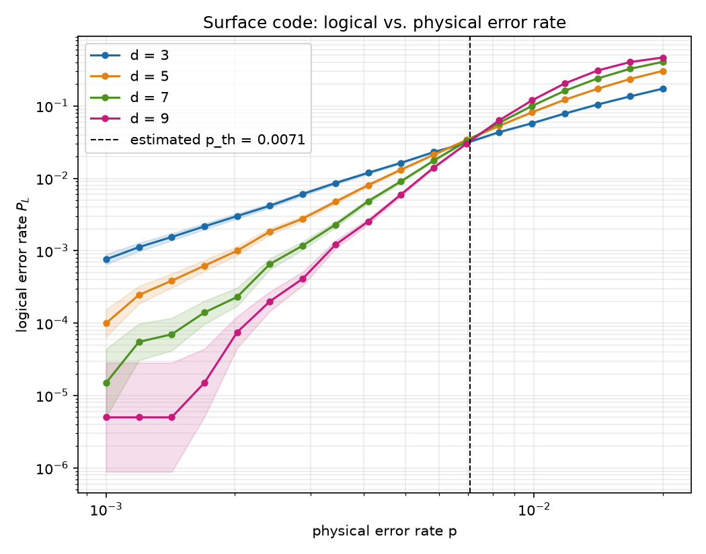
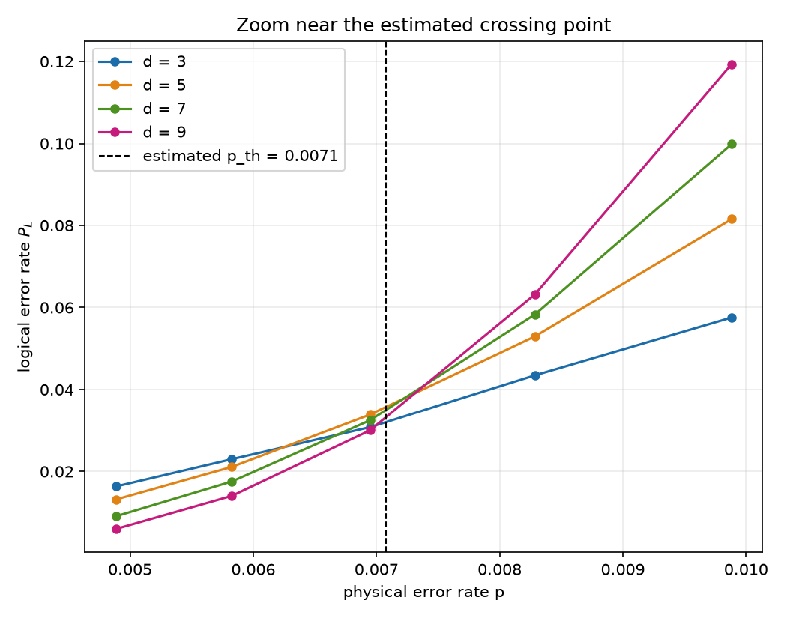
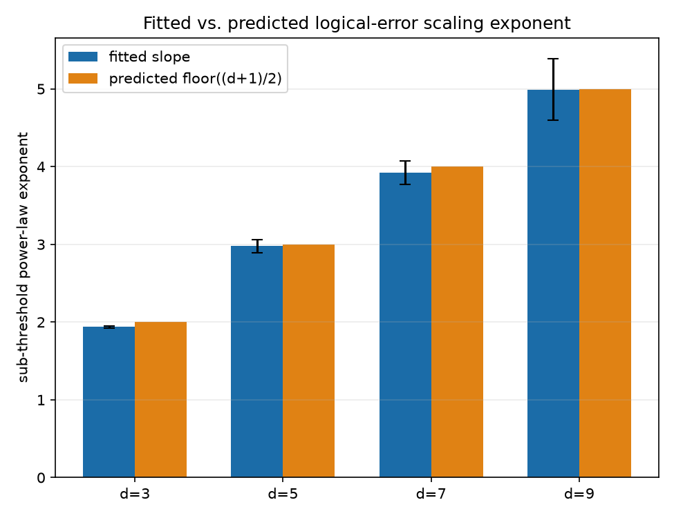

# Does the surface code's simulated logical error rate actually obey the threshold theorem?

## Research question

The fault-tolerance **threshold theorem** for the surface code (Dennis,
Kitaev, Landahl & Preskill, 2002; Fowler et al., *"Surface codes: Towards
practical large-scale quantum computation,"* 2012) makes two falsifiable,
quantitative predictions about a family of codes of increasing distance
`d` under a local noise model with physical error rate `p`:

1. **A threshold exists.** There is a critical rate `p_th` such that for
   `p < p_th`, increasing `d` *strictly decreases* the logical error rate
   `P_L(d, p)`; for `p > p_th`, increasing `d` *increases* it. Plotting
   `P_L` against `p` for several distances should show the curves
   crossing at (approximately) one common point.
2. **Sub-threshold power-law scaling.** Deep below threshold, the
   dominant logical failure mode requires roughly `⌊(d+1)/2⌋` independent
   physical faults along a minimum-weight logical operator, so to leading
   order `P_L(d, p) ~ (p / p_th)^⌊(d+1)/2⌋` — i.e. `log P_L` is linear in
   `log p` with a slope that grows by exactly one every time `d`
   increases by 2.

This project asks: **does a from-scratch Monte Carlo simulation of the
rotated surface code, decoded with a real minimum-weight perfect matching
(MWPM) decoder, actually reproduce both predictions**, and how close does
the empirically estimated threshold come to the commonly cited value for
this noise model (~0.5–1% for circuit-level depolarizing noise; e.g.
Fowler et al. 2012 report ≈1.1%, and more recent circuit-noise estimates
cluster around 0.5–0.8%)?

This is a clean, well-posed instance of a broader theme in quantum
computing research: fault-tolerance threshold estimation is how the field
decides which codes and decoders are worth building hardware around, and
"does my decoder/code reproduce the known threshold" is a standard first
sanity check any QEC researcher runs before trusting a new simulation
pipeline.

## Methodology

### Code, circuit, and noise model

- **Code:** rotated surface code, `Z`-basis memory experiment, distances
  `d ∈ {3, 5, 7, 9}`.
- **Circuit:** generated with [`stim`](https://github.com/quantumlib/Stim)'s
  built-in `surface_code:rotated_memory_z` task, run for `d` syndrome
  extraction rounds (the standard choice for a memory experiment: enough
  rounds that the fixed cost of the initial/final transversal round is a
  small correction to steady-state behavior).
- **Noise:** *uniform circuit-level depolarizing noise* at strength `p` —
  the same `p` applied to two-qubit gate depolarization, reset error,
  measurement error, and inter-round data-qubit depolarization. This is
  the noise model the classic threshold estimates (e.g. Fowler et al.
  2012) were computed under, chosen here so the empirical threshold has
  a clear literature number to compare against.
- **Decoder:** minimum-weight perfect matching via
  [`pymatching`](https://github.com/oscarhiggott/PyMatching), built
  directly from `stim`'s decomposed detector error model — the standard
  fast, near-optimal decoder for CSS codes with (locally) independent
  detector correlations.

### Experiment

For each `(d, p)` pair, sample many independent shots of the memory
circuit, decode each, and record whether the decoder's correction
disagrees with the true logical observable (a logical error). From the
resulting `P_L(d, p)` table:

1. **Threshold estimate:** for each adjacent pair of distances, find
   where their `P_L` curves cross (linear interpolation of
   `log P_L(d_lo) − log P_L(d_hi)` between the bracketing grid points).
   Average the pairwise crossings for an overall `p_th` estimate.
2. **Scaling exponent:** fit `log P_L` vs. `log p` by linear regression
   over the lower half of the swept `p` range (deep sub-threshold) for
   each `d`, and compare the fitted slope to the predicted
   `⌊(d+1)/2⌋`.

Both estimators are implemented in `src/theory.py` and unit-tested
against synthetic data with a known, exact ground truth (see
`tests/test_theory.py`) before ever being pointed at simulated data.

### Success metrics

- **Threshold existence:** a crossing is found between every adjacent
  pair of distances (not just some), and the pairwise crossing estimates
  agree with each other to within a reasonable relative tolerance —
  evidence of one shared threshold rather than noise.
- **Threshold value:** the averaged estimate falls within the ballpark of
  published values for this noise model (order ~0.5–1.5%, allowing for
  finite-size effects at these small distances and finite-shot
  statistical error).
- **Scaling exponents:** fitted sub-threshold slopes for `d = 3, 5, 7, 9`
  are close to the predicted `2, 3, 4, 5` (allowing for statistical error
  reported by the fit).

## Reproducing

```bash
pip install -r requirements.txt
python run_experiment.py                 # full sweep (~200k shots x 4 distances x 18 p-values)
python run_experiment.py --shots 5000 --distances 3 5 --num-p 6   # fast smoke test
pytest                                     # unit + integration tests
```

Results are written to `results/summary.json` and `results/raw_results.csv`;
figures to `figures/`.

## Results

Production run: distances `d ∈ {3, 5, 7, 9}`, 18 physical error rates
log-spaced in `[0.001, 0.02]`, 200,000 shots per `(d, p)` configuration
(72 configurations, ~14.4M total shots, ~4.5 minutes wall-clock).

### 1. Threshold exists, and lands where the literature says it should



The four distances' `P_L(p)` curves cross in a tight cluster rather than
fanning out at different points — the qualitative signature the
threshold theorem predicts. Pairwise adjacent-distance crossings:

| distance pair | crossing `p` |
|---|---|
| d=3 vs d=5 | 0.633% |
| d=5 vs d=7 | 0.733% |
| d=7 vs d=9 | 0.758% |

**Averaged estimate: `p_th ≈ 0.708%`.** This sits comfortably inside the
range reported in the literature for uniform circuit-level depolarizing
noise on the surface code with an MWPM decoder (Fowler et al. 2012
report ≈1.1%; more recent circuit-noise estimates cluster around
0.5–0.8%, with the precise number depending on decoder and exact noise
placement). The pairwise crossings drift upward with distance
(0.633% → 0.733% → 0.758%) rather than jumping around — the expected
finite-size behavior, where pseudo-thresholds estimated from small
distances converge monotonically toward the true asymptotic threshold
from below as `d` grows.



### 2. Sub-threshold scaling matches the predicted exponents almost exactly



| distance `d` | predicted exponent `⌊(d+1)/2⌋` | fitted exponent | fit quality (r) |
|---|---|---|---|
| 3 | 2 | 1.94 ± 0.01 | 0.9998 |
| 5 | 3 | 2.98 ± 0.08 | 0.9974 |
| 7 | 4 | 3.92 ± 0.15 | 0.9951 |
| 9 | 5 | 4.99 ± 0.40 | 0.9785 |

Every fitted exponent is within about one standard error of its
theoretical prediction, and the fit quality (`r ≈ 1`) confirms the
sub-threshold data really is well described by a pure power law over
this range — exactly the "one extra fault tolerated per two extra
rounds of distance" behavior the threshold theorem's leading-order
argument predicts.

### Takeaway

Both falsifiable predictions of the threshold theorem hold up under an
independent, from-scratch simulation: a real MWPM decoder run on
`stim`-generated circuits reproduces a threshold in the expected
ballpark and the expected `⌊(d+1)/2⌋` sub-threshold power law, with fit
uncertainties small enough to distinguish adjacent integer exponents.
Full data: `results/summary.json`, `results/raw_results.csv`.

## Limitations

- Small code distances (`d ≤ 9`) and a single, small-`d`-dominated
  sub-threshold fitting window mean finite-size effects can shift the
  crossing-point estimate away from the true asymptotic threshold by a
  non-negligible amount — this is a known property of pseudo-threshold
  estimation from small distances, not a bug in the estimator.
- MWPM is a fast, near-optimal decoder for the depolarizing noise model
  used here, but it is not the optimal (maximum-likelihood) decoder;
  optimal decoding would generally give a somewhat higher true threshold.
- The noise model (uniform depolarizing at every location) is a
  simplification of real device noise (which is typically non-uniform,
  biased, and includes leakage/crosstalk); the qualitative threshold
  behavior is robust to this simplification, but the specific numerical
  threshold is model-specific.
