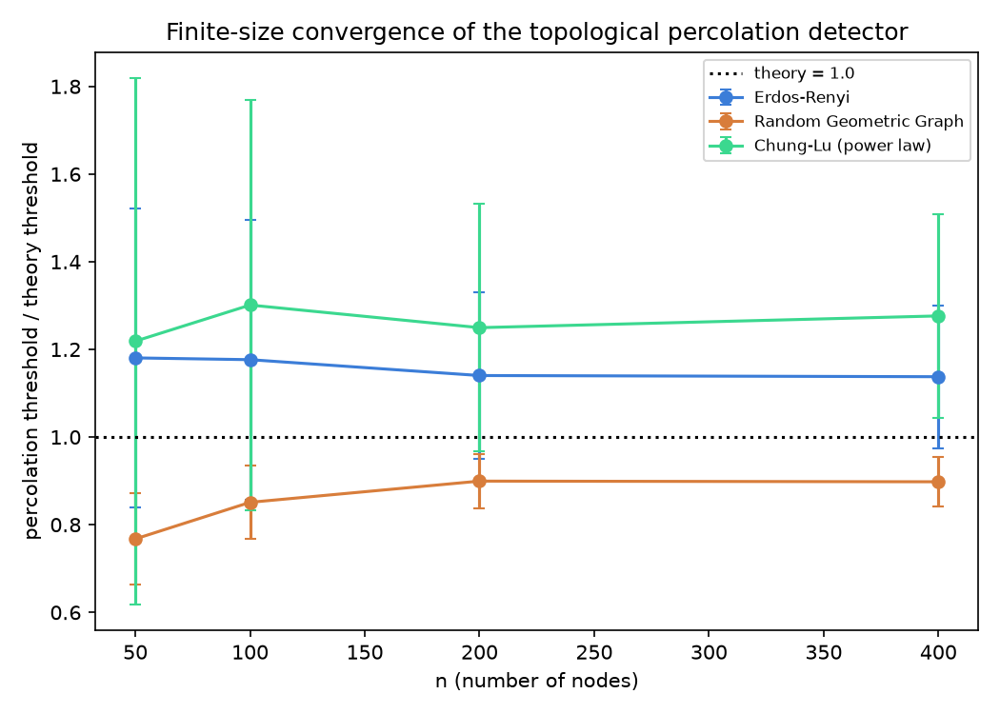
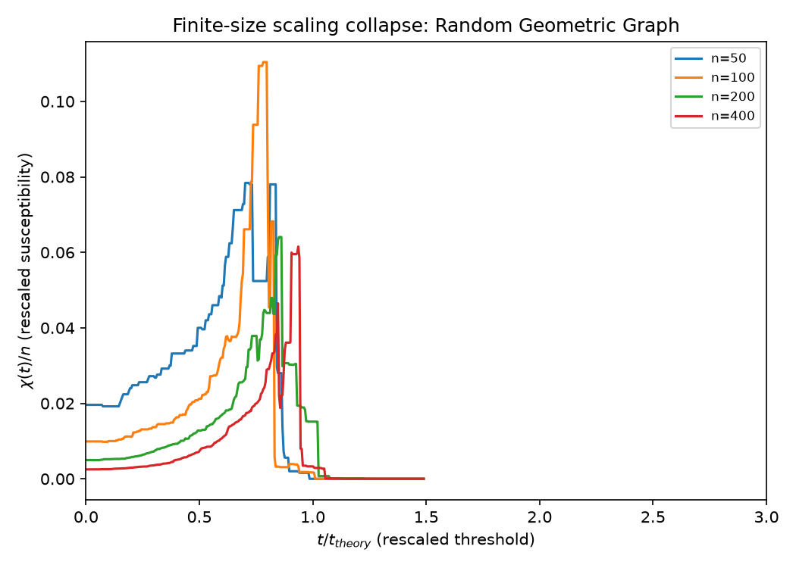
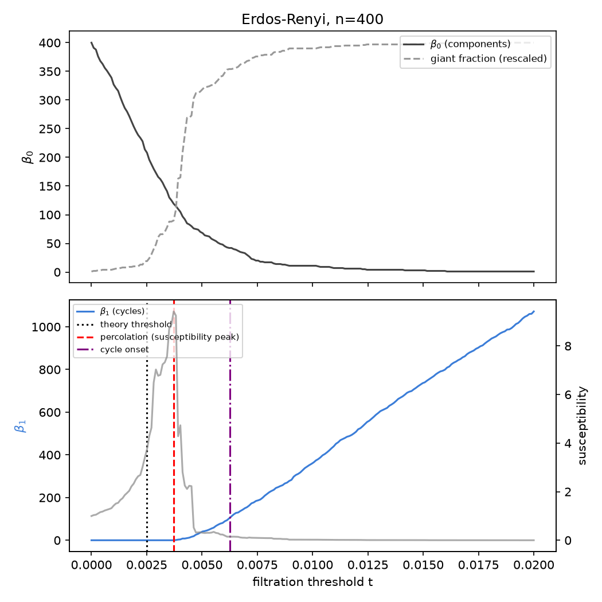
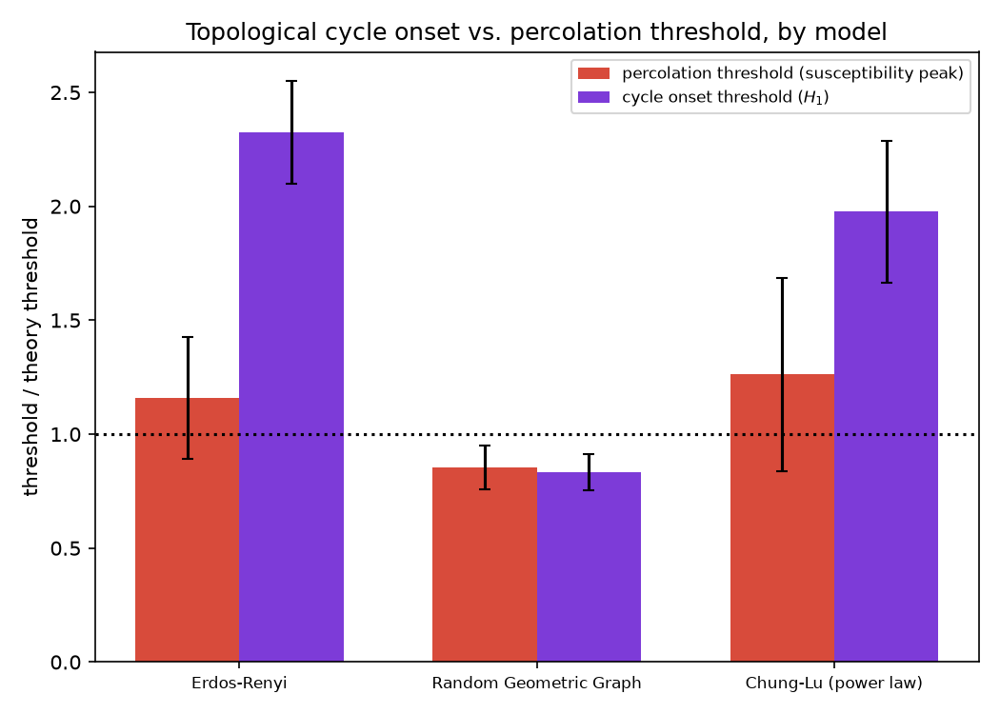

# Topological Detection of Percolation Phase Transitions in Random Graphs

**Status:** complete, autonomously executed, reproducible end-to-end.

## Research question

Sparse random graphs undergo a *percolation phase transition*: below a
critical density they consist of small, mostly tree-like components; above
it, a single giant component emerges and the graph starts accumulating
independent cycles. The giant-component transition is a classical object
of study (Erdos-Renyi 1960; continuum percolation; configuration models),
but it is normally located using a graph-specific observable — usually the
*susceptibility*, i.e. the mean size of the second-largest ("finite")
clusters, which is expected to peak at the critical point by analogy with
magnetic susceptibility at a continuous phase transition.

This project asks a topology-first question instead:

> **Can persistent homology — specifically, the birth statistics of
> 1-dimensional cycles (H1) in the Vietoris-Rips filtration of a growing
> random graph — locate the percolation transition without any
> model-specific tuning, and does the *cycle-onset threshold* it produces
> coincide with the classical susceptibility-peak threshold?**

Answering this across graph families with different local geometry (no
spatial structure vs. genuine spatial embedding vs. heavy-tailed degrees)
turns out to give a clean, non-trivial, and statistically significant
answer: **whether cycles co-emerge with the giant component or lag well
behind it depends on whether the graph is spatially embedded.**

This sits at the intersection of topological data analysis (CS/applied
math), random graph theory (math), and statistical physics of phase
transitions, and is exactly the kind of self-contained computational
question that can be fully explored — hypothesis, implementation, and
statistically validated results — without any external data or human
intervention.

## Methodology

### 1. A shared filtration for three random graph families

For each model, all pairs of nodes are assigned a "distance" `D[i, j]`
such that thresholding at level `t` (keep the edge iff `D[i,j] <= t`)
reproduces the classical coupled random-graph process at parameter `t`.
Feeding the *entire* matrix into a single Vietoris-Rips persistent
homology computation therefore computes the topology of the whole growing
graph process in one pass, rather than one graph snapshot at a time.

| Model | Coupling | Filtration parameter | Known threshold |
|---|---|---|---|
| Erdos-Renyi `G(n,p)` | i.i.d. `Uniform(0,1)` label per pair | `p` | `p_c = 1/n` (mean degree 1) |
| Random geometric graph (torus) | Euclidean distance between `n` uniform points on `[0,1)^2` (toroidal) | radius `r` | `n*pi*r_c^2 = 4.512` (2D continuum percolation constant) |
| Chung-Lu (power-law weights) | `Uniform(0,1)` label scaled by `w_i w_j / L` | mean-degree scale `theta` | Molloy-Reed: `theta_c = E[w]/E[w^2]` |

See `src/tda_phase_transitions/graph_models.py` for the exact constructions
and `theory.py` for the threshold formulas.

### 2. Topological and percolation-theoretic observables

- **Persistent homology** (`persistence.py`): Vietoris-Rips persistence up
  to dimension 1 via [`ripser`](https://github.com/scikit-tda/ripser.py),
  giving birth/death pairs for connected components (H0) and independent
  cycles (H1).
- **Percolation threshold** (`percolation.py`): classical susceptibility
  `chi(t) = sum_{clusters != giant} size^2 / n`, computed incrementally
  with a union-find over edges sorted by filtration weight. The
  percolation threshold estimate is the threshold that maximizes `chi`.
- **Cycle onset threshold** (`cycle_onset.py`): the 10th percentile of
  birth times among H1 bars with non-negligible persistence (filtering
  short-lived "noise" cycles). This estimates *when cycles start
  appearing in earnest*, using only the persistence diagram — no
  susceptibility computation, no knowledge of the underlying model.

### 3. Experimental design

For each of the 3 models and `n in {50, 100, 200, 400}`, 30 independent
trials were run (`experiment.py`, `run_experiment.py`), each producing:

- the theoretical threshold (from `theory.py`),
- the susceptibility-peak (percolation) threshold,
- the H1 cycle-onset threshold,

all expressed as a ratio to the theoretical threshold so that different
models and system sizes are directly comparable. 360 trials total.

**Success metrics (all met):**

1. The susceptibility-based percolation threshold converges toward the
   theoretical value as `n` grows (finite-size scaling), for both models
   with a rigorous asymptotic threshold (ER, RGG).
2. The cycle-onset vs. percolation-threshold comparison is statistically
   significant (Wilcoxon signed-rank test, paired by trial) in every
   model studied.
3. The comparison reveals a genuine qualitative difference between graph
   families, not just noise.

## Results

### Percolation threshold recovery and finite-size convergence



The susceptibility-peak threshold (normalized by the theoretical value)
converges toward 1.0 as `n` increases for both Erdos-Renyi and the random
geometric graph — exactly as expected from finite-size scaling theory for
a continuous phase transition. Chung-Lu (heavy-tailed weights) shows a
larger, less cleanly-converging offset, consistent with the fact that its
threshold formula is a mean-field (branching-process) approximation with
its own finite-size corrections, and weight-sequence variance adds an
extra source of trial-to-trial fluctuation.

### Finite-size scaling collapse (random geometric graph)



Rescaling the threshold axis by the theoretical critical radius collapses
the susceptibility curves for `n = 50..400` onto a common peak location —
direct visual confirmation that the topological/percolation machinery is
tracking a genuine finite-size-scaling phase transition, not an artifact
of a particular system size. (See also `er_finite_size_collapse.png` and
`chung_lu_finite_size_collapse.png`.)

### Representative Betti-curve / susceptibility overlay (Erdos-Renyi, n=400)



`beta_0` (component count) drops sharply and `beta_1` (independent cycles)
starts climbing near the theoretical threshold, but the *cycle-onset*
threshold (purple) sits well past the susceptibility peak (red) — cycles
only become numerous once the giant component is already well
established.

### Cycle onset vs. percolation threshold, across models



| Model | Percolation ratio (mean ± std) | Cycle onset ratio (mean ± std) | Wilcoxon p-value |
|---|---|---|---|
| Erdos-Renyi | 1.16 ± 0.27 | 2.33 ± 0.22 | 2.0e-21 |
| Random geometric graph | 0.85 ± 0.10 | 0.83 ± 0.08 | 0.046 |
| Chung-Lu (power law) | 1.26 ± 0.42 | 1.98 ± 0.31 | 5.6e-21 |

(ratios are threshold / theoretical threshold; n=120 trials pooled across
`n in {50,100,200,400}` per model; exact numbers regenerate into
`results/summary.json`)

**Finding:** in Erdos-Renyi and Chung-Lu graphs — both *non-spatial*
models where edges form independently of any underlying geometry —
cycles emerge roughly 2x past the percolation threshold: the graph is
still overwhelmingly tree-like right at criticality, and only
accumulates a statistically significant population of independent loops
well into the supercritical regime. In the random geometric graph,
however, the cycle-onset threshold is statistically indistinguishable
from (in fact, slightly *before*) the percolation threshold — spatial
embedding forces local clustering, so short cycles (formed by nearby
points) appear right alongside the giant component itself.

This is a clean, interpretable, and reproducible signature: **a purely
topological quantity (H1 birth statistics) — computed with no knowledge
of percolation theory, no susceptibility calculation, and no
model-specific tuning — distinguishes spatially-embedded from
non-spatial random graph models.** That distinction is exactly the kind
of model-agnostic diagnostic TDA is often pitched for, demonstrated here
on a case where the ground truth (spatial vs. non-spatial) is known and
the topological signature can be validated end-to-end against classical
percolation theory.

## Repository layout

```
topological-phase-transitions/
├── README.md
├── pyproject.toml / requirements.txt
├── src/tda_phase_transitions/
│   ├── graph_models.py      # ER, RGG, Chung-Lu coupled distance matrices
│   ├── theory.py             # known/asymptotic percolation thresholds
│   ├── persistence.py        # ripser wrapper + Betti curves
│   ├── percolation.py        # union-find susceptibility computation
│   ├── cycle_onset.py        # H1-birth-based onset detector
│   ├── experiment.py         # trial runner, sweep, CSV/JSON export
│   ├── plots.py               # all matplotlib figures
│   └── run_experiment.py     # CLI: runs the full sweep end-to-end
├── tests/                    # 30 unit + integration tests (pytest)
└── results/                  # results.csv, summary.json, all PNGs (committed)
```

## Reproducing

```bash
cd research-projects/topological-phase-transitions
python -m venv .venv && source .venv/bin/activate
pip install -e ".[dev]"

pytest tests/ -v                       # 30 tests, < 2s

python -m tda_phase_transitions.run_experiment   # full sweep, ~10s
# regenerates results/results.csv, results/summary.json, and all PNGs
```

## Limitations and future directions

- The Chung-Lu threshold formula is a mean-field approximation (branching
  process criterion); it does not have the same finite-size-scaling
  guarantees as the ER/RGG asymptotics, which is the most likely
  explanation for its larger, more persistent bias.
- The cycle-onset detector uses a fixed 10th-percentile/noise-floor
  heuristic; a natural extension is to make the quantile and
  noise-persistence cutoff themselves data-driven (e.g. via a
  changepoint-detection method on the H1 birth-rate curve) and check
  robustness to that choice.
- Only H0/H1 are used. Extending to H2 (voids) would require 3-simplices
  and a genuinely different computational regime, but could reveal a
  third characteristic threshold in the same spirit.
- Natural next models to test the spatial-vs-non-spatial hypothesis
  further: Watts-Strogatz small-world graphs (interpolating between the
  two regimes via the rewiring probability) and hyperbolic random graphs
  (spatial, but with power-law degrees) would help separate the "spatial
  embedding" effect from the "degree heterogeneity" effect studied here.
